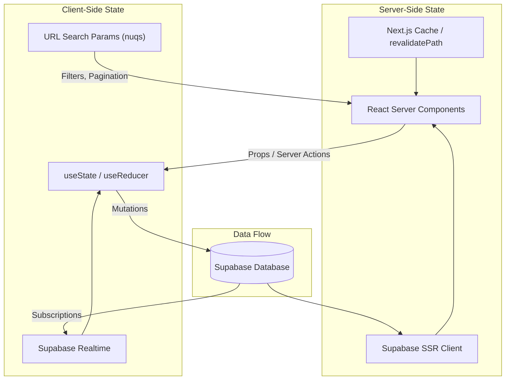
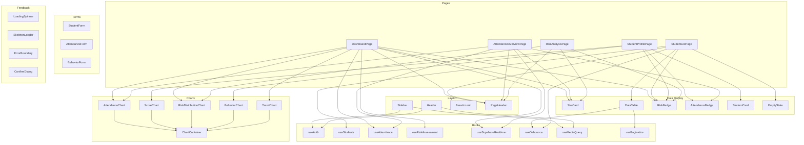

# 📐 Component Architecture Documentation

## ระบบดูแลช่วยเหลือนักเรียนและวิเคราะห์พัฒนาการรายบุคคล สำหรับโรงเรียนขนาดเล็ก

### Student Care and Individual Development Analytics System for Small Schools

> **Tech Stack**: Next.js 16.2.7 App Router · React 19.2.4 · Tailwind CSS v4 · shadcn/ui · Recharts · Lucide Icons · Supabase
> **เวอร์ชันเอกสาร**: 1.0.0  
> **อัปเดตล่าสุด**: 10 มิถุนายน 2569

> **Current planning note (2026-06-10):** Section 0 below is the active migration architecture. Older sections remain for historical context and still contain stale Next.js 15 route/component examples that must not be used as implementation authority.

---

## สารบัญ

0. [Active Migration Architecture](#0-active-migration-architecture)
1. [App Router Structure](#1-app-router-structure)
2. [Shared Components](#2-shared-components)
3. [State Management](#3-state-management)
4. [Custom Hooks](#4-custom-hooks)
5. [Design System](#5-design-system)
6. [Responsive Design Strategy](#6-responsive-design-strategy)
7. [Component Dependency Graph](#7-component-dependency-graph)

---

## 0. Active Migration Architecture

This section supersedes the older architecture snapshot below for Phase 1 work.

### 0.1 Next.js 16 Rules To Preserve

The local Next.js 16 docs in `node_modules/next/dist/docs/` confirm these conventions:

- The project uses the App Router under `src/app`.
- Route groups such as `(dashboard)` organize files but do not appear in URLs.
- A route is public only when a `page.tsx` or `route.ts` exists in that segment.
- `_components` folders are safe private colocated implementation folders, but they should not become the long-term home for repeated product UI.
- Pages and layouts are Server Components by default. Add `"use client"` only for state, event handlers, browser APIs, client-only charts, and form interaction.
- Server Actions are asynchronous server functions and must verify auth/authorization internally because they can be invoked by direct POST requests.

### 0.2 Current Route Shape

The current app shape is:

```text
src/app/
  layout.tsx
  globals.css
  login/page.tsx
  auth/callback/route.ts
  actions/*.actions.ts
  (dashboard)/
    layout.tsx
    loading.tsx
    error.tsx
    page.tsx
    students/page.tsx
    students/[id]/page.tsx
    attendance/page.tsx
    academics/page.tsx
    behavior/page.tsx
    behavior/[id]/page.tsx
    behavior/record/page.tsx
    home-visits/page.tsx
    home-visits/new/page.tsx
    support/page.tsx
    support/new/page.tsx
    risk-analysis/page.tsx
    development-plans/page.tsx
    development-plans/[id]/page.tsx
    reports/page.tsx
    notifications/page.tsx
    settings/page.tsx
```

There is no `/menu` route in this inventory. Mobile navigation must open a menu surface or route to existing pages only.

### 0.3 Current Component Reality

Current shared folders:

```text
src/components/ui/       base UI primitives
src/components/layout/   app shell components owned by layout/navigation work
src/lib/utils.ts         shared className/util helpers
```

Current debt:

- Many modules keep duplicated UI under `src/app/(dashboard)/**/_components`.
- Several modules split mobile and desktop rendering into separate components with repeated business logic.
- Status color, card radius, tiny text, shadows, and chart treatments are still inconsistent across route-local components.

### 0.4 Phase 1 Target Folders

Create shared system pieces before broad page rewrites:

```text
src/lib/navigation.ts         route taxonomy and visibility rules
src/lib/design/status.ts      status labels, badge variants, chart colors
src/components/dashboard/     PageShell, PageHeader, PageToolbar, Section, MetricCard, StatusBadge
src/components/data/          DataTable, MobileList, FilterBar, Pagination
src/components/charts/        ChartCard, Legend, EmptyChartState
src/components/forms/         FormSection, SubmitBar, ActionResultAlert
src/components/feedback/      EmptyState, ErrorState, LoadingState, PermissionState
```

Keep route-local `_components` only for page-specific composition that is not reused elsewhere. When two modules need the same UI behavior, promote it to a shared folder before migrating more pages.

### 0.5 Page Composition Contract

Every migrated dashboard page should follow this shape:

```text
Route Server Component
  -> authenticate/authorize
  -> query/service function
  -> typed DTO or view model
  -> PageShell
  -> PageHeader
  -> PageToolbar if the page filters/searches/sorts
  -> shared content components
  -> Client Component only for interaction
  -> Server Action for mutation
  -> ActionResult<T>
  -> revalidatePath/redirect/refresh as narrowly as possible
```

Required page states:

- loading
- empty
- error
- permission denied
- pending mutation
- success or validation result

### 0.6 Migration Boundaries

- Do not edit `src/components/layout/*` or `src/lib/navigation.ts` from docs/guardrails work unless that is the assigned task.
- Do not change shared UI primitives opportunistically while documenting migration rules.
- Do not add new page-local visual systems after a shared contract exists.
- Do not migrate page visuals without updating the relevant checklist in `task.md`.
- Design rules live in [frontend.md](./frontend.md); migration order lives in [UX_UI_SYSTEM_ROADMAP.md](./UX_UI_SYSTEM_ROADMAP.md).

---

## 1. App Router Structure

### 1.1 ภาพรวมโครงสร้าง Route ทั้งหมด

ระบบใช้ **Next.js 15 App Router** พร้อม **Route Groups** เพื่อจัดการ Layout แยกระหว่างหน้า Authentication และหน้า Dashboard หลัก

```
app/
├── layout.tsx                          # Root Layout (Providers, Fonts, Metadata)
├── globals.css                         # Tailwind CSS Global Styles
├── not-found.tsx                       # Custom 404 Page
├── error.tsx                           # Global Error Boundary
├── loading.tsx                         # Global Loading UI
│
├── (auth)/                             # 🔓 Route Group: Authentication
│   ├── layout.tsx                      # Auth Layout (Centered card layout)
│   ├── login/
│   │   └── page.tsx                    # หน้าเข้าสู่ระบบ
│   ├── register/
│   │   └── page.tsx                    # หน้าลงทะเบียน
│   └── forgot-password/
│       └── page.tsx                    # หน้ารีเซ็ตรหัสผ่าน
│
├── (dashboard)/                        # 📊 Route Group: Dashboard หลัก
│   ├── layout.tsx                      # Dashboard Layout (Sidebar + Header)
│   ├── page.tsx                        # หน้า Dashboard Overview
│   │
│   ├── students/                       # 👨‍🎓 โมดูลนักเรียน
│   │   ├── page.tsx                    # รายชื่อนักเรียนทั้งหมด
│   │   ├── [id]/
│   │   │   └── page.tsx               # โปรไฟล์นักเรียน (Tabbed View)
│   │   ├── new/
│   │   │   └── page.tsx               # เพิ่มนักเรียนใหม่
│   │   └── import/
│   │       └── page.tsx               # นำเข้าข้อมูลนักเรียน (CSV/Excel)
│   │
│   ├── attendance/                     # 📋 โมดูลการเข้าเรียน
│   │   ├── page.tsx                    # ภาพรวมการเข้าเรียน
│   │   └── record/
│   │       └── page.tsx               # บันทึกการเข้าเรียนรายวัน
│   │
│   ├── academics/                      # 📚 โมดูลผลการเรียน
│   │   ├── page.tsx                    # ภาพรวมคะแนน/ผลการเรียน
│   │   └── record/
│   │       └── page.tsx               # บันทึกคะแนนสอบ/ผลการเรียน
│   │
│   ├── behavior/                       # 🎭 โมดูลพฤติกรรม
│   │   ├── page.tsx                    # ภาพรวมพฤติกรรมนักเรียน
│   │   └── record/
│   │       └── page.tsx               # บันทึกพฤติกรรม
│   │
│   ├── home-visits/                    # 🏠 โมดูลเยี่ยมบ้าน
│   │   ├── page.tsx                    # รายการเยี่ยมบ้านทั้งหมด
│   │   └── new/
│   │       └── page.tsx               # บันทึกการเยี่ยมบ้านใหม่
│   │
│   ├── support/                        # 🤝 โมดูลส่งต่อ/ช่วยเหลือ
│   │   ├── page.tsx                    # รายการ Case ทั้งหมด
│   │   └── new/
│   │       └── page.tsx               # สร้าง Case ใหม่
│   │
│   ├── risk-analysis/                  # ⚠️ โมดูลวิเคราะห์ความเสี่ยง
│   │   └── page.tsx                    # Risk Dashboard
│   │
│   ├── development-plans/              # 📈 โมดูลแผนพัฒนารายบุคคล
│   │   ├── page.tsx                    # รายการแผนพัฒนาทั้งหมด
│   │   └── [id]/
│   │       └── page.tsx               # รายละเอียดแผนพัฒนา
│   │
│   ├── reports/                        # 📄 โมดูลรายงาน
│   │   └── page.tsx                    # ตัวสร้างรายงาน (Report Generator)
│   │
│   └── settings/                       # ⚙️ โมดูลตั้งค่า
│       ├── page.tsx                    # ตั้งค่าทั่วไป
│       └── users/
│           └── page.tsx               # จัดการผู้ใช้งาน
│
└── api/                                # 🔌 API Routes (Route Handlers)
    ├── auth/
    │   ├── callback/route.ts           # Supabase Auth Callback
    │   └── signout/route.ts            # Sign Out Handler
    ├── students/
    │   ├── route.ts                    # GET (list), POST (create)
    │   ├── [id]/route.ts              # GET, PATCH, DELETE
    │   └── import/route.ts            # POST (bulk import)
    ├── attendance/
    │   └── route.ts                    # GET, POST
    ├── academics/
    │   └── route.ts                    # GET, POST
    ├── behavior/
    │   └── route.ts                    # GET, POST
    ├── home-visits/
    │   └── route.ts                    # GET, POST
    ├── support/
    │   └── route.ts                    # GET, POST
    ├── risk-analysis/
    │   └── route.ts                    # GET (compute risk scores)
    ├── development-plans/
    │   └── route.ts                    # GET, POST, PATCH
    └── reports/
        └── generate/route.ts          # POST (generate PDF/Excel)
```

---

### 1.2 รายละเอียดแต่ละ Route

#### (auth) — Route Group สำหรับ Authentication

| Route | Component | คำอธิบาย | Data Fetching |
|-------|-----------|----------|---------------|
| `/login` | `LoginPage` | หน้าเข้าสู่ระบบด้วย Email/Password หรือ Social Login | Client Component (form handling) |
| `/register` | `RegisterPage` | หน้าลงทะเบียนผู้ใช้ใหม่ พร้อมเลือกบทบาท (ครู, ผู้บริหาร) | Client Component |
| `/forgot-password` | `ForgotPasswordPage` | หน้ารีเซ็ตรหัสผ่านผ่านอีเมล | Client Component |

**Auth Layout** (`(auth)/layout.tsx`):
```tsx
// แสดงผลเป็น centered card layout พร้อมพื้นหลัง gradient
// ไม่มี Sidebar หรือ Header
export default function AuthLayout({ children }: { children: React.ReactNode }) {
  return (
    <div className="min-h-screen flex items-center justify-center bg-gradient-to-br from-indigo-50 to-slate-100 dark:from-slate-950 dark:to-indigo-950">
      <div className="w-full max-w-md p-6">
        {children}
      </div>
    </div>
  );
}
```

#### (dashboard) — Route Group สำหรับ Dashboard หลัก

**Dashboard Layout** (`(dashboard)/layout.tsx`):
```tsx
// Layout หลักประกอบด้วย Sidebar (ด้านซ้าย) + Header (ด้านบน)
// ใช้ Sidebar แบบ Collapsible สำหรับจอเล็ก
export default async function DashboardLayout({ children }: { children: React.ReactNode }) {
  const user = await getAuthUser(); // Server-side auth check

  return (
    <SidebarProvider>
      <div className="flex h-screen overflow-hidden">
        <Sidebar user={user} />
        <div className="flex flex-1 flex-col overflow-hidden">
          <Header user={user} />
          <main className="flex-1 overflow-y-auto p-4 md:p-6 lg:p-8">
            <Breadcrumb />
            {children}
          </main>
        </div>
      </div>
    </SidebarProvider>
  );
}
```

| Route | Component | คำอธิบาย | Rendering |
|-------|-----------|----------|-----------|
| `/` | `DashboardPage` | ภาพรวมระบบ: สถิตินักเรียน, กราฟการเข้าเรียน, การแจ้งเตือน | RSC + Client Charts |
| `/students` | `StudentListPage` | ตารางนักเรียน พร้อมค้นหา/กรองตามชั้น/ห้อง | RSC + Client DataTable |
| `/students/[id]` | `StudentProfilePage` | โปรไฟล์นักเรียนแบบ Tab: ข้อมูลส่วนตัว, การเรียน, พฤติกรรม, เยี่ยมบ้าน | RSC + Client Tabs |
| `/students/new` | `AddStudentPage` | ฟอร์มเพิ่มนักเรียนใหม่ พร้อมอัปโหลดรูปภาพ | Client Component |
| `/students/import` | `ImportStudentsPage` | นำเข้า CSV/Excel พร้อม Preview และ Validation | Client Component |
| `/attendance` | `AttendanceOverviewPage` | ภาพรวมการเข้าเรียน: กราฟ, สถิติ, แนวโน้ม | RSC + Client Charts |
| `/attendance/record` | `RecordAttendancePage` | บันทึกการเข้าเรียนรายวัน แบบ Batch (เลือกทีละชั้น) | Client Component |
| `/academics` | `AcademicsOverviewPage` | ภาพรวมผลการเรียน: คะแนนเฉลี่ย, การกระจายเกรด | RSC + Client Charts |
| `/academics/record` | `RecordScoresPage` | บันทึกคะแนนสอบ/ผลการเรียนรายวิชา | Client Component |
| `/behavior` | `BehaviorOverviewPage` | ภาพรวมพฤติกรรม: คะแนนเชิงบวก/ลบ, แนวโน้ม | RSC + Client Charts |
| `/behavior/record` | `RecordBehaviorPage` | บันทึกพฤติกรรมนักเรียนรายบุคคลหรือกลุ่ม | Client Component |
| `/home-visits` | `HomeVisitsPage` | รายการเยี่ยมบ้านทั้งหมด พร้อมสถานะ | RSC + Client DataTable |
| `/home-visits/new` | `NewHomeVisitPage` | ฟอร์มบันทึกการเยี่ยมบ้าน พร้อมแนบภาพ/เอกสาร | Client Component |
| `/support` | `SupportCasesPage` | รายการ Case ส่งต่อ/ช่วยเหลือ พร้อมสถานะ Pipeline | RSC + Client DataTable |
| `/support/new` | `NewSupportCasePage` | สร้าง Case ใหม่ พร้อมเลือกระดับการช่วยเหลือ | Client Component |
| `/risk-analysis` | `RiskAnalysisPage` | Dashboard วิเคราะห์ความเสี่ยงรวม: แผนภูมิ, คะแนน, Priority List | RSC + Client Charts |
| `/development-plans` | `DevelopmentPlansPage` | รายการแผนพัฒนารายบุคคล (IDP) ทั้งหมด | RSC + Client DataTable |
| `/development-plans/[id]` | `PlanDetailPage` | รายละเอียดแผน: เป้าหมาย, กิจกรรม, Timeline, ความคืบหน้า | RSC + Client Components |
| `/reports` | `ReportsPage` | ตัวสร้างรายงาน: เลือกประเภท, ช่วงเวลา, รูปแบบ Export | Client Component |
| `/settings` | `SettingsPage` | ตั้งค่าทั่วไปของระบบ: ข้อมูลโรงเรียน, ปีการศึกษา | Client Component |
| `/settings/users` | `UserManagementPage` | จัดการผู้ใช้งาน: เพิ่ม/แก้ไข/ลบ, กำหนดบทบาท | RSC + Client DataTable |

---

## 2. Shared Components

### 2.1 โครงสร้างโฟลเดอร์ Components

```
components/
├── layout/                    # Components โครงสร้างหน้า
│   ├── sidebar.tsx
│   ├── sidebar-nav.tsx
│   ├── sidebar-provider.tsx
│   ├── header.tsx
│   ├── breadcrumb.tsx
│   └── page-header.tsx
│
├── ui/                        # shadcn/ui Components (auto-generated)
│   ├── button.tsx
│   ├── input.tsx
│   ├── select.tsx
│   ├── table.tsx
│   ├── dialog.tsx
│   ├── sheet.tsx
│   ├── tabs.tsx
│   ├── card.tsx
│   ├── badge.tsx
│   ├── avatar.tsx
│   ├── dropdown-menu.tsx
│   ├── toast.tsx
│   ├── toaster.tsx
│   ├── calendar.tsx
│   ├── date-picker.tsx
│   ├── popover.tsx
│   ├── command.tsx
│   ├── separator.tsx
│   ├── skeleton.tsx
│   ├── scroll-area.tsx
│   ├── tooltip.tsx
│   ├── switch.tsx
│   ├── checkbox.tsx
│   ├── radio-group.tsx
│   ├── textarea.tsx
│   ├── label.tsx
│   ├── form.tsx
│   ├── progress.tsx
│   └── alert.tsx
│
├── data-display/              # Components แสดงข้อมูล
│   ├── stat-card.tsx
│   ├── risk-badge.tsx
│   ├── attendance-badge.tsx
│   ├── student-card.tsx
│   ├── data-table.tsx
│   ├── data-table-toolbar.tsx
│   ├── data-table-pagination.tsx
│   ├── data-table-column-header.tsx
│   ├── data-table-faceted-filter.tsx
│   ├── data-table-view-options.tsx
│   └── empty-state.tsx
│
├── charts/                    # Components กราฟ/แผนภูมิ
│   ├── attendance-chart.tsx
│   ├── score-chart.tsx
│   ├── risk-distribution-chart.tsx
│   ├── behavior-chart.tsx
│   ├── trend-chart.tsx
│   └── chart-container.tsx
│
├── forms/                     # Components ฟอร์ม
│   ├── student-form.tsx
│   ├── attendance-form.tsx
│   ├── score-form.tsx
│   ├── behavior-form.tsx
│   ├── home-visit-form.tsx
│   ├── support-form.tsx
│   ├── development-plan-form.tsx
│   └── form-field-wrapper.tsx
│
└── feedback/                  # Components Feedback/UX
    ├── loading-spinner.tsx
    ├── skeleton-loader.tsx
    ├── error-boundary.tsx
    └── confirm-dialog.tsx
```

---

### 2.2 Layout Components

#### 2.2.1 `Sidebar`

Sidebar หลักสำหรับนำทางระหว่างโมดูลต่างๆ รองรับการ Collapse บนหน้าจอขนาดเล็ก

```tsx
// components/layout/sidebar.tsx

interface SidebarProps {
  user: {
    id: string;
    name: string;
    email: string;
    role: "admin" | "teacher" | "counselor";
    avatar_url?: string;
  };
}

// --- Navigation Items ---
const navItems: NavItem[] = [
  {
    title: "แดชบอร์ด",
    href: "/",
    icon: LayoutDashboard,
  },
  {
    title: "นักเรียน",
    href: "/students",
    icon: Users,
    children: [
      { title: "รายชื่อนักเรียน", href: "/students" },
      { title: "เพิ่มนักเรียน", href: "/students/new" },
      { title: "นำเข้าข้อมูล", href: "/students/import" },
    ],
  },
  {
    title: "การเข้าเรียน",
    href: "/attendance",
    icon: ClipboardCheck,
    children: [
      { title: "ภาพรวม", href: "/attendance" },
      { title: "บันทึกการเข้าเรียน", href: "/attendance/record" },
    ],
  },
  {
    title: "ผลการเรียน",
    href: "/academics",
    icon: BookOpen,
    children: [
      { title: "ภาพรวม", href: "/academics" },
      { title: "บันทึกคะแนน", href: "/academics/record" },
    ],
  },
  {
    title: "พฤติกรรม",
    href: "/behavior",
    icon: Heart,
    children: [
      { title: "ภาพรวม", href: "/behavior" },
      { title: "บันทึกพฤติกรรม", href: "/behavior/record" },
    ],
  },
  {
    title: "เยี่ยมบ้าน",
    href: "/home-visits",
    icon: Home,
    children: [
      { title: "รายการทั้งหมด", href: "/home-visits" },
      { title: "บันทึกใหม่", href: "/home-visits/new" },
    ],
  },
  {
    title: "ส่งต่อ/ช่วยเหลือ",
    href: "/support",
    icon: HandHeart,
    children: [
      { title: "รายการ Case", href: "/support" },
      { title: "สร้าง Case ใหม่", href: "/support/new" },
    ],
  },
  {
    title: "วิเคราะห์ความเสี่ยง",
    href: "/risk-analysis",
    icon: AlertTriangle,
  },
  {
    title: "แผนพัฒนารายบุคคล",
    href: "/development-plans",
    icon: Target,
  },
  {
    title: "รายงาน",
    href: "/reports",
    icon: FileBarChart,
  },
  {
    title: "ตั้งค่า",
    href: "/settings",
    icon: Settings,
    children: [
      { title: "ทั่วไป", href: "/settings" },
      { title: "จัดการผู้ใช้", href: "/settings/users" },
    ],
  },
];
```

**คุณสมบัติหลัก:**
- **Collapsible**: สามารถย่อ/ขยายได้ด้วยปุ่ม Toggle หรือ `Ctrl+B`
- **Active State**: ไฮไลต์เมนูที่กำลังใช้งานอยู่โดยอัตโนมัติจาก `usePathname()`
- **Nested Navigation**: รองรับเมนูย่อยแบบ Expandable
- **User Profile**: แสดง Avatar, ชื่อ, และบทบาทของผู้ใช้ด้านล่าง
- **Mobile**: บนมือถือแสดงเป็น Sheet (Drawer) เปิด/ปิดด้วยปุ่ม Hamburger

---

#### 2.2.2 `Header`

แถบด้านบนแสดงข้อมูลผู้ใช้, การแจ้งเตือน, และ Theme Toggle

```tsx
// components/layout/header.tsx

interface HeaderProps {
  user: {
    id: string;
    name: string;
    email: string;
    role: string;
    avatar_url?: string;
  };
}
```

**ส่วนประกอบของ Header:**
| ตำแหน่ง | Component | คำอธิบาย |
|---------|-----------|----------|
| ซ้าย | `SidebarToggle` | ปุ่มเปิด/ปิด Sidebar (Hamburger icon บนมือถือ) |
| ซ้าย | `SearchCommand` | ช่องค้นหาแบบ Command Palette (`Ctrl+K`) |
| ขวา | `NotificationBell` | ปุ่มแจ้งเตือน พร้อม Badge แสดงจำนวน |
| ขวา | `ThemeToggle` | สลับ Light/Dark Mode (`Sun`/`Moon` icon) |
| ขวา | `UserMenu` | Dropdown แสดงข้อมูลผู้ใช้, โปรไฟล์, ออกจากระบบ |

---

#### 2.2.3 `Breadcrumb`

แถบแสดงตำแหน่งปัจจุบัน (Navigation Path) สร้างอัตโนมัติจาก URL Segments

```tsx
// components/layout/breadcrumb.tsx

// สร้างจาก pathname โดยอัตโนมัติ
// ตัวอย่าง: /students/123 → แดชบอร์ด > นักเรียน > โปรไฟล์นักเรียน

interface BreadcrumbProps {
  customLabels?: Record<string, string>; // Override label สำหรับ dynamic segments
  className?: string;
}

// --- การแมป Segment เป็นภาษาไทย ---
const segmentLabels: Record<string, string> = {
  students: "นักเรียน",
  attendance: "การเข้าเรียน",
  academics: "ผลการเรียน",
  behavior: "พฤติกรรม",
  "home-visits": "เยี่ยมบ้าน",
  support: "ส่งต่อ/ช่วยเหลือ",
  "risk-analysis": "วิเคราะห์ความเสี่ยง",
  "development-plans": "แผนพัฒนารายบุคคล",
  reports: "รายงาน",
  settings: "ตั้งค่า",
  new: "เพิ่มใหม่",
  record: "บันทึก",
  import: "นำเข้าข้อมูล",
  users: "จัดการผู้ใช้",
};
```

---

#### 2.2.4 `PageHeader`

ส่วนหัวของแต่ละหน้า แสดงชื่อหน้า, คำอธิบาย, และปุ่ม Action

```tsx
// components/layout/page-header.tsx

interface PageHeaderProps {
  title: string;                         // ชื่อหน้า เช่น "รายชื่อนักเรียน"
  description?: string;                  // คำอธิบายสั้น (optional)
  children?: React.ReactNode;            // ปุ่ม Action (ด้านขวา)
  className?: string;
}

// --- ตัวอย่างการใช้งาน ---
<PageHeader
  title="รายชื่อนักเรียน"
  description="จัดการข้อมูลนักเรียนทั้งหมดในระบบ"
>
  <Button asChild>
    <Link href="/students/new">
      <Plus className="mr-2 h-4 w-4" />
      เพิ่มนักเรียน
    </Link>
  </Button>
</PageHeader>
```

---

### 2.3 UI Components (shadcn/ui)

ระบบใช้ **shadcn/ui** เป็น Component Library หลัก ซึ่งเป็น Unstyled, Composable Components ที่ปรับแต่งได้อย่างเต็มที่ผ่าน Tailwind CSS

> **หมายเหตุ:** shadcn/ui Components จะถูก Install ลงใน `components/ui/` โดยตรง สามารถแก้ไข Source Code ได้ตามต้องการ

#### ตารางสรุป shadcn/ui Components ที่ใช้ในระบบ

| Component | คำอธิบาย | ใช้ในหน้า |
|-----------|----------|----------|
| `Button` | ปุ่มกดทั้งหมดในระบบ (variants: default, destructive, outline, secondary, ghost, link) | ทุกหน้า |
| `Input` | ช่องกรอกข้อมูลแบบ Text | ฟอร์มทุกประเภท |
| `Textarea` | ช่องกรอกข้อความหลายบรรทัด | บันทึกพฤติกรรม, เยี่ยมบ้าน |
| `Select` | Dropdown เลือกตัวเลือก | ฟิลเตอร์, ฟอร์ม |
| `Table` | ตารางแสดงข้อมูล (Head, Body, Row, Cell) | รายชื่อนักเรียน, เยี่ยมบ้าน |
| `Dialog` | Modal Popup สำหรับ Confirm, แก้ไข, รายละเอียด | ทุกโมดูล |
| `Sheet` | Slide-over Panel จากด้านข้าง | Sidebar มือถือ, Quick Edit |
| `Tabs` | แท็บสลับเนื้อหา | โปรไฟล์นักเรียน, ตั้งค่า |
| `Card` | กล่องแสดงเนื้อหาแบบ Grouped | StatCard, Summary |
| `Badge` | แท็กเล็กแสดงสถานะ/ประเภท | สถานะ Risk, การเข้าเรียน |
| `Avatar` | รูปโปรไฟล์แบบวงกลม | Header, Student Card |
| `DropdownMenu` | เมนู Dropdown แบบ Context | User Menu, Row Actions |
| `Toast` | การแจ้งเตือนชั่วคราว (Pop-up) | หลัง Save/Delete สำเร็จ |
| `Calendar` | ปฏิทินเลือกวันที่ | DatePicker |
| `DatePicker` | ช่องเลือกวันที่ พร้อม Popover Calendar | ฟอร์มบันทึกวันที่ |
| `Popover` | กล่อง Floating Content | DatePicker, Filter |
| `Command` | Command Palette แบบ Search | ค้นหาทั่วทั้งระบบ |
| `Separator` | เส้นแบ่ง | Sidebar, Form Sections |
| `Skeleton` | Placeholder ขณะ Loading | ทุกหน้า |
| `ScrollArea` | พื้นที่เลื่อนแบบ Custom | Sidebar, Long Lists |
| `Tooltip` | ข้อความ Hover | Icon Buttons |
| `Switch` | Toggle Switch On/Off | ตั้งค่า, สถานะ |
| `Checkbox` | ช่องเลือกแบบ Tick | ตาราง (Multi-select) |
| `RadioGroup` | ตัวเลือกแบบ Single | ฟอร์มเลือกประเภท |
| `Label` | ป้ายชื่อ Field | ฟอร์มทุกประเภท |
| `Form` | Form Wrapper (react-hook-form + zod) | ฟอร์มทุกประเภท |
| `Progress` | Progress Bar | ความคืบหน้าแผนพัฒนา |
| `Alert` | กล่องแจ้งเตือนแบบ Inline | คำเตือน, ข้อผิดพลาด |

---

#### ตัวอย่าง Button Variants

```tsx
import { Button } from "@/components/ui/button";

// Variants ทั้งหมด
<Button variant="default">บันทึก</Button>          // พื้นหลัง Primary สีเข้ม
<Button variant="secondary">ยกเลิก</Button>        // พื้นหลังสี Secondary
<Button variant="destructive">ลบ</Button>           // พื้นหลังสีแดง (Destructive Action)
<Button variant="outline">ส่งออก</Button>           // เส้นขอบ, ไม่มีพื้นหลัง
<Button variant="ghost">ดูเพิ่มเติม</Button>        // ไม่มีเส้นขอบ, Hover เท่านั้น
<Button variant="link">ลิงก์</Button>               // เป็นแบบ Text Link

// Sizes
<Button size="sm">เล็ก</Button>
<Button size="default">ปกติ</Button>
<Button size="lg">ใหญ่</Button>
<Button size="icon"><Plus className="h-4 w-4" /></Button>  // ปุ่ม Icon เท่านั้น

// With Icon
<Button>
  <Plus className="mr-2 h-4 w-4" />
  เพิ่มนักเรียน
</Button>

// Loading State
<Button disabled>
  <Loader2 className="mr-2 h-4 w-4 animate-spin" />
  กำลังบันทึก...
</Button>
```

---

### 2.4 Data Display Components

#### 2.4.1 `StatCard`

การ์ดแสดงสถิติสรุป ใช้บนหน้า Dashboard และหน้า Overview ต่างๆ

```tsx
// components/data-display/stat-card.tsx

interface StatCardProps {
  title: string;                              // ชื่อสถิติ เช่น "นักเรียนทั้งหมด"
  value: string | number;                     // ค่าสถิติ เช่น 245
  description?: string;                       // คำอธิบายเพิ่มเติม
  icon?: LucideIcon;                          // Icon แสดงด้านซ้าย
  trend?: {
    value: number;                            // เปอร์เซ็นต์การเปลี่ยนแปลง
    direction: "up" | "down" | "neutral";     // ทิศทาง
  };
  variant?: "default" | "success" | "warning" | "danger";  // สีของการ์ด
  className?: string;
}

// --- ตัวอย่างการใช้งาน ---
<div className="grid gap-4 md:grid-cols-2 lg:grid-cols-4">
  <StatCard
    title="นักเรียนทั้งหมด"
    value={245}
    description="ปีการศึกษา 2569"
    icon={Users}
    trend={{ value: 3.2, direction: "up" }}
  />
  <StatCard
    title="เข้าเรียนวันนี้"
    value="96.3%"
    icon={ClipboardCheck}
    trend={{ value: 1.1, direction: "up" }}
    variant="success"
  />
  <StatCard
    title="นักเรียนกลุ่มเสี่ยง"
    value={12}
    icon={AlertTriangle}
    trend={{ value: 2, direction: "down" }}
    variant="danger"
  />
  <StatCard
    title="Case ที่รอดำเนินการ"
    value={5}
    icon={HandHeart}
    variant="warning"
  />
</div>
```

**การแสดงผล Variant:**
| Variant | สีพื้นหลัง (Light) | สีพื้นหลัง (Dark) | ใช้สำหรับ |
|---------|-------------------|-------------------|----------|
| `default` | `bg-white` | `bg-slate-900` | สถิติทั่วไป |
| `success` | `bg-emerald-50` | `bg-emerald-950/30` | สถิติเชิงบวก |
| `warning` | `bg-amber-50` | `bg-amber-950/30` | สถิติที่ต้องระวัง |
| `danger` | `bg-red-50` | `bg-red-950/30` | สถิติเชิงลบ/เสี่ยง |

---

#### 2.4.2 `RiskBadge`

Badge แสดงระดับความเสี่ยงของนักเรียน ใช้ Color-coded ตามมาตรฐาน

```tsx
// components/data-display/risk-badge.tsx

type RiskLevel = "normal" | "watch" | "at-risk" | "critical";

interface RiskBadgeProps {
  level: RiskLevel;
  showIcon?: boolean;          // แสดง Icon หรือไม่ (default: true)
  showLabel?: boolean;         // แสดง Label หรือไม่ (default: true)
  size?: "sm" | "md" | "lg";  // ขนาด (default: "md")
  className?: string;
}

// --- การแมประดับความเสี่ยง ---
const riskConfig: Record<RiskLevel, RiskConfig> = {
  normal: {
    label: "ปกติ",
    icon: CheckCircle2,
    className: "bg-emerald-100 text-emerald-800 dark:bg-emerald-900/30 dark:text-emerald-400",
  },
  watch: {
    label: "เฝ้าระวัง",
    icon: Eye,
    className: "bg-amber-100 text-amber-800 dark:bg-amber-900/30 dark:text-amber-400",
  },
  "at-risk": {
    label: "เสี่ยง",
    icon: AlertTriangle,
    className: "bg-orange-100 text-orange-800 dark:bg-orange-900/30 dark:text-orange-400",
  },
  critical: {
    label: "เสี่ยงสูง",
    icon: AlertOctagon,
    className: "bg-red-100 text-red-800 dark:bg-red-900/30 dark:text-red-400",
  },
};

// --- ตัวอย่างการใช้งาน ---
<RiskBadge level="normal" />       // ✅ ปกติ (สีเขียว)
<RiskBadge level="watch" />        // 👁 เฝ้าระวัง (สีเหลืองอำพัน)
<RiskBadge level="at-risk" />      // ⚠️ เสี่ยง (สีส้ม)
<RiskBadge level="critical" />     // 🛑 เสี่ยงสูง (สีแดง)
```

---

#### 2.4.3 `AttendanceBadge`

Badge แสดงสถานะการเข้าเรียน

```tsx
// components/data-display/attendance-badge.tsx

type AttendanceStatus = "present" | "absent" | "late" | "sick" | "leave" | "unknown";

interface AttendanceBadgeProps {
  status: AttendanceStatus;
  showIcon?: boolean;
  className?: string;
}

// --- การแมปสถานะ ---
const statusConfig: Record<AttendanceStatus, StatusConfig> = {
  present:  { label: "มาเรียน",    icon: CheckCircle2,  color: "emerald" },
  absent:   { label: "ขาดเรียน",   icon: XCircle,       color: "red" },
  late:     { label: "มาสาย",      icon: Clock,         color: "amber" },
  sick:     { label: "ลาป่วย",     icon: Thermometer,   color: "blue" },
  leave:    { label: "ลากิจ",      icon: CalendarOff,   color: "slate" },
  unknown:  { label: "ไม่ทราบ",    icon: HelpCircle,    color: "gray" },
};
```

---

#### 2.4.4 `StudentCard`

การ์ดแสดงข้อมูลสรุปของนักเรียนแต่ละคน ใช้ในมุมมอง Grid View

```tsx
// components/data-display/student-card.tsx

interface StudentCardProps {
  student: {
    id: string;
    student_code: string;          // รหัสนักเรียน
    first_name: string;
    last_name: string;
    nickname?: string;
    avatar_url?: string;
    grade_level: number;           // ระดับชั้น (1-6, 7-9, 10-12)
    classroom: string;             // ห้อง
    risk_level: RiskLevel;
    attendance_rate?: number;      // อัตราการเข้าเรียน (%)
    gpa?: number;                  // เกรดเฉลี่ย
  };
  onView?: (id: string) => void;
  onEdit?: (id: string) => void;
  className?: string;
}

// --- ตัวอย่างการใช้งาน ---
<div className="grid gap-4 sm:grid-cols-2 lg:grid-cols-3 xl:grid-cols-4">
  {students.map((student) => (
    <StudentCard
      key={student.id}
      student={student}
      onView={(id) => router.push(`/students/${id}`)}
    />
  ))}
</div>
```

---

#### 2.4.5 `DataTable`

ตารางข้อมูลหลัก ใช้ `@tanstack/react-table` ร่วมกับ shadcn/ui Table สนับสนุน Sorting, Filtering, Pagination, และ Row Selection

```tsx
// components/data-display/data-table.tsx

interface DataTableProps<TData, TValue> {
  columns: ColumnDef<TData, TValue>[];    // คำจำกัดความคอลัมน์
  data: TData[];                           // ข้อมูลทั้งหมด
  searchKey?: string;                      // คอลัมน์สำหรับค้นหา (text search)
  searchPlaceholder?: string;              // Placeholder ช่องค้นหา
  filterableColumns?: {
    id: string;
    title: string;
    options: { label: string; value: string; icon?: LucideIcon }[];
  }[];
  pageSize?: number;                       // จำนวนแถวต่อหน้า (default: 10)
  pageSizeOptions?: number[];              // ตัวเลือกจำนวนแถว [10, 20, 30, 50]
  isLoading?: boolean;                     // สถานะกำลังโหลด
  emptyMessage?: string;                   // ข้อความเมื่อไม่มีข้อมูล
  onRowClick?: (row: TData) => void;       // Callback เมื่อคลิกแถว
  enableRowSelection?: boolean;            // เปิดใช้การเลือกแถว
  enableColumnVisibility?: boolean;        // เปิดใช้การซ่อน/แสดงคอลัมน์
}
```

**Sub-components ของ DataTable:**

| Component | คำอธิบาย |
|-----------|----------|
| `DataTableToolbar` | แถบเครื่องมือด้านบน: ช่องค้นหา, ปุ่มฟิลเตอร์, ปุ่มรีเซ็ต |
| `DataTablePagination` | แถบ Pagination ด้านล่าง: ข้อมูลจำนวนแถว, เลือกหน้า, จำนวนต่อหน้า |
| `DataTableColumnHeader` | ส่วนหัวคอลัมน์: ชื่อคอลัมน์, ปุ่ม Sort (Asc/Desc/None), ปุ่ม Hide |
| `DataTableFacetedFilter` | Popover Filter แบบ Faceted: เลือกหลายค่าพร้อมกัน |
| `DataTableViewOptions` | Dropdown ตั้งค่าการแสดงผลคอลัมน์: Toggle Visibility |

```tsx
// --- ตัวอย่างการใช้งาน (Student List) ---
const columns: ColumnDef<Student>[] = [
  {
    id: "select",
    header: ({ table }) => <Checkbox ... />,
    cell: ({ row }) => <Checkbox ... />,
  },
  {
    accessorKey: "student_code",
    header: ({ column }) => <DataTableColumnHeader column={column} title="รหัส" />,
  },
  {
    accessorKey: "full_name",
    header: ({ column }) => <DataTableColumnHeader column={column} title="ชื่อ-นามสกุล" />,
    cell: ({ row }) => (
      <div className="flex items-center gap-3">
        <Avatar className="h-8 w-8">
          <AvatarImage src={row.original.avatar_url} />
          <AvatarFallback>{row.original.first_name[0]}</AvatarFallback>
        </Avatar>
        <div>
          <p className="font-medium">{row.original.first_name} {row.original.last_name}</p>
          <p className="text-sm text-muted-foreground">{row.original.nickname}</p>
        </div>
      </div>
    ),
  },
  {
    accessorKey: "grade_level",
    header: ({ column }) => <DataTableColumnHeader column={column} title="ชั้น/ห้อง" />,
    cell: ({ row }) => `ป.${row.original.grade_level}/${row.original.classroom}`,
    filterFn: (row, id, filterValue) => filterValue.includes(row.getValue(id)),
  },
  {
    accessorKey: "risk_level",
    header: "ระดับความเสี่ยง",
    cell: ({ row }) => <RiskBadge level={row.original.risk_level} />,
    filterFn: (row, id, filterValue) => filterValue.includes(row.getValue(id)),
  },
  {
    id: "actions",
    cell: ({ row }) => (
      <DropdownMenu>
        <DropdownMenuTrigger asChild>
          <Button variant="ghost" size="icon"><MoreHorizontal className="h-4 w-4" /></Button>
        </DropdownMenuTrigger>
        <DropdownMenuContent align="end">
          <DropdownMenuItem>ดูโปรไฟล์</DropdownMenuItem>
          <DropdownMenuItem>แก้ไข</DropdownMenuItem>
          <DropdownMenuSeparator />
          <DropdownMenuItem className="text-red-600">ลบ</DropdownMenuItem>
        </DropdownMenuContent>
      </DropdownMenu>
    ),
  },
];

<DataTable
  columns={columns}
  data={students}
  searchKey="full_name"
  searchPlaceholder="ค้นหานักเรียน..."
  filterableColumns={[
    {
      id: "grade_level",
      title: "ชั้น",
      options: [
        { label: "ป.1", value: "1" },
        { label: "ป.2", value: "2" },
        // ...
      ],
    },
    {
      id: "risk_level",
      title: "ระดับความเสี่ยง",
      options: [
        { label: "ปกติ", value: "normal", icon: CheckCircle2 },
        { label: "เฝ้าระวัง", value: "watch", icon: Eye },
        { label: "เสี่ยง", value: "at-risk", icon: AlertTriangle },
        { label: "เสี่ยงสูง", value: "critical", icon: AlertOctagon },
      ],
    },
  ]}
/>
```

---

#### 2.4.6 `EmptyState`

แสดงเมื่อไม่มีข้อมูล พร้อมรูปภาพ/Icon และปุ่ม Action

```tsx
// components/data-display/empty-state.tsx

interface EmptyStateProps {
  icon?: LucideIcon;                 // Icon แสดงกลางหน้า
  title: string;                     // ข้อความหลัก เช่น "ยังไม่มีนักเรียน"
  description?: string;              // คำอธิบายเพิ่มเติม
  action?: {
    label: string;                   // ข้อความปุ่ม เช่น "เพิ่มนักเรียน"
    href?: string;                   // Link URL
    onClick?: () => void;            // Callback
  };
  className?: string;
}

// --- ตัวอย่างการใช้งาน ---
<EmptyState
  icon={Users}
  title="ยังไม่มีข้อมูลนักเรียน"
  description="เริ่มต้นด้วยการเพิ่มนักเรียนใหม่ หรือนำเข้าจากไฟล์ CSV"
  action={{ label: "เพิ่มนักเรียน", href: "/students/new" }}
/>
```

---

### 2.5 Chart Components

ระบบใช้ **Recharts** สำหรับสร้างกราฟทั้งหมด โดย Wrap ใน Container Component เพื่อจัดการ Responsive, Theme, และ Loading State

#### 2.5.1 `ChartContainer`

Wrapper สำหรับกราฟทั้งหมด จัดการ Responsive Container และ Loading State

```tsx
// components/charts/chart-container.tsx

interface ChartContainerProps {
  title: string;                          // ชื่อกราฟ
  description?: string;                   // คำอธิบาย
  isLoading?: boolean;                    // สถานะกำลังโหลด
  isEmpty?: boolean;                      // ไม่มีข้อมูล
  height?: number;                        // ความสูงกราฟ (default: 350)
  actions?: React.ReactNode;              // ปุ่ม Action มุมขวาบน
  children: React.ReactNode;              // Recharts Component
  className?: string;
}

// --- ตัวอย่างการใช้งาน ---
<ChartContainer title="แนวโน้มการเข้าเรียน" description="สัปดาห์ที่ผ่านมา">
  <ResponsiveContainer width="100%" height={350}>
    <LineChart data={data}>...</LineChart>
  </ResponsiveContainer>
</ChartContainer>
```

---

#### 2.5.2 `AttendanceChart`

กราฟแสดงข้อมูลการเข้าเรียน รองรับหลายรูปแบบ

```tsx
// components/charts/attendance-chart.tsx

interface AttendanceChartProps {
  data: AttendanceDataPoint[];
  type?: "line" | "bar" | "area";          // รูปแบบกราฟ (default: "area")
  period?: "daily" | "weekly" | "monthly"; // ช่วงเวลา (default: "weekly")
  showLegend?: boolean;                    // แสดง Legend (default: true)
  compareMode?: boolean;                   // เปรียบเทียบระหว่างชั้น/ห้อง
  height?: number;
  className?: string;
}

interface AttendanceDataPoint {
  date: string;                   // วันที่ (ISO format)
  present: number;                // จำนวนมาเรียน
  absent: number;                 // จำนวนขาด
  late: number;                   // จำนวนมาสาย
  sick: number;                   // จำนวนลาป่วย
  leave: number;                  // จำนวนลากิจ
  rate: number;                   // อัตราการเข้าเรียน (%)
}

// --- สีที่ใช้ในกราฟ ---
const CHART_COLORS = {
  present: "#10b981",    // emerald-500
  absent:  "#ef4444",    // red-500
  late:    "#f59e0b",    // amber-500
  sick:    "#3b82f6",    // blue-500
  leave:   "#64748b",    // slate-500
  rate:    "#6366f1",    // indigo-500
};
```

---

#### 2.5.3 `ScoreChart`

กราฟแสดงคะแนน/ผลการเรียนของนักเรียน

```tsx
// components/charts/score-chart.tsx

interface ScoreChartProps {
  data: ScoreDataPoint[];
  type?: "bar" | "radar" | "line";          // รูปแบบกราฟ
  showAverage?: boolean;                    // แสดงเส้นค่าเฉลี่ย
  showTarget?: boolean;                     // แสดงเส้นเป้าหมาย
  targetScore?: number;                     // คะแนนเป้าหมาย
  className?: string;
}

interface ScoreDataPoint {
  subject: string;             // วิชา
  score: number;               // คะแนนนักเรียน
  average: number;             // คะแนนเฉลี่ยชั้น
  maxScore: number;            // คะแนนเต็ม
  grade?: string;              // เกรด (A, B+, B, ...)
}
```

---

#### 2.5.4 `RiskDistributionChart`

กราฟแสดงการกระจายระดับความเสี่ยงของนักเรียนทั้งหมด

```tsx
// components/charts/risk-distribution-chart.tsx

interface RiskDistributionChartProps {
  data: RiskDistribution;
  type?: "pie" | "donut" | "bar";           // รูปแบบ (default: "donut")
  showPercentage?: boolean;                  // แสดงเปอร์เซ็นต์
  showCount?: boolean;                       // แสดงจำนวน
  interactive?: boolean;                     // คลิกได้เพื่อ Filter
  className?: string;
}

interface RiskDistribution {
  normal: number;               // จำนวนนักเรียนระดับปกติ
  watch: number;                // จำนวนนักเรียนระดับเฝ้าระวัง
  "at-risk": number;            // จำนวนนักเรียนระดับเสี่ยง
  critical: number;             // จำนวนนักเรียนระดับเสี่ยงสูง
}

// --- สีตามระดับความเสี่ยง ---
const RISK_COLORS = {
  normal:   "#10b981",   // emerald-500
  watch:    "#f59e0b",   // amber-500
  "at-risk": "#f97316",  // orange-500
  critical: "#ef4444",   // red-500
};
```

---

#### 2.5.5 `BehaviorChart`

กราฟแสดงพฤติกรรมนักเรียน แยกเป็นพฤติกรรมเชิงบวกและเชิงลบ

```tsx
// components/charts/behavior-chart.tsx

interface BehaviorChartProps {
  data: BehaviorDataPoint[];
  type?: "bar" | "stacked-bar" | "line";    // รูปแบบ (default: "stacked-bar")
  period?: "daily" | "weekly" | "monthly";
  className?: string;
}

interface BehaviorDataPoint {
  date: string;
  positive: number;             // คะแนนพฤติกรรมเชิงบวก
  negative: number;             // คะแนนพฤติกรรมเชิงลบ
  total: number;                // คะแนนรวม
  categories?: {
    name: string;               // หมวดหมู่ เช่น "มีวินัย", "มีจิตสาธารณะ"
    score: number;
  }[];
}
```

---

#### 2.5.6 `TrendChart`

กราฟแสดงแนวโน้มทั่วไป ใช้ได้กับข้อมูลหลายประเภท

```tsx
// components/charts/trend-chart.tsx

interface TrendChartProps {
  data: TrendDataPoint[];
  lines: {
    key: string;                   // Data key
    label: string;                 // ชื่อ Line
    color: string;                 // สี
    strokeDasharray?: string;      // เส้นประ (optional)
  }[];
  xAxisKey?: string;               // Key สำหรับแกน X (default: "date")
  yAxisLabel?: string;             // ชื่อแกน Y
  showDots?: boolean;              // แสดงจุดบนเส้น
  showGrid?: boolean;              // แสดงเส้น Grid
  showTooltip?: boolean;           // แสดง Tooltip เมื่อ Hover
  areaFill?: boolean;              // เติมสีใต้เส้น
  className?: string;
}

interface TrendDataPoint {
  date: string;
  [key: string]: string | number;   // Dynamic data keys
}

// --- ตัวอย่างการใช้งาน ---
<TrendChart
  data={trendData}
  lines={[
    { key: "attendance_rate", label: "อัตราเข้าเรียน", color: "#6366f1" },
    { key: "behavior_score", label: "คะแนนพฤติกรรม", color: "#10b981" },
    { key: "academic_score", label: "คะแนนวิชาการ", color: "#f59e0b" },
  ]}
  yAxisLabel="เปอร์เซ็นต์ (%)"
  showDots
  areaFill
/>
```

---

### 2.6 Form Components

ทุกฟอร์มใช้ **react-hook-form** ร่วมกับ **zod** สำหรับ Validation และ **shadcn/ui Form** สำหรับ UI

#### รูปแบบมาตรฐานของฟอร์ม

```tsx
// --- Pattern ฟอร์มมาตรฐานทั้งหมด ---
"use client";

import { useForm } from "react-hook-form";
import { zodResolver } from "@hookform/resolvers/zod";
import { z } from "zod";
import { Form, FormControl, FormField, FormItem, FormLabel, FormMessage } from "@/components/ui/form";

// 1. สร้าง Zod Schema
const formSchema = z.object({
  field_name: z.string().min(1, "กรุณากรอกข้อมูล"),
  // ...
});

type FormValues = z.infer<typeof formSchema>;

// 2. สร้าง Form Component
function ExampleForm({ defaultValues, onSubmit }: FormProps) {
  const form = useForm<FormValues>({
    resolver: zodResolver(formSchema),
    defaultValues,
  });

  return (
    <Form {...form}>
      <form onSubmit={form.handleSubmit(onSubmit)} className="space-y-6">
        <FormField
          control={form.control}
          name="field_name"
          render={({ field }) => (
            <FormItem>
              <FormLabel>ชื่อฟิลด์</FormLabel>
              <FormControl>
                <Input placeholder="กรอกข้อมูล..." {...field} />
              </FormControl>
              <FormMessage /> {/* แสดง Error Message อัตโนมัติ */}
            </FormItem>
          )}
        />
        <Button type="submit" disabled={form.formState.isSubmitting}>
          {form.formState.isSubmitting ? "กำลังบันทึก..." : "บันทึก"}
        </Button>
      </form>
    </Form>
  );
}
```

---

#### 2.6.1 `StudentForm`

ฟอร์มเพิ่ม/แก้ไขข้อมูลนักเรียน

```tsx
// components/forms/student-form.tsx

const studentSchema = z.object({
  student_code: z.string().min(1, "กรุณากรอกรหัสนักเรียน"),
  prefix: z.enum(["เด็กชาย", "เด็กหญิง", "นาย", "นางสาว"]),
  first_name: z.string().min(1, "กรุณากรอกชื่อ"),
  last_name: z.string().min(1, "กรุณากรอกนามสกุล"),
  nickname: z.string().optional(),
  date_of_birth: z.date({ required_error: "กรุณาเลือกวันเกิด" }),
  gender: z.enum(["male", "female"]),
  id_card_number: z.string().length(13, "เลขบัตรประชาชนต้อง 13 หลัก").optional(),
  grade_level: z.number().min(1).max(12),
  classroom: z.string().min(1, "กรุณาเลือกห้อง"),
  address: z.string().optional(),
  phone: z.string().optional(),
  parent_name: z.string().optional(),
  parent_phone: z.string().optional(),
  parent_relation: z.enum(["father", "mother", "guardian", "other"]).optional(),
  medical_conditions: z.string().optional(),
  special_needs: z.string().optional(),
  avatar: z.instanceof(File).optional(),
});

interface StudentFormProps {
  mode: "create" | "edit";                        // โหมดสร้างหรือแก้ไข
  defaultValues?: Partial<z.infer<typeof studentSchema>>;  // ค่าเริ่มต้น (สำหรับโหมดแก้ไข)
  onSubmit: (data: z.infer<typeof studentSchema>) => Promise<void>;
  onCancel?: () => void;
  isLoading?: boolean;
}
```

**ฟิลด์ในฟอร์ม:**
| กลุ่ม | ฟิลด์ | ประเภท | Required |
|-------|-------|--------|----------|
| ข้อมูลส่วนตัว | `student_code` | Text Input | ✅ |
| ข้อมูลส่วนตัว | `prefix` | Select | ✅ |
| ข้อมูลส่วนตัว | `first_name` | Text Input | ✅ |
| ข้อมูลส่วนตัว | `last_name` | Text Input | ✅ |
| ข้อมูลส่วนตัว | `nickname` | Text Input | ❌ |
| ข้อมูลส่วนตัว | `date_of_birth` | DatePicker | ✅ |
| ข้อมูลส่วนตัว | `gender` | RadioGroup | ✅ |
| ข้อมูลส่วนตัว | `id_card_number` | Text Input (13 digits) | ❌ |
| การศึกษา | `grade_level` | Select | ✅ |
| การศึกษา | `classroom` | Select | ✅ |
| ที่อยู่/ติดต่อ | `address` | Textarea | ❌ |
| ที่อยู่/ติดต่อ | `phone` | Text Input | ❌ |
| ผู้ปกครอง | `parent_name` | Text Input | ❌ |
| ผู้ปกครอง | `parent_phone` | Text Input | ❌ |
| ผู้ปกครอง | `parent_relation` | Select | ❌ |
| สุขภาพ | `medical_conditions` | Textarea | ❌ |
| สุขภาพ | `special_needs` | Textarea | ❌ |
| รูปภาพ | `avatar` | File Upload | ❌ |

---

#### 2.6.2 `AttendanceForm`

ฟอร์มบันทึกการเข้าเรียนแบบ Batch (เช็คชื่อทั้งห้อง)

```tsx
// components/forms/attendance-form.tsx

const attendanceSchema = z.object({
  date: z.date({ required_error: "กรุณาเลือกวันที่" }),
  grade_level: z.number().min(1).max(12),
  classroom: z.string(),
  records: z.array(z.object({
    student_id: z.string(),
    status: z.enum(["present", "absent", "late", "sick", "leave"]),
    note: z.string().optional(),
  })),
});

interface AttendanceFormProps {
  date?: Date;                                   // วันที่เริ่มต้น (default: วันนี้)
  students: StudentBasicInfo[];                  // รายชื่อนักเรียนของชั้น/ห้อง
  existingRecords?: AttendanceRecord[];          // ข้อมูลเดิม (สำหรับแก้ไข)
  onSubmit: (data: z.infer<typeof attendanceSchema>) => Promise<void>;
}
```

**UI Pattern:** ตารางแบบ Inline Edit — แต่ละแถวคือนักเรียน 1 คน มีปุ่มเลือกสถานะ (`present` | `absent` | `late` | `sick` | `leave`) แบบ Radio Button Group

---

#### 2.6.3 `ScoreForm`

ฟอร์มบันทึกคะแนนสอบ/ผลการเรียน

```tsx
// components/forms/score-form.tsx

const scoreSchema = z.object({
  academic_year: z.string(),
  semester: z.enum(["1", "2"]),
  subject: z.string().min(1, "กรุณาเลือกวิชา"),
  exam_type: z.enum(["midterm", "final", "quiz", "assignment", "project"]),
  max_score: z.number().min(1),
  scores: z.array(z.object({
    student_id: z.string(),
    score: z.number().min(0),
    note: z.string().optional(),
  })),
});

interface ScoreFormProps {
  students: StudentBasicInfo[];
  subjects: Subject[];
  onSubmit: (data: z.infer<typeof scoreSchema>) => Promise<void>;
}
```

---

#### 2.6.4 `BehaviorForm`

ฟอร์มบันทึกพฤติกรรมนักเรียน

```tsx
// components/forms/behavior-form.tsx

const behaviorSchema = z.object({
  student_id: z.string(),
  date: z.date(),
  type: z.enum(["positive", "negative"]),         // เชิงบวก/เชิงลบ
  category: z.string(),                            // หมวดหมู่ เช่น "มีวินัย"
  description: z.string().min(1, "กรุณากรอกรายละเอียด"),
  points: z.number(),                              // คะแนน (+/-)
  evidence_url: z.string().url().optional(),        // ลิงก์หลักฐาน (optional)
});

interface BehaviorFormProps {
  students: StudentBasicInfo[];
  categories: BehaviorCategory[];
  onSubmit: (data: z.infer<typeof behaviorSchema>) => Promise<void>;
}

// --- หมวดหมู่พฤติกรรมตัวอย่าง ---
const defaultCategories: BehaviorCategory[] = [
  { id: "discipline", name: "มีวินัย", type: "positive", defaultPoints: 5 },
  { id: "kindness", name: "มีจิตสาธารณะ", type: "positive", defaultPoints: 5 },
  { id: "respect", name: "มีมารยาท", type: "positive", defaultPoints: 3 },
  { id: "leadership", name: "ความเป็นผู้นำ", type: "positive", defaultPoints: 5 },
  { id: "fighting", name: "ทะเลาะวิวาท", type: "negative", defaultPoints: -10 },
  { id: "bullying", name: "กลั่นแกล้ง", type: "negative", defaultPoints: -10 },
  { id: "late", name: "มาสาย", type: "negative", defaultPoints: -3 },
  { id: "uniform", name: "แต่งกายไม่เรียบร้อย", type: "negative", defaultPoints: -2 },
];
```

---

#### 2.6.5 `HomeVisitForm`

ฟอร์มบันทึกการเยี่ยมบ้าน

```tsx
// components/forms/home-visit-form.tsx

const homeVisitSchema = z.object({
  student_id: z.string().min(1, "กรุณาเลือกนักเรียน"),
  visit_date: z.date({ required_error: "กรุณาเลือกวันที่เยี่ยม" }),
  visit_type: z.enum(["regular", "follow-up", "emergency"]),     // ประเภทการเยี่ยม
  visitors: z.array(z.string()).min(1, "กรุณาเลือกผู้เยี่ยม"),    // รายชื่อผู้ไปเยี่ยม
  met_with: z.string(),                                            // พบใคร (ผู้ปกครอง/ญาติ)
  home_condition: z.enum(["good", "fair", "poor"]),                // สภาพบ้าน
  family_relationship: z.enum(["good", "fair", "poor"]),           // ความสัมพันธ์ในครอบครัว
  economic_status: z.enum(["stable", "moderate", "difficult"]),    // สถานะเศรษฐกิจ
  findings: z.string().min(1, "กรุณากรอกสิ่งที่พบ"),               // สิ่งที่พบ
  recommendations: z.string().optional(),                           // ข้อเสนอแนะ
  needs_followup: z.boolean().default(false),                       // ต้องติดตามต่อ
  photos: z.array(z.instanceof(File)).optional(),                   // รูปภาพแนบ
  gps_location: z.object({
    lat: z.number(),
    lng: z.number(),
  }).optional(),                                                     // พิกัด GPS
});

interface HomeVisitFormProps {
  students: StudentBasicInfo[];
  teachers: TeacherInfo[];
  defaultValues?: Partial<z.infer<typeof homeVisitSchema>>;
  onSubmit: (data: z.infer<typeof homeVisitSchema>) => Promise<void>;
}
```

---

#### 2.6.6 `SupportForm`

ฟอร์มสร้าง Case ส่งต่อ/ช่วยเหลือ

```tsx
// components/forms/support-form.tsx

const supportSchema = z.object({
  student_id: z.string(),
  case_type: z.enum([
    "academic",          // ปัญหาการเรียน
    "behavioral",        // ปัญหาพฤติกรรม
    "emotional",         // ปัญหาอารมณ์/จิตใจ
    "social",            // ปัญหาสังคม
    "economic",          // ปัญหาเศรษฐกิจ
    "health",            // ปัญหาสุขภาพ
    "family",            // ปัญหาครอบครัว
    "other",             // อื่นๆ
  ]),
  severity: z.enum(["low", "medium", "high", "critical"]),
  title: z.string().min(1, "กรุณากรอกหัวข้อ"),
  description: z.string().min(1, "กรุณากรอกรายละเอียด"),
  support_level: z.enum([
    "classroom",         // ระดับชั้นเรียน (ครูประจำชั้น)
    "school",            // ระดับโรงเรียน (ครูแนะแนว/ฝ่ายปกครอง)
    "external",          // ระดับภายนอก (ส่งต่อหน่วยงาน)
  ]),
  assigned_to: z.string().optional(),              // ผู้รับผิดชอบ
  referred_to: z.string().optional(),              // ส่งต่อไปยัง (หน่วยงานภายนอก)
  action_plan: z.string().optional(),              // แผนการช่วยเหลือ
  target_date: z.date().optional(),                // วันที่เป้าหมาย
});

interface SupportFormProps {
  students: StudentBasicInfo[];
  teachers: TeacherInfo[];
  onSubmit: (data: z.infer<typeof supportSchema>) => Promise<void>;
}
```

---

#### 2.6.7 `DevelopmentPlanForm`

ฟอร์มสร้าง/แก้ไขแผนพัฒนารายบุคคล (Individual Development Plan - IDP)

```tsx
// components/forms/development-plan-form.tsx

const developmentPlanSchema = z.object({
  student_id: z.string(),
  title: z.string().min(1),
  academic_year: z.string(),
  semester: z.enum(["1", "2"]),
  start_date: z.date(),
  end_date: z.date(),
  focus_areas: z.array(z.enum([
    "academic", "behavior", "social", "emotional", "physical", "special"
  ])).min(1, "กรุณาเลือกอย่างน้อย 1 ด้าน"),
  goals: z.array(z.object({
    id: z.string(),
    area: z.string(),                        // ด้านที่พัฒนา
    description: z.string(),                 // เป้าหมาย
    target_indicator: z.string(),            // ตัวชี้วัด
    activities: z.array(z.object({
      description: z.string(),              // กิจกรรม
      responsible: z.string(),              // ผู้รับผิดชอบ
      timeline: z.string(),                 // ระยะเวลา
      status: z.enum(["pending", "in-progress", "completed"]),
    })),
    current_progress: z.number().min(0).max(100).default(0),
  })).min(1, "กรุณาเพิ่มเป้าหมายอย่างน้อย 1 ข้อ"),
  notes: z.string().optional(),
});

interface DevelopmentPlanFormProps {
  students: StudentBasicInfo[];
  mode: "create" | "edit";
  defaultValues?: Partial<z.infer<typeof developmentPlanSchema>>;
  onSubmit: (data: z.infer<typeof developmentPlanSchema>) => Promise<void>;
}
```

---

### 2.7 Feedback Components

#### 2.7.1 `LoadingSpinner`

แสดงระหว่างรอข้อมูล

```tsx
// components/feedback/loading-spinner.tsx

interface LoadingSpinnerProps {
  size?: "sm" | "md" | "lg" | "xl";    // ขนาด (default: "md")
  text?: string;                        // ข้อความแสดงด้านล่าง
  fullScreen?: boolean;                 // เต็มจอหรือไม่
  className?: string;
}

// ขนาด
// sm: h-4 w-4   | md: h-8 w-8   | lg: h-12 w-12   | xl: h-16 w-16

// --- ตัวอย่างการใช้งาน ---
<LoadingSpinner />                                  // ปกติ
<LoadingSpinner size="lg" text="กำลังโหลดข้อมูล..." />   // พร้อมข้อความ
<LoadingSpinner fullScreen text="กรุณารอสักครู่..." />    // เต็มจอ
```

---

#### 2.7.2 `SkeletonLoader`

Placeholder แสดงระหว่างโหลดข้อมูล ใช้ `Skeleton` จาก shadcn/ui

```tsx
// components/feedback/skeleton-loader.tsx

interface SkeletonLoaderProps {
  variant: "card" | "table" | "profile" | "chart" | "list" | "form";
  count?: number;                       // จำนวน Skeleton ที่แสดง (default: 1)
  className?: string;
}

// --- ตัวอย่างการใช้งาน ---
<SkeletonLoader variant="card" count={4} />     // 4 การ์ด Skeleton
<SkeletonLoader variant="table" />               // ตาราง Skeleton
<SkeletonLoader variant="chart" />               // กราฟ Skeleton
```

**Variant Patterns:**
| Variant | รูปแบบ |
|---------|--------|
| `card` | การ์ดสี่เหลี่ยม พร้อม Title, Value, Description placeholder |
| `table` | ตาราง 5 แถว พร้อม Header placeholder |
| `profile` | Avatar วงกลม + ข้อมูลส่วนตัว placeholder |
| `chart` | สี่เหลี่ยมใหญ่ แทนกราฟ |
| `list` | รายการ 5 แถว พร้อม Icon + Text placeholder |
| `form` | ฟอร์ม 4-5 ฟิลด์ placeholder |

---

#### 2.7.3 `ErrorBoundary`

จับ Error ที่เกิดขึ้นใน Component Tree แสดง Fallback UI แทน

```tsx
// components/feedback/error-boundary.tsx

interface ErrorBoundaryProps {
  children: React.ReactNode;
  fallback?: React.ReactNode;           // Custom Fallback UI
  onError?: (error: Error, errorInfo: React.ErrorInfo) => void;  // Error Callback
  onReset?: () => void;                 // Reset Callback
}

// --- Default Fallback UI ---
// แสดง Icon ⚠️ + ข้อความ "เกิดข้อผิดพลาด" + ปุ่ม "ลองใหม่อีกครั้ง"

// --- ตัวอย่างการใช้งาน ---
<ErrorBoundary
  fallback={<div>เกิดข้อผิดพลาดในการโหลดกราฟ</div>}
  onError={(error) => console.error("Chart error:", error)}
>
  <AttendanceChart data={data} />
</ErrorBoundary>
```

---

#### 2.7.4 `ConfirmDialog`

Dialog ยืนยันการกระทำสำคัญ (ลบข้อมูล, ส่งต่อ Case, ฯลฯ)

```tsx
// components/feedback/confirm-dialog.tsx

interface ConfirmDialogProps {
  open: boolean;
  onOpenChange: (open: boolean) => void;
  title: string;                                    // หัวข้อ
  description: string;                              // คำอธิบาย
  confirmText?: string;                             // ข้อความปุ่มยืนยัน (default: "ยืนยัน")
  cancelText?: string;                              // ข้อความปุ่มยกเลิก (default: "ยกเลิก")
  variant?: "default" | "destructive";              // สีปุ่มยืนยัน (default: "default")
  onConfirm: () => void | Promise<void>;
  isLoading?: boolean;
}

// --- ตัวอย่างการใช้งาน ---
<ConfirmDialog
  open={showDeleteDialog}
  onOpenChange={setShowDeleteDialog}
  title="ยืนยันการลบ"
  description="คุณต้องการลบข้อมูลนักเรียนนี้ใช่หรือไม่? การกระทำนี้ไม่สามารถยกเลิกได้"
  confirmText="ลบข้อมูล"
  variant="destructive"
  onConfirm={handleDelete}
  isLoading={isDeleting}
/>
```

---

## 3. State Management

### 3.1 ภาพรวมแนวทาง State Management

ระบบนี้ใช้แนวทาง **Hybrid State Management** ที่ผสมผสานระหว่าง Server-side และ Client-side ตามหลัก Next.js 15 App Router



---

### 3.2 Server-Side State: React Server Components + Supabase SSR

**หลักการ:** ดึงข้อมูลจาก Supabase โดยตรงใน Server Components เพื่อลด Client-side JavaScript และปรับปรุง Performance

```tsx
// app/(dashboard)/students/page.tsx (Server Component)

import { createServerSupabaseClient } from "@/lib/supabase/server";

export default async function StudentListPage({
  searchParams,
}: {
  searchParams: Promise<{ page?: string; search?: string; grade?: string }>;
}) {
  const params = await searchParams;
  const supabase = await createServerSupabaseClient();

  // ดึงข้อมูลโดยตรงใน Server Component
  const page = Number(params.page) || 1;
  const pageSize = 20;
  const offset = (page - 1) * pageSize;

  let query = supabase
    .from("students")
    .select("*", { count: "exact" })
    .range(offset, offset + pageSize - 1)
    .order("created_at", { ascending: false });

  if (params.search) {
    query = query.or(
      `first_name.ilike.%${params.search}%,last_name.ilike.%${params.search}%`
    );
  }

  if (params.grade) {
    query = query.eq("grade_level", params.grade);
  }

  const { data: students, count, error } = await query;

  // ส่งข้อมูลให้ Client Component ผ่าน Props
  return (
    <div>
      <PageHeader title="รายชื่อนักเรียน" />
      <StudentDataTable
        students={students ?? []}
        totalCount={count ?? 0}
        currentPage={page}
        pageSize={pageSize}
      />
    </div>
  );
}
```

**Supabase SSR Client Setup:**
```tsx
// lib/supabase/server.ts

import { createServerClient } from "@supabase/ssr";
import { cookies } from "next/headers";

export async function createServerSupabaseClient() {
  const cookieStore = await cookies();

  return createServerClient(
    process.env.NEXT_PUBLIC_SUPABASE_URL!,
    process.env.NEXT_PUBLIC_SUPABASE_ANON_KEY!,
    {
      cookies: {
        getAll() {
          return cookieStore.getAll();
        },
        setAll(cookiesToSet) {
          try {
            cookiesToSet.forEach(({ name, value, options }) =>
              cookieStore.set(name, value, options)
            );
          } catch {
            // Server Component — ignore
          }
        },
      },
    }
  );
}
```

---

### 3.3 Client-Side State: useState / useReducer

**หลักการ:** ใช้สำหรับ UI State ที่ไม่จำเป็นต้อง Persist เช่น Modal open/close, Form state, Temporary selections

```tsx
// ตัวอย่าง: จัดการสถานะ Dialog + การเลือกนักเรียนใน Client Component

"use client";

import { useState, useReducer } from "react";

// --- useState สำหรับ State เดี่ยว ---
function StudentActions() {
  const [showDeleteDialog, setShowDeleteDialog] = useState(false);
  const [selectedStudent, setSelectedStudent] = useState<Student | null>(null);
  const [isLoading, setIsLoading] = useState(false);

  return (/* ... */);
}

// --- useReducer สำหรับ State ซับซ้อน ---
type AttendanceState = {
  records: Record<string, AttendanceStatus>;
  isSubmitting: boolean;
  hasChanges: boolean;
};

type AttendanceAction =
  | { type: "SET_STATUS"; studentId: string; status: AttendanceStatus }
  | { type: "MARK_ALL"; status: AttendanceStatus }
  | { type: "SET_SUBMITTING"; value: boolean }
  | { type: "RESET" };

function attendanceReducer(state: AttendanceState, action: AttendanceAction): AttendanceState {
  switch (action.type) {
    case "SET_STATUS":
      return {
        ...state,
        records: { ...state.records, [action.studentId]: action.status },
        hasChanges: true,
      };
    case "MARK_ALL":
      const allRecords = Object.keys(state.records).reduce(
        (acc, id) => ({ ...acc, [id]: action.status }),
        {}
      );
      return { ...state, records: allRecords, hasChanges: true };
    case "SET_SUBMITTING":
      return { ...state, isSubmitting: action.value };
    case "RESET":
      return { records: {}, isSubmitting: false, hasChanges: false };
    default:
      return state;
  }
}
```

---

### 3.4 URL State: nuqs (Type-safe Search Params)

**หลักการ:** ใช้ URL Search Params สำหรับ State ที่ต้องการ Shareable/Bookmarkable เช่น Filter, Pagination, Sort, Tab selection

```tsx
// ใช้ nuqs สำหรับ Type-safe URL State Management

"use client";

import { useQueryState, parseAsInteger, parseAsString } from "nuqs";

function StudentFilters() {
  // Type-safe search params ที่ Sync กับ URL
  const [search, setSearch] = useQueryState("search", parseAsString.withDefault(""));
  const [grade, setGrade] = useQueryState("grade", parseAsString);
  const [riskLevel, setRiskLevel] = useQueryState("risk", parseAsString);
  const [page, setPage] = useQueryState("page", parseAsInteger.withDefault(1));
  const [sort, setSort] = useQueryState("sort", parseAsString.withDefault("name-asc"));

  // URL จะอัปเดตอัตโนมัติ: /students?search=สมชาย&grade=4&risk=at-risk&page=1
  return (
    <div className="flex gap-4">
      <Input
        placeholder="ค้นหา..."
        value={search}
        onChange={(e) => setSearch(e.target.value)}
      />
      <Select value={grade ?? ""} onValueChange={(v) => { setGrade(v); setPage(1); }}>
        <SelectTrigger><SelectValue placeholder="เลือกชั้น" /></SelectTrigger>
        <SelectContent>
          <SelectItem value="1">ป.1</SelectItem>
          <SelectItem value="2">ป.2</SelectItem>
          {/* ... */}
        </SelectContent>
      </Select>
    </div>
  );
}
```

---

### 3.5 Real-time State: Supabase Realtime Subscriptions

**หลักการ:** ใช้ Supabase Realtime สำหรับข้อมูลที่ต้องอัปเดตทันที เช่น การเข้าเรียนวันนี้, จำนวน Case ใหม่

```tsx
// lib/supabase/client.ts
import { createBrowserClient } from "@supabase/ssr";

export function createBrowserSupabaseClient() {
  return createBrowserClient(
    process.env.NEXT_PUBLIC_SUPABASE_URL!,
    process.env.NEXT_PUBLIC_SUPABASE_ANON_KEY!
  );
}

// --- ตัวอย่างการ Subscribe ---
"use client";

import { useEffect, useState } from "react";
import { createBrowserSupabaseClient } from "@/lib/supabase/client";

function useRealtimeAttendance(date: string) {
  const [records, setRecords] = useState<AttendanceRecord[]>([]);
  const supabase = createBrowserSupabaseClient();

  useEffect(() => {
    // Subscribe to attendance changes
    const channel = supabase
      .channel("attendance-updates")
      .on(
        "postgres_changes",
        {
          event: "*",
          schema: "public",
          table: "attendance_records",
          filter: `date=eq.${date}`,
        },
        (payload) => {
          if (payload.eventType === "INSERT") {
            setRecords((prev) => [...prev, payload.new as AttendanceRecord]);
          } else if (payload.eventType === "UPDATE") {
            setRecords((prev) =>
              prev.map((r) => (r.id === payload.new.id ? (payload.new as AttendanceRecord) : r))
            );
          } else if (payload.eventType === "DELETE") {
            setRecords((prev) => prev.filter((r) => r.id !== payload.old.id));
          }
        }
      )
      .subscribe();

    return () => {
      supabase.removeChannel(channel);
    };
  }, [date, supabase]);

  return records;
}
```

---

### 3.6 Server Actions

ใช้ **Next.js Server Actions** สำหรับ Data Mutations เพื่อหลีกเลี่ยงการสร้าง API Routes แยก

```tsx
// app/(dashboard)/students/actions.ts
"use server";

import { createServerSupabaseClient } from "@/lib/supabase/server";
import { revalidatePath } from "next/cache";
import { z } from "zod";

const createStudentSchema = z.object({
  first_name: z.string().min(1),
  last_name: z.string().min(1),
  // ...
});

export async function createStudent(formData: z.infer<typeof createStudentSchema>) {
  const supabase = await createServerSupabaseClient();

  const { data, error } = await supabase
    .from("students")
    .insert(formData)
    .select()
    .single();

  if (error) {
    return { error: error.message };
  }

  revalidatePath("/students");
  return { data };
}

export async function deleteStudent(studentId: string) {
  const supabase = await createServerSupabaseClient();

  const { error } = await supabase
    .from("students")
    .delete()
    .eq("id", studentId);

  if (error) {
    return { error: error.message };
  }

  revalidatePath("/students");
  return { success: true };
}
```

---

## 4. Custom Hooks

### 4.1 `useAuth`

Hook สำหรับจัดการ Authentication State และ User Session

```tsx
// hooks/use-auth.ts
"use client";

import { useEffect, useState } from "react";
import { createBrowserSupabaseClient } from "@/lib/supabase/client";
import { User, Session } from "@supabase/supabase-js";

interface AuthState {
  user: User | null;                   // ข้อมูลผู้ใช้จาก Supabase Auth
  session: Session | null;            // Session ปัจจุบัน
  profile: UserProfile | null;        // ข้อมูลเพิ่มเติมจากตาราง profiles
  isLoading: boolean;                 // สถานะกำลังโหลด
  isAuthenticated: boolean;           // เข้าสู่ระบบแล้วหรือไม่
}

interface UserProfile {
  id: string;
  email: string;
  full_name: string;
  role: "admin" | "teacher" | "counselor";
  avatar_url?: string;
  school_id: string;
}

interface UseAuthReturn extends AuthState {
  signIn: (email: string, password: string) => Promise<{ error?: string }>;
  signUp: (email: string, password: string, metadata: object) => Promise<{ error?: string }>;
  signOut: () => Promise<void>;
  resetPassword: (email: string) => Promise<{ error?: string }>;
  updateProfile: (data: Partial<UserProfile>) => Promise<{ error?: string }>;
}

export function useAuth(): UseAuthReturn {
  const [state, setState] = useState<AuthState>({
    user: null,
    session: null,
    profile: null,
    isLoading: true,
    isAuthenticated: false,
  });

  const supabase = createBrowserSupabaseClient();

  useEffect(() => {
    // ดึง Session ปัจจุบัน
    const getSession = async () => {
      const { data: { session } } = await supabase.auth.getSession();
      if (session?.user) {
        const { data: profile } = await supabase
          .from("profiles")
          .select("*")
          .eq("id", session.user.id)
          .single();

        setState({
          user: session.user,
          session,
          profile,
          isLoading: false,
          isAuthenticated: true,
        });
      } else {
        setState((prev) => ({ ...prev, isLoading: false }));
      }
    };

    getSession();

    // Listen to auth state changes
    const { data: { subscription } } = supabase.auth.onAuthStateChange(
      async (event, session) => {
        if (session?.user) {
          const { data: profile } = await supabase
            .from("profiles")
            .select("*")
            .eq("id", session.user.id)
            .single();

          setState({
            user: session.user,
            session,
            profile,
            isLoading: false,
            isAuthenticated: true,
          });
        } else {
          setState({
            user: null,
            session: null,
            profile: null,
            isLoading: false,
            isAuthenticated: false,
          });
        }
      }
    );

    return () => subscription.unsubscribe();
  }, [supabase]);

  // ... signIn, signUp, signOut, resetPassword, updateProfile methods

  return { ...state, signIn, signUp, signOut, resetPassword, updateProfile };
}
```

---

### 4.2 `useStudents`

Hook สำหรับจัดการข้อมูลนักเรียน

```tsx
// hooks/use-students.ts
"use client";

interface UseStudentsOptions {
  gradeLevel?: number;
  classroom?: string;
  riskLevel?: RiskLevel;
  search?: string;
  page?: number;
  pageSize?: number;
  sortBy?: string;
  sortOrder?: "asc" | "desc";
}

interface UseStudentsReturn {
  students: Student[];                   // รายชื่อนักเรียน
  totalCount: number;                    // จำนวนทั้งหมด
  isLoading: boolean;
  error: string | null;
  refetch: () => Promise<void>;          // ดึงข้อมูลใหม่
  createStudent: (data: CreateStudentInput) => Promise<{ data?: Student; error?: string }>;
  updateStudent: (id: string, data: Partial<Student>) => Promise<{ error?: string }>;
  deleteStudent: (id: string) => Promise<{ error?: string }>;
  getStudentById: (id: string) => Promise<{ data?: StudentDetail; error?: string }>;
}

export function useStudents(options: UseStudentsOptions = {}): UseStudentsReturn {
  // ใช้ Supabase Client สำหรับ CRUD operations
  // Pagination, Filtering, Sorting ผ่าน Supabase Query Builder
  // ...
}
```

---

### 4.3 `useAttendance`

Hook สำหรับจัดการข้อมูลการเข้าเรียน

```tsx
// hooks/use-attendance.ts
"use client";

interface UseAttendanceOptions {
  date?: string;                          // วันที่ (ISO format)
  gradeLevel?: number;
  classroom?: string;
  studentId?: string;                     // สำหรับดูเฉพาะนักเรียนคนเดียว
  period?: "daily" | "weekly" | "monthly" | "semester";
}

interface UseAttendanceReturn {
  records: AttendanceRecord[];
  stats: AttendanceStats;
  isLoading: boolean;
  error: string | null;
  recordAttendance: (data: RecordAttendanceInput) => Promise<{ error?: string }>;
  updateRecord: (id: string, status: AttendanceStatus, note?: string) => Promise<{ error?: string }>;
  getStudentAttendanceHistory: (
    studentId: string,
    startDate: string,
    endDate: string
  ) => Promise<AttendanceRecord[]>;
  getClassAttendanceSummary: (
    gradeLevel: number,
    classroom: string,
    month: string
  ) => Promise<ClassAttendanceSummary>;
}

interface AttendanceStats {
  totalDays: number;                       // จำนวนวันทั้งหมด
  presentDays: number;                     // จำนวนวันมาเรียน
  absentDays: number;                      // จำนวนวันขาด
  lateDays: number;                        // จำนวนวันมาสาย
  sickDays: number;                        // จำนวนวันลาป่วย
  leaveDays: number;                       // จำนวนวันลากิจ
  attendanceRate: number;                  // อัตราเข้าเรียน (%)
}

export function useAttendance(options: UseAttendanceOptions = {}): UseAttendanceReturn {
  // ...
}
```

---

### 4.4 `useRiskAssessment`

Hook สำหรับคำนวณและจัดการระดับความเสี่ยงของนักเรียน

```tsx
// hooks/use-risk-assessment.ts
"use client";

interface UseRiskAssessmentReturn {
  riskDistribution: RiskDistribution;           // การกระจายระดับความเสี่ยง
  highRiskStudents: StudentWithRisk[];           // นักเรียนกลุ่มเสี่ยงสูง
  riskFactors: RiskFactor[];                     // ปัจจัยเสี่ยง
  isLoading: boolean;
  error: string | null;
  assessStudent: (studentId: string) => Promise<RiskAssessmentResult>;
  assessAll: () => Promise<void>;                 // คำนวณใหม่ทั้งหมด
  getRiskTrend: (studentId: string, months: number) => Promise<RiskTrendData[]>;
}

interface RiskAssessmentResult {
  studentId: string;
  overallLevel: RiskLevel;                        // ระดับความเสี่ยงรวม
  score: number;                                  // คะแนนความเสี่ยง (0-100)
  factors: {
    attendance: { score: number; level: RiskLevel; details: string };
    academic: { score: number; level: RiskLevel; details: string };
    behavior: { score: number; level: RiskLevel; details: string };
    social: { score: number; level: RiskLevel; details: string };
    family: { score: number; level: RiskLevel; details: string };
  };
  recommendations: string[];                      // คำแนะนำ
  assessedAt: string;                              // วันที่ประเมิน
}

// --- เกณฑ์การคำนวณความเสี่ยง ---
// คะแนน 0-25:   normal   (ปกติ)
// คะแนน 26-50:  watch    (เฝ้าระวัง)
// คะแนน 51-75:  at-risk  (เสี่ยง)
// คะแนน 76-100: critical (เสี่ยงสูง)

// ปัจจัยน้ำหนัก:
// - การเข้าเรียน (Attendance):  น้ำหนัก 25%
// - ผลการเรียน (Academic):      น้ำหนัก 25%
// - พฤติกรรม (Behavior):        น้ำหนัก 20%
// - สังคม (Social):             น้ำหนัก 15%
// - ครอบครัว (Family):          น้ำหนัก 15%

export function useRiskAssessment(): UseRiskAssessmentReturn {
  // ...
}
```

---

### 4.5 `useSupabaseRealtime`

Generic Hook สำหรับ Subscribe ข้อมูล Realtime จาก Supabase

```tsx
// hooks/use-supabase-realtime.ts
"use client";

interface UseSupabaseRealtimeOptions<T> {
  table: string;                             // ชื่อตาราง
  schema?: string;                           // Schema (default: "public")
  event?: "INSERT" | "UPDATE" | "DELETE" | "*";  // Event ที่ต้องการ Listen
  filter?: string;                           // Filter expression เช่น "grade_level=eq.4"
  onInsert?: (record: T) => void;            // Callback เมื่อมีข้อมูลใหม่
  onUpdate?: (record: T) => void;            // Callback เมื่อข้อมูลอัปเดต
  onDelete?: (record: T) => void;            // Callback เมื่อข้อมูลถูกลบ
  enabled?: boolean;                         // เปิด/ปิดการ Subscribe
}

export function useSupabaseRealtime<T = any>(
  options: UseSupabaseRealtimeOptions<T>
): {
  isConnected: boolean;                      // สถานะการเชื่อมต่อ
  error: string | null;
} {
  // ... subscribe to Supabase Realtime channel
}

// --- ตัวอย่างการใช้งาน ---
useSupabaseRealtime<AttendanceRecord>({
  table: "attendance_records",
  filter: `date=eq.${today}`,
  onInsert: (record) => {
    toast({ title: "บันทึกใหม่", description: `${record.student_name} - ${record.status}` });
    refetchAttendance();
  },
  onUpdate: (record) => {
    refetchAttendance();
  },
});
```

---

### 4.6 `useDebounce`

Hook สำหรับ Debounce ค่าที่เปลี่ยนบ่อย (เช่น ค้นหา) เพื่อลดจำนวน Re-render/API Call

```tsx
// hooks/use-debounce.ts
"use client";

import { useState, useEffect } from "react";

/**
 * Debounce ค่าที่เปลี่ยนบ่อยเกินไป
 * @param value - ค่าที่ต้องการ Debounce
 * @param delay - ระยะเวลา Delay (ms) (default: 300)
 * @returns ค่าที่ Debounce แล้ว
 */
export function useDebounce<T>(value: T, delay: number = 300): T {
  const [debouncedValue, setDebouncedValue] = useState<T>(value);

  useEffect(() => {
    const timer = setTimeout(() => setDebouncedValue(value), delay);
    return () => clearTimeout(timer);
  }, [value, delay]);

  return debouncedValue;
}

// --- ตัวอย่างการใช้งาน ---
function SearchInput() {
  const [search, setSearch] = useState("");
  const debouncedSearch = useDebounce(search, 300);

  useEffect(() => {
    // เรียก API เฉพาะเมื่อ debouncedSearch เปลี่ยน
    if (debouncedSearch) {
      fetchStudents({ search: debouncedSearch });
    }
  }, [debouncedSearch]);

  return <Input value={search} onChange={(e) => setSearch(e.target.value)} />;
}
```

---

### 4.7 `useMediaQuery`

Hook ตรวจสอบขนาดหน้าจอ สำหรับ Responsive Logic ใน JavaScript

```tsx
// hooks/use-media-query.ts
"use client";

import { useState, useEffect } from "react";

/**
 * ตรวจสอบ Media Query
 * @param query - CSS Media Query เช่น "(min-width: 768px)"
 * @returns boolean ว่า Match หรือไม่
 */
export function useMediaQuery(query: string): boolean {
  const [matches, setMatches] = useState(false);

  useEffect(() => {
    const media = window.matchMedia(query);
    if (media.matches !== matches) {
      setMatches(media.matches);
    }

    const listener = (event: MediaQueryListEvent) => setMatches(event.matches);
    media.addEventListener("change", listener);
    return () => media.removeEventListener("change", listener);
  }, [matches, query]);

  return matches;
}

// --- Preset Hooks ---
export function useIsMobile(): boolean {
  return !useMediaQuery("(min-width: 768px)");
}

export function useIsTablet(): boolean {
  return useMediaQuery("(min-width: 768px)") && !useMediaQuery("(min-width: 1024px)");
}

export function useIsDesktop(): boolean {
  return useMediaQuery("(min-width: 1024px)");
}

// --- ตัวอย่างการใช้งาน ---
function SidebarWrapper() {
  const isMobile = useIsMobile();

  if (isMobile) {
    return <Sheet><SheetContent><SidebarNav /></SheetContent></Sheet>;
  }

  return <aside className="w-64"><SidebarNav /></aside>;
}
```

---

### 4.8 `usePagination`

Hook สำหรับจัดการ Pagination Logic

```tsx
// hooks/use-pagination.ts
"use client";

interface UsePaginationOptions {
  totalItems: number;                      // จำนวนรายการทั้งหมด
  pageSize?: number;                       // จำนวนต่อหน้า (default: 10)
  initialPage?: number;                    // หน้าเริ่มต้น (default: 1)
  siblingCount?: number;                   // จำนวนหน้าข้างเคียง (default: 1)
}

interface UsePaginationReturn {
  currentPage: number;                     // หน้าปัจจุบัน
  totalPages: number;                      // จำนวนหน้าทั้งหมด
  pageSize: number;                        // จำนวนต่อหน้า
  startIndex: number;                      // Index เริ่มต้นของหน้าปัจจุบัน
  endIndex: number;                        // Index สิ้นสุดของหน้าปัจจุบัน
  hasNextPage: boolean;                    // มีหน้าถัดไปหรือไม่
  hasPrevPage: boolean;                    // มีหน้าก่อนหน้าหรือไม่
  pages: (number | "ellipsis")[];          // ตัวเลขหน้าที่แสดง
  goToPage: (page: number) => void;
  nextPage: () => void;
  prevPage: () => void;
  setPageSize: (size: number) => void;
}

export function usePagination(options: UsePaginationOptions): UsePaginationReturn {
  // ...
}

// --- ตัวอย่างการใช้งาน ---
const pagination = usePagination({ totalItems: 245, pageSize: 20 });

// pagination.pages → [1, 2, 3, "ellipsis", 12, 13]
// pagination.currentPage → 1
// pagination.totalPages → 13
```

---

## 5. Design System

### 5.1 Color Palette

ระบบใช้ชุดสีที่เหมาะสมกับ Platform การศึกษา โดยรองรับทั้ง **Light Mode** และ **Dark Mode**

#### Primary Colors — Deep Blue/Indigo

ใช้สำหรับองค์ประกอบหลัก: ปุ่มหลัก, Links, Active States, Branding

| Token | Light Mode | Dark Mode | ค่า Hex (Light) | การใช้งาน |
|-------|------------|-----------|-----------------|----------|
| `primary-50` | พื้นหลังอ่อนมาก | — | `#eef2ff` | Hover Background |
| `primary-100` | พื้นหลังอ่อน | — | `#e0e7ff` | Selected Background |
| `primary-200` | เส้นขอบอ่อน | — | `#c7d2fe` | Focus Ring |
| `primary-300` | — | — | `#a5b4fc` | — |
| `primary-400` | — | ข้อความ Accent | `#818cf8` | Dark mode text |
| `primary-500` | สีหลัก | — | `#6366f1` | Primary buttons |
| `primary-600` | สีหลัก Hover | — | `#4f46e5` | Button Hover |
| `primary-700` | สีหลัก Active | สีหลัก | `#4338ca` | Button Active |
| `primary-800` | — | สีหลัก Hover | `#3730a3` | — |
| `primary-900` | ข้อความ Heading | พื้นหลังเข้ม | `#312e81` | Dark surfaces |
| `primary-950` | — | พื้นหลังเข้มมาก | `#1e1b4b` | — |

#### Accent Colors — Teal/Emerald

ใช้สำหรับ สถานะบวก, ความสำเร็จ, ข้อมูลเชิงบวก

| Token | ค่า Hex | การใช้งาน |
|-------|---------|----------|
| `emerald-50` | `#ecfdf5` | Success Background (Light) |
| `emerald-100` | `#d1fae5` | Success Border |
| `emerald-500` | `#10b981` | Success Text/Icon |
| `emerald-600` | `#059669` | Success Button |
| `emerald-900` | `#064e3b` | Success Text (Dark) |
| `teal-500` | `#14b8a6` | Secondary Accent |

#### Risk Level Colors

| ระดับ | สี | Light Hex | Dark Hex | การใช้งาน |
|-------|-----|-----------|----------|----------|
| **Normal** (ปกติ) | Emerald | `#10b981` | `#34d399` | Badge, Chart, Icon |
| **Watch** (เฝ้าระวัง) | Amber | `#f59e0b` | `#fbbf24` | Badge, Chart, Icon |
| **At-Risk** (เสี่ยง) | Orange | `#f97316` | `#fb923c` | Badge, Chart, Icon |
| **Critical** (เสี่ยงสูง) | Red | `#ef4444` | `#f87171` | Badge, Chart, Icon |

#### Neutral Colors — Slate

| Token | ค่า Hex | การใช้งาน |
|-------|---------|----------|
| `slate-50` | `#f8fafc` | Page Background (Light) |
| `slate-100` | `#f1f5f9` | Card Background (Light) |
| `slate-200` | `#e2e8f0` | Borders, Dividers |
| `slate-300` | `#cbd5e1` | Disabled State |
| `slate-400` | `#94a3b8` | Placeholder Text |
| `slate-500` | `#64748b` | Secondary Text |
| `slate-600` | `#475569` | Body Text |
| `slate-700` | `#334155` | Heading Text |
| `slate-800` | `#1e293b` | Card Background (Dark) |
| `slate-900` | `#0f172a` | Page Background (Dark) |
| `slate-950` | `#020617` | Deepest Background (Dark) |

#### Semantic Colors

| ความหมาย | สี | ค่า Hex | ใช้สำหรับ |
|----------|-----|---------|----------|
| Info | Blue | `#3b82f6` | ข้อมูลทั่วไป, ลาป่วย |
| Success | Emerald | `#10b981` | สำเร็จ, ปกติ, มาเรียน |
| Warning | Amber | `#f59e0b` | คำเตือน, เฝ้าระวัง, มาสาย |
| Error | Red | `#ef4444` | ข้อผิดพลาด, เสี่ยง, ขาดเรียน |

---

#### CSS Variables Configuration

```css
/* globals.css */
@layer base {
  :root {
    /* --- Light Mode --- */
    --background: 0 0% 100%;
    --foreground: 222.2 84% 4.9%;

    --card: 0 0% 100%;
    --card-foreground: 222.2 84% 4.9%;

    --popover: 0 0% 100%;
    --popover-foreground: 222.2 84% 4.9%;

    --primary: 238.7 83.5% 66.7%;        /* indigo-500 */
    --primary-foreground: 226 100% 97%;

    --secondary: 210 40% 96%;
    --secondary-foreground: 222.2 47.4% 11.2%;

    --muted: 210 40% 96%;
    --muted-foreground: 215.4 16.3% 46.9%;

    --accent: 210 40% 96%;
    --accent-foreground: 222.2 47.4% 11.2%;

    --destructive: 0 84.2% 60.2%;         /* red-500 */
    --destructive-foreground: 210 40% 98%;

    --border: 214.3 31.8% 91.4%;
    --input: 214.3 31.8% 91.4%;
    --ring: 238.7 83.5% 66.7%;            /* indigo-500 */

    --radius: 0.625rem;

    /* --- Custom Semantic Colors --- */
    --success: 160 84% 39%;               /* emerald-600 */
    --success-foreground: 152 81% 96%;
    --warning: 38 92% 50%;                 /* amber-500 */
    --warning-foreground: 32 95% 12%;
    --info: 217 91% 60%;                   /* blue-500 */
    --info-foreground: 214 100% 97%;

    /* --- Chart Colors --- */
    --chart-1: 238.7 83.5% 66.7%;         /* indigo-500 */
    --chart-2: 160 84% 39%;               /* emerald-600 */
    --chart-3: 38 92% 50%;                /* amber-500 */
    --chart-4: 0 84.2% 60.2%;            /* red-500 */
    --chart-5: 217 91% 60%;              /* blue-500 */

    /* --- Sidebar --- */
    --sidebar-background: 0 0% 98%;
    --sidebar-foreground: 240 5.3% 26.1%;
    --sidebar-primary: 238.7 83.5% 66.7%;
    --sidebar-primary-foreground: 0 0% 98%;
    --sidebar-accent: 240 4.8% 95.9%;
    --sidebar-accent-foreground: 240 5.9% 10%;
    --sidebar-border: 220 13% 91%;
    --sidebar-ring: 238.7 83.5% 66.7%;
  }

  .dark {
    /* --- Dark Mode --- */
    --background: 222.2 84% 4.9%;
    --foreground: 210 40% 98%;

    --card: 222.2 84% 4.9%;
    --card-foreground: 210 40% 98%;

    --popover: 222.2 84% 4.9%;
    --popover-foreground: 210 40% 98%;

    --primary: 238.7 83.5% 66.7%;
    --primary-foreground: 222.2 47.4% 11.2%;

    --secondary: 217.2 32.6% 17.5%;
    --secondary-foreground: 210 40% 98%;

    --muted: 217.2 32.6% 17.5%;
    --muted-foreground: 215 20.2% 65.1%;

    --accent: 217.2 32.6% 17.5%;
    --accent-foreground: 210 40% 98%;

    --destructive: 0 62.8% 30.6%;
    --destructive-foreground: 210 40% 98%;

    --border: 217.2 32.6% 17.5%;
    --input: 217.2 32.6% 17.5%;
    --ring: 224.3 76.3% 48%;

    /* --- Custom Semantic Colors (Dark) --- */
    --success: 160 84% 39%;
    --success-foreground: 152 81% 96%;
    --warning: 38 92% 50%;
    --warning-foreground: 32 95% 12%;
    --info: 217 91% 60%;
    --info-foreground: 214 100% 97%;

    /* --- Chart Colors (Dark) --- */
    --chart-1: 238.7 83.5% 66.7%;
    --chart-2: 160 84% 39%;
    --chart-3: 38 92% 50%;
    --chart-4: 0 84.2% 60.2%;
    --chart-5: 217 91% 60%;

    /* --- Sidebar (Dark) --- */
    --sidebar-background: 240 5.9% 10%;
    --sidebar-foreground: 240 4.8% 95.9%;
    --sidebar-primary: 238.7 83.5% 66.7%;
    --sidebar-primary-foreground: 0 0% 98%;
    --sidebar-accent: 240 3.7% 15.9%;
    --sidebar-accent-foreground: 240 4.8% 95.9%;
    --sidebar-border: 240 3.7% 15.9%;
    --sidebar-ring: 238.7 83.5% 66.7%;
  }
}
```

---

### 5.2 Typography Scale

ระบบใช้ฟอนต์ **IBM Plex Sans Thai** สำหรับภาษาไทย และ **Inter** สำหรับภาษาอังกฤษ โดยโหลดผ่าน `next/font`

```tsx
// app/layout.tsx
import { Inter } from "next/font/google";
import localFont from "next/font/local";

const inter = Inter({
  subsets: ["latin"],
  variable: "--font-inter",
});

const ibmPlexSansThai = localFont({
  src: [
    { path: "./fonts/IBMPlexSansThai-Regular.woff2", weight: "400" },
    { path: "./fonts/IBMPlexSansThai-Medium.woff2", weight: "500" },
    { path: "./fonts/IBMPlexSansThai-SemiBold.woff2", weight: "600" },
    { path: "./fonts/IBMPlexSansThai-Bold.woff2", weight: "700" },
  ],
  variable: "--font-thai",
});
```

#### ระดับ Typography

| ระดับ | ขนาด (rem) | ขนาด (px) | Line Height | Font Weight | การใช้งาน |
|-------|-----------|-----------|-------------|-------------|----------|
| `text-xs` | 0.75 | 12 | 1rem (16px) | 400 | Badge, Caption, Helper Text |
| `text-sm` | 0.875 | 14 | 1.25rem (20px) | 400 | Body Small, Table Content |
| `text-base` | 1 | 16 | 1.5rem (24px) | 400 | Body Default |
| `text-lg` | 1.125 | 18 | 1.75rem (28px) | 500 | Card Title, Sub-heading |
| `text-xl` | 1.25 | 20 | 1.75rem (28px) | 600 | Section Title |
| `text-2xl` | 1.5 | 24 | 2rem (32px) | 600 | Page Title |
| `text-3xl` | 1.875 | 30 | 2.25rem (36px) | 700 | Hero/Dashboard Title |
| `text-4xl` | 2.25 | 36 | 2.5rem (40px) | 700 | Stats Number |

#### Tailwind Typography Config

```ts
// tailwind.config.ts (เฉพาะส่วน Typography)
{
  theme: {
    extend: {
      fontFamily: {
        sans: ["var(--font-inter)", "var(--font-thai)", "system-ui", "sans-serif"],
        thai: ["var(--font-thai)", "system-ui", "sans-serif"],
        mono: ["JetBrains Mono", "Fira Code", "monospace"],
      },
    },
  },
}
```

---

### 5.3 Spacing System

ใช้ระบบ Spacing ของ Tailwind CSS (4px base unit)

| Token | ค่า | Pixel | การใช้งาน |
|-------|-----|-------|----------|
| `space-0.5` | 0.125rem | 2px | Micro spacing |
| `space-1` | 0.25rem | 4px | Tight spacing (between badge & text) |
| `space-1.5` | 0.375rem | 6px | Icon gap |
| `space-2` | 0.5rem | 8px | Compact gap (form fields inline) |
| `space-3` | 0.75rem | 12px | Default gap within card |
| `space-4` | 1rem | 16px | Default padding/gap |
| `space-5` | 1.25rem | 20px | Card body padding |
| `space-6` | 1.5rem | 24px | Section gap |
| `space-8` | 2rem | 32px | Section margin |
| `space-10` | 2.5rem | 40px | Page section spacing |
| `space-12` | 3rem | 48px | Major section spacing |
| `space-16` | 4rem | 64px | Hero spacing |

#### Spacing Guidelines

| บริบท | ค่า Spacing | Tailwind Class |
|-------|-------------|----------------|
| Page padding (Mobile) | 16px | `p-4` |
| Page padding (Tablet) | 24px | `md:p-6` |
| Page padding (Desktop) | 32px | `lg:p-8` |
| Card padding | 24px | `p-6` |
| Card gap (internal) | 16px | `space-y-4` |
| Form field gap | 24px | `space-y-6` |
| Grid gap | 16px | `gap-4` |
| Table cell padding | 16px × 12px | `px-4 py-3` |
| Button padding (default) | 16px × 8px | `px-4 py-2` |
| Badge padding | 10px × 4px | `px-2.5 py-0.5` |

---

### 5.4 Border Radius

| Token | ค่า | Tailwind | การใช้งาน |
|-------|-----|---------|----------|
| `radius-sm` | 0.375rem (6px) | `rounded-sm` | Badge, Small elements |
| `radius` | 0.625rem (10px) | `rounded-md` | Default (Buttons, Inputs) |
| `radius-lg` | 0.875rem (14px) | `rounded-lg` | Cards, Dialogs |
| `radius-xl` | 1.25rem (20px) | `rounded-xl` | Large Cards, Modal |
| `radius-2xl` | 1.5rem (24px) | `rounded-2xl` | Feature Cards |
| `radius-full` | 9999px | `rounded-full` | Avatar, Badges, Pills |

---

### 5.5 Shadow System

| Token | Tailwind | ค่า CSS | การใช้งาน |
|-------|---------|--------|----------|
| `shadow-sm` | `shadow-sm` | `0 1px 2px rgba(0,0,0,0.05)` | Subtle elevation (Badge) |
| `shadow` | `shadow` | `0 1px 3px rgba(0,0,0,0.1), 0 1px 2px rgba(0,0,0,0.06)` | Default Card |
| `shadow-md` | `shadow-md` | `0 4px 6px rgba(0,0,0,0.1), 0 2px 4px rgba(0,0,0,0.06)` | Hover Card |
| `shadow-lg` | `shadow-lg` | `0 10px 15px rgba(0,0,0,0.1), 0 4px 6px rgba(0,0,0,0.05)` | Dropdown, Popover |
| `shadow-xl` | `shadow-xl` | `0 20px 25px rgba(0,0,0,0.1), 0 10px 10px rgba(0,0,0,0.04)` | Dialog, Modal |

> **Dark Mode Note:** ใน Dark Mode เงาจะลดลงเกือบทั้งหมด และใช้ `border` แทนเพื่อแบ่งระดับ

---

### 5.6 Animation Tokens

ระบบใช้ `tailwindcss-animate` สำหรับ Animation ต่างๆ

| Animation | Tailwind Class | Duration | ใช้สำหรับ |
|-----------|---------------|----------|----------|
| Fade In | `animate-in fade-in` | 200ms | Dialog/Modal เปิด |
| Fade Out | `animate-out fade-out` | 200ms | Dialog/Modal ปิด |
| Slide In (Bottom) | `animate-in slide-in-from-bottom-2` | 200ms | Toast, Sheet (Mobile) |
| Slide In (Left) | `animate-in slide-in-from-left` | 300ms | Sidebar เปิด |
| Slide In (Right) | `animate-in slide-in-from-right` | 300ms | Sheet (Desktop) |
| Zoom In | `animate-in zoom-in-95` | 200ms | Dialog เปิด |
| Spin | `animate-spin` | 1000ms (loop) | Loading Spinner |
| Pulse | `animate-pulse` | 2000ms (loop) | Skeleton Loader |
| Bounce | `animate-bounce` | 1000ms (loop) | Notification Badge |

#### Custom Transitions

```css
/* globals.css */
@layer utilities {
  .transition-sidebar {
    transition: width 300ms cubic-bezier(0.4, 0, 0.2, 1),
                padding 300ms cubic-bezier(0.4, 0, 0.2, 1);
  }

  .transition-card {
    transition: box-shadow 200ms ease, transform 200ms ease;
  }

  .hover-card:hover {
    box-shadow: 0 4px 6px -1px rgb(0 0 0 / 0.1);
    transform: translateY(-1px);
  }
}
```

---

## 6. Responsive Design Strategy

### 6.1 แนวทางหลัก: Mobile-First

ระบบออกแบบด้วยแนวทาง **Mobile-First** ซึ่งหมายความว่า:
1. CSS Default จะเป็นรูปแบบสำหรับ **หน้าจอเล็ก** (< 768px)
2. ใช้ **Breakpoint Modifiers** (`md:`, `lg:`, `xl:`) เพื่อเพิ่มรูปแบบสำหรับหน้าจอใหญ่ขึ้น
3. ไม่ใช้ `sm:` เป็นพื้นฐาน แต่ใช้ Default Styles แทน

---

### 6.2 Breakpoints

| Breakpoint | ขนาดขั้นต่ำ | Tailwind Prefix | อุปกรณ์เป้าหมาย |
|------------|-------------|-----------------|----------------|
| Default | 0px | (ไม่มี) | มือถือทั้งหมด |
| `sm` | 640px | `sm:` | มือถือแนวนอน, มือถือจอใหญ่ |
| `md` | 768px | `md:` | Tablet แนวตั้ง |
| `lg` | 1024px | `lg:` | Tablet แนวนอน, Laptop |
| `xl` | 1280px | `xl:` | Desktop |
| `2xl` | 1536px | `2xl:` | Desktop จอใหญ่ |

---

### 6.3 Layout Adaptations ตามขนาดหน้าจอ

#### Sidebar

| หน้าจอ | พฤติกรรม | คำอธิบาย |
|--------|----------|----------|
| **Mobile** (< 768px) | Sheet (Drawer) | ซ่อนไว้ เปิดด้วยปุ่ม Hamburger บน Header ใช้ `Sheet` component แบบ Slide-over |
| **Tablet** (768px - 1023px) | Collapsed (Icon Only) | แสดงเป็นแถบแคบ มีเฉพาะ Icon ขยายได้เมื่อ Hover หรือกดปุ่ม |
| **Desktop** (≥ 1024px) | Expanded (Full) | แสดงเต็มรูปแบบ ความกว้าง 256px (w-64) มีทั้ง Icon + Text |

```tsx
// ตัวอย่าง Responsive Sidebar
<aside
  className={cn(
    "hidden md:flex flex-col border-r bg-sidebar transition-sidebar",
    isCollapsed ? "w-16" : "w-64"
  )}
>
  {/* Sidebar content */}
</aside>

{/* Mobile Sheet */}
<Sheet open={isMobileMenuOpen} onOpenChange={setIsMobileMenuOpen}>
  <SheetContent side="left" className="w-72 p-0">
    <SidebarNav />
  </SheetContent>
</Sheet>
```

#### Dashboard Grid (StatCards)

| หน้าจอ | Grid Layout | คำอธิบาย |
|--------|-------------|----------|
| Mobile | 1 คอลัมน์ | Stack แนวตั้ง |
| Tablet | 2 คอลัมน์ | `md:grid-cols-2` |
| Desktop | 4 คอลัมน์ | `lg:grid-cols-4` |

```tsx
<div className="grid gap-4 md:grid-cols-2 lg:grid-cols-4">
  <StatCard ... />
  <StatCard ... />
  <StatCard ... />
  <StatCard ... />
</div>
```

#### DataTable

| หน้าจอ | พฤติกรรม |
|--------|----------|
| **Mobile** | ซ่อนคอลัมน์ที่ไม่จำเป็น (ใช้ `visibleFrom` prop), แสดงเฉพาะชื่อ + สถานะ, ใช้ Horizontal Scroll สำหรับตารางกว้าง |
| **Tablet** | แสดงคอลัมน์เพิ่มเติม เช่น ชั้น/ห้อง, คะแนน |
| **Desktop** | แสดงทุกคอลัมน์ |

```tsx
// คอลัมน์ที่ซ่อนบนมือถือ
{
  accessorKey: "grade_level",
  header: "ชั้น/ห้อง",
  meta: { visibleFrom: "md" },     // ซ่อนเมื่อ < 768px
},
{
  accessorKey: "attendance_rate",
  header: "อัตราเข้าเรียน",
  meta: { visibleFrom: "lg" },     // ซ่อนเมื่อ < 1024px
},
```

#### Charts

| หน้าจอ | พฤติกรรม |
|--------|----------|
| **Mobile** | กราฟเต็มความกว้าง, ลดความสูง (200px), ซ่อน Legend, แสดง Tooltip เมื่อ Tap |
| **Tablet** | กราฟเต็มความกว้าง, ความสูงปกติ (300px), แสดง Legend ด้านล่าง |
| **Desktop** | กราฟเต็มความกว้าง, ความสูงเต็ม (350px), แสดง Legend ด้านข้าง |

```tsx
<ResponsiveContainer width="100%" height={isMobile ? 200 : isTablet ? 300 : 350}>
  <LineChart data={data}>
    {!isMobile && <Legend />}
    {/* ... */}
  </LineChart>
</ResponsiveContainer>
```

#### Forms

| หน้าจอ | พฤติกรรม |
|--------|----------|
| **Mobile** | ฟิลด์เต็มความกว้าง (1 คอลัมน์), ปุ่ม Submit เต็มความกว้าง |
| **Tablet** | 2 คอลัมน์สำหรับฟิลด์สั้น (ชื่อ-นามสกุล), ปุ่ม Submit ด้านขวา |
| **Desktop** | 2-3 คอลัมน์, Form Group แบ่งเป็น Section ชัดเจน |

```tsx
<div className="grid gap-4 md:grid-cols-2">
  <FormField name="first_name" ... />
  <FormField name="last_name" ... />
</div>
<div className="grid gap-4 md:grid-cols-3">
  <FormField name="grade_level" ... />
  <FormField name="classroom" ... />
  <FormField name="student_code" ... />
</div>
```

#### Student Profile (Tabbed View)

| หน้าจอ | พฤติกรรม |
|--------|----------|
| **Mobile** | Tabs แบบ Scrollable Horizontal, Content เต็มความกว้าง |
| **Tablet** | Tabs แบบ Full-width ด้านบน, Content มี Padding |
| **Desktop** | Tabs แบบ Vertical (ด้านซ้าย) หรือ Top Tabs, Content พร้อม Side Panel |

---

### 6.4 Touch-Friendly Guidelines

สำหรับอุปกรณ์ Touch Screen:

| องค์ประกอบ | ขนาดขั้นต่ำ | คำอธิบาย |
|-----------|-------------|----------|
| ปุ่ม (Button) | 44px × 44px | ตาม WCAG Touch Target ขั้นต่ำ |
| Input Fields | Height 44px | `h-11` (Tailwind) |
| Table Rows | Height 48px | `h-12` เพื่อให้กดได้ง่าย |
| Icon Buttons | 36px × 36px | `h-9 w-9` พร้อม Padding |
| Spacing ระหว่าง Interactive Elements | ≥ 8px | ป้องกันการกดพลาด |

---

## 7. Component Dependency Graph

### 7.1 ภาพรวม Dependencies ระหว่าง Components



---

### 7.2 Third-Party Dependencies

| Package | เวอร์ชัน | การใช้งาน |
|---------|---------|----------|
| `next` | ^15.0 | Framework หลัก |
| `react` | ^19.0 | UI Library |
| `tailwindcss` | ^4.0 | CSS Framework |
| `@supabase/ssr` | ^0.5 | Supabase SSR Client |
| `@supabase/supabase-js` | ^2.45 | Supabase JS Client |
| `@tanstack/react-table` | ^8.20 | DataTable Engine |
| `react-hook-form` | ^7.53 | Form Management |
| `@hookform/resolvers` | ^3.9 | Form Validation Resolvers |
| `zod` | ^3.23 | Schema Validation |
| `recharts` | ^2.13 | Charts/Graphs |
| `lucide-react` | ^0.460 | Icons |
| `nuqs` | ^2.2 | URL State Management |
| `date-fns` | ^4.1 | Date Utilities |
| `clsx` | ^2.1 | ClassName Utility |
| `tailwind-merge` | ^2.5 | Tailwind Class Merge |
| `class-variance-authority` | ^0.7 | Component Variants |
| `cmdk` | ^1.0 | Command Palette |
| `sonner` | ^1.7 | Toast Notifications |
| `next-themes` | ^0.4 | Dark Mode |

---

> **📝 หมายเหตุ:** เอกสารนี้เป็น Living Document ที่จะอัปเดตตามการพัฒนาของระบบ ทุกการเปลี่ยนแปลง Component ควรอัปเดตเอกสารนี้ด้วย
