# 📘 Database Schema Documentation

## ระบบสารสนเทศเพื่อวิเคราะห์และดูแลช่วยเหลือนักเรียนรายบุคคลสำหรับโรงเรียนขนาดเล็ก

**Student Care and Individual Development Analytics System for Small Schools**

| รายการ | รายละเอียด |
|---|---|
| **เวอร์ชัน** | 1.0.0 |
| **วันที่จัดทำ** | 9 มิถุนายน 2569 |
| **เทคโนโลยี** | Supabase (PostgreSQL 15+) |
| **ผู้จัดทำ** | ทีมพัฒนาระบบ |
| **สถานะ** | Production-Ready |

---

## 📑 สารบัญ

1. [ภาพรวมระบบ](#1-ภาพรวมระบบ)
2. [Enum Types](#2-enum-types)
3. [ER Diagram](#3-er-diagram)
4. [รายละเอียดตาราง](#4-รายละเอียดตาราง)
   - 4.1 [ตารางพื้นฐานของระบบ (Core Tables)](#41-ตารางพื้นฐานของระบบ-core-tables)
   - 4.2 [ตารางข้อมูลนักเรียนและผู้ปกครอง](#42-ตารางข้อมูลนักเรียนและผู้ปกครอง)
   - 4.3 [ตารางห้องเรียนและรายวิชา](#43-ตารางห้องเรียนและรายวิชา)
   - 4.4 [ตารางระบบเวลาเรียน](#44-ตารางระบบเวลาเรียน)
   - 4.5 [ตารางผลการเรียนและทักษะพื้นฐาน](#45-ตารางผลการเรียนและทักษะพื้นฐาน)
   - 4.6 [ตารางพฤติกรรมและงานที่มอบหมาย](#46-ตารางพฤติกรรมและงานที่มอบหมาย)
   - 4.7 [ตารางเยี่ยมบ้าน](#47-ตารางเยี่ยมบ้าน)
   - 4.8 [ตารางดูแลช่วยเหลือ](#48-ตารางดูแลช่วยเหลือ)
   - 4.9 [ตารางวิเคราะห์ความเสี่ยง](#49-ตารางวิเคราะห์ความเสี่ยง)
   - 4.10 [ตารางแผนพัฒนารายบุคคล (IDP)](#410-ตารางแผนพัฒนารายบุคคล-idp)
   - 4.11 [ตารางระบบแจ้งเตือนและ Audit](#411-ตารางระบบแจ้งเตือนและ-audit)
5. [Indexes](#5-indexes)
6. [Row Level Security (RLS) Policies](#6-row-level-security-rls-policies)
7. [Database Functions](#7-database-functions)
8. [Triggers](#8-triggers)
9. [Supabase-Specific Configurations](#9-supabase-specific-configurations)
10. [SQL Migration Scripts](#10-sql-migration-scripts)

---

## 1. ภาพรวมระบบ

### 1.1 โมดูลของระบบ

| # | โมดูล | คำอธิบาย |
|---|---|---|
| 1 | **Student Profile** | จัดการข้อมูลส่วนตัวนักเรียน ผู้ปกครอง ประวัติครอบครัว |
| 2 | **Attendance** | บันทึกการมาเรียน ขาด ลา มาสาย |
| 3 | **Academic Performance & Basic Skills** | ผลการเรียนรายวิชา และทักษะพื้นฐาน (อ่าน เขียน คิดคำนวณ) |
| 4 | **Behavior & Assignment Tracking** | บันทึกพฤติกรรม และติดตามการส่งงาน |
| 5 | **Home Visit** | เยี่ยมบ้านนักเรียน พร้อมบันทึกภาพถ่าย |
| 6 | **Student Support/Assistance** | ดูแลช่วยเหลือนักเรียน พร้อมการติดตามผล |
| 7 | **Risk Analysis (Early Warning)** | วิเคราะห์ความเสี่ยง ระบบเตือนภัยล่วงหน้า |
| 8 | **Individual Development Plan (IDP)** | แผนพัฒนารายบุคคล เป้าหมาย กิจกรรม และประเมินผล |
| 9 | **Admin Dashboard** | แดชบอร์ดสำหรับผู้ดูแลระบบ การตั้งค่า และ Audit Log |

### 1.2 บทบาทผู้ใช้งาน (User Roles)

| บทบาท | Enum Value | สิทธิ์การเข้าถึง |
|---|---|---|
| ผู้ดูแลระบบ | `admin` | เข้าถึงข้อมูลทั้งหมด จัดการระบบ |
| ผู้บริหาร | `director` | ดูข้อมูลภาพรวมทั้งโรงเรียน อนุมัติแผน |
| ครูประจำชั้น | `homeroom_teacher` | จัดการข้อมูลนักเรียนในชั้นที่รับผิดชอบ |
| ครูแนะแนว/ฝ่ายปกครอง | `counselor` | ดูข้อมูลนักเรียนทั้งหมด บันทึกการดูแลช่วยเหลือ |
| ครูผู้สอน | `subject_teacher` | บันทึกคะแนน พฤติกรรม ในรายวิชาที่สอน |

### 1.3 ระบบคะแนนความเสี่ยง (Risk Scoring System)

| ปัจจัยเสี่ยง | คะแนน | คำอธิบาย |
|---|---|---|
| ขาดเรียนบ่อย | +20 | ขาดเรียนเกิน 3 วัน/เดือน |
| มาสายบ่อย | +10 | มาสายเกิน 5 ครั้ง/เดือน |
| คะแนนต่ำ | +20 | เกรดเฉลี่ยต่ำกว่า 1.5 |
| อ่าน/เขียนต่ำกว่าเกณฑ์ | +15 | ทักษะพื้นฐานไม่ผ่านเกณฑ์ |
| ไม่ส่งงานบ่อย | +10 | ไม่ส่งงานเกิน 30% ของงานทั้งหมด |
| มีปัญหาครอบครัว | +15 | จากการเยี่ยมบ้านหรือรายงานครู |
| เดินทางมาเรียนลำบาก | +10 | ระยะทางไกล/การเดินทางไม่สะดวก |
| ครูระบุว่าควรติดตาม | +10 | ครูผู้สอนหรือครูประจำชั้นรายงาน |

**ระดับความเสี่ยง:**

| ช่วงคะแนน | ระดับ | สี | การดำเนินการ |
|---|---|---|---|
| 0 – 30 | ปกติ (Normal) | 🟢 เขียว | ติดตามปกติ |
| 31 – 60 | เฝ้าระวัง (Watch) | 🟡 เหลือง | เพิ่มการติดตาม แจ้งครูประจำชั้น |
| 61 – 100 | เสี่ยงสูง (High Risk) | 🔴 แดง | ดำเนินการช่วยเหลือเร่งด่วน แจ้งผู้บริหาร |

---

## 2. Enum Types

ระบบใช้ PostgreSQL Enum Types เพื่อจำกัดค่าที่ถูกต้องในแต่ละ column

```sql
-- ===================================================================
-- ENUM TYPES
-- ===================================================================

-- บทบาทผู้ใช้งาน
CREATE TYPE user_role AS ENUM (
    'admin',              -- ผู้ดูแลระบบ
    'director',           -- ผู้บริหาร
    'homeroom_teacher',   -- ครูประจำชั้น
    'counselor',          -- ครูแนะแนว/ฝ่ายปกครอง
    'subject_teacher'     -- ครูผู้สอน
);

-- เพศ
CREATE TYPE gender_type AS ENUM (
    'male',     -- ชาย
    'female',   -- หญิง
    'other'     -- อื่นๆ
);

-- สถานะนักเรียน
CREATE TYPE student_status AS ENUM (
    'active',       -- กำลังศึกษา
    'graduated',    -- สำเร็จการศึกษา
    'transferred',  -- ย้ายโรงเรียน
    'dropped_out',  -- ลาออก
    'suspended'     -- พักการเรียน
);

-- สถานะการเข้าเรียน
CREATE TYPE attendance_status AS ENUM (
    'present',  -- มาเรียน
    'absent',   -- ขาดเรียน
    'late',     -- มาสาย
    'leave',    -- ลา
    'sick'      -- ลาป่วย
);

-- ภาคเรียน
CREATE TYPE semester_type AS ENUM (
    'semester_1',   -- ภาคเรียนที่ 1
    'semester_2'    -- ภาคเรียนที่ 2
);

-- ระดับทักษะพื้นฐาน
CREATE TYPE skill_level AS ENUM (
    'excellent',    -- ดีเยี่ยม
    'good',         -- ดี
    'fair',         -- พอใช้
    'poor',         -- ปรับปรุง
    'critical'      -- ต้องได้รับการช่วยเหลือเร่งด่วน
);

-- ประเภทพฤติกรรม
CREATE TYPE behavior_type AS ENUM (
    'positive',     -- พฤติกรรมด้านบวก
    'negative',     -- พฤติกรรมด้านลบ
    'neutral'       -- พฤติกรรมทั่วไป
);

-- ระดับความรุนแรงของพฤติกรรม
CREATE TYPE severity_level AS ENUM (
    'low',          -- เล็กน้อย
    'medium',       -- ปานกลาง
    'high',         -- รุนแรง
    'critical'      -- รุนแรงมาก
);

-- สถานะการส่งงาน
CREATE TYPE submission_status AS ENUM (
    'submitted',        -- ส่งแล้ว
    'late_submitted',   -- ส่งช้า
    'not_submitted',    -- ไม่ส่ง
    'resubmitted'       -- ส่งแก้ไข
);

-- ผลการเยี่ยมบ้าน - สภาพที่อยู่อาศัย
CREATE TYPE housing_condition AS ENUM (
    'good',         -- ดี
    'moderate',     -- ปานกลาง
    'poor',         -- ทรุดโทรม
    'critical'      -- ไม่เหมาะสม
);

-- ประเภทการช่วยเหลือ
CREATE TYPE support_type AS ENUM (
    'academic',         -- ด้านวิชาการ
    'behavioral',       -- ด้านพฤติกรรม
    'emotional',        -- ด้านจิตใจ/อารมณ์
    'financial',        -- ด้านเศรษฐกิจ
    'health',           -- ด้านสุขภาพ
    'family',           -- ด้านครอบครัว
    'social',           -- ด้านสังคม
    'other'             -- อื่นๆ
);

-- สถานะการช่วยเหลือ
CREATE TYPE support_status AS ENUM (
    'pending',          -- รอดำเนินการ
    'in_progress',      -- กำลังดำเนินการ
    'completed',        -- เสร็จสิ้น
    'cancelled',        -- ยกเลิก
    'referred'          -- ส่งต่อหน่วยงานภายนอก
);

-- ระดับความเสี่ยง
CREATE TYPE risk_level AS ENUM (
    'normal',   -- ปกติ (0-30)
    'watch',    -- เฝ้าระวัง (31-60)
    'high'      -- เสี่ยงสูง (61-100)
);

-- สถานะแผนพัฒนา
CREATE TYPE plan_status AS ENUM (
    'draft',        -- ร่าง
    'active',       -- กำลังดำเนินการ
    'completed',    -- เสร็จสิ้น
    'cancelled'     -- ยกเลิก
);

-- สถานะเป้าหมาย
CREATE TYPE goal_status AS ENUM (
    'not_started',  -- ยังไม่เริ่ม
    'in_progress',  -- กำลังดำเนินการ
    'achieved',     -- บรรลุเป้าหมาย
    'not_achieved', -- ไม่บรรลุเป้าหมาย
    'cancelled'     -- ยกเลิก
);

-- ประเภทการแจ้งเตือน
CREATE TYPE notification_type AS ENUM (
    'risk_alert',           -- แจ้งเตือนความเสี่ยง
    'attendance_alert',     -- แจ้งเตือนการขาดเรียน
    'assignment_alert',     -- แจ้งเตือนไม่ส่งงาน
    'behavior_alert',       -- แจ้งเตือนพฤติกรรม
    'home_visit_reminder',  -- เตือนเยี่ยมบ้าน
    'plan_review',          -- ทบทวนแผน IDP
    'system',               -- แจ้งเตือนจากระบบ
    'general'               -- ทั่วไป
);

-- ประเภทการดำเนินการ Audit
CREATE TYPE audit_action AS ENUM (
    'INSERT',
    'UPDATE',
    'DELETE',
    'LOGIN',
    'LOGOUT',
    'EXPORT',
    'IMPORT'
);

-- ความสัมพันธ์ผู้ปกครอง
CREATE TYPE guardian_relation AS ENUM (
    'father',           -- บิดา
    'mother',           -- มารดา
    'grandfather',      -- ปู่/ตา
    'grandmother',      -- ย่า/ยาย
    'uncle',            -- ลุง/อา
    'aunt',             -- ป้า/น้า
    'sibling',          -- พี่/น้อง
    'other_relative',   -- ญาติคนอื่น
    'guardian'          -- ผู้ปกครอง (ไม่ใช่ญาติ)
);

-- ระดับชั้น
CREATE TYPE grade_level AS ENUM (
    'p1', 'p2', 'p3', 'p4', 'p5', 'p6',  -- ประถมศึกษาปีที่ 1-6
    'm1', 'm2', 'm3',                      -- มัธยมศึกษาปีที่ 1-3
    'm4', 'm5', 'm6'                        -- มัธยมศึกษาปีที่ 4-6
);
```

---

## 3. ER Diagram

```mermaid
erDiagram
    %% ===== Core Tables =====
    schools ||--o{ profiles : "has staff"
    schools ||--o{ academic_years : "has"
    schools ||--o{ students : "enrolls"
    schools ||--o{ classrooms : "has"
    schools ||--o{ subjects : "offers"

    academic_years ||--o{ semesters : "has"

    %% ===== User & Auth =====
    profiles }o--|| schools : "belongs to"

    %% ===== Student & Guardian =====
    students ||--o{ student_guardians : "has"
    guardians ||--o{ student_guardians : "has"

    %% ===== Classroom & Subject =====
    classrooms ||--o{ classroom_students : "enrolls"
    classrooms }o--|| profiles : "homeroom teacher"
    classrooms }o--|| academic_years : "in year"
    students ||--o{ classroom_students : "assigned to"
    semesters ||--o{ classroom_students : "in semester"

    classrooms ||--o{ classroom_subjects : "teaches"
    subjects ||--o{ classroom_subjects : "taught in"
    profiles ||--o{ classroom_subjects : "teaches"

    %% ===== Attendance =====
    students ||--o{ attendance_records : "has"
    classrooms ||--o{ attendance_records : "tracked in"
    profiles ||--o{ attendance_records : "recorded by"

    %% ===== Academic =====
    students ||--o{ academic_scores : "has"
    classroom_subjects ||--o{ academic_scores : "for"
    semesters ||--o{ academic_scores : "in"

    students ||--o{ basic_skills : "assessed"
    semesters ||--o{ basic_skills : "in"
    profiles ||--o{ basic_skills : "assessed by"

    %% ===== Behavior & Assignment =====
    students ||--o{ behavior_records : "has"
    profiles ||--o{ behavior_records : "reported by"

    students ||--o{ assignment_submissions : "submits"
    classroom_subjects ||--o{ assignment_submissions : "for"
    profiles ||--o{ assignment_submissions : "assigned by"

    %% ===== Home Visit =====
    students ||--o{ home_visits : "visited"
    profiles ||--o{ home_visits : "visited by"
    home_visits ||--o{ home_visit_images : "has"

    %% ===== Support =====
    students ||--o{ support_records : "receives"
    profiles ||--o{ support_records : "provided by"
    support_records ||--o{ support_followups : "has"
    profiles ||--o{ support_followups : "followed by"

    %% ===== Risk =====
    students ||--o{ risk_assessments : "assessed"
    semesters ||--o{ risk_assessments : "in"
    profiles ||--o{ risk_assessments : "assessed by"
    risk_assessments ||--o{ risk_factors : "has"

    %% ===== IDP =====
    students ||--o{ development_plans : "has"
    profiles ||--o{ development_plans : "created by"
    semesters ||--o{ development_plans : "in"
    development_plans ||--o{ development_goals : "has"
    development_goals ||--o{ development_activities : "has"
    development_plans ||--o{ development_evaluations : "evaluated"
    profiles ||--o{ development_evaluations : "evaluated by"

    %% ===== Notifications =====
    profiles ||--o{ notifications : "receives"

    %% ===== System =====
    schools ||--o{ system_settings : "has"
    profiles ||--o{ audit_logs : "performed by"
```



---

## 4. รายละเอียดตาราง

### 4.1 ตารางพื้นฐานของระบบ (Core Tables)

#### 4.1.1 `schools` — โรงเรียน

ตารางเก็บข้อมูลโรงเรียนที่ใช้งานระบบ รองรับระบบ Multi-tenant

| Column | Type | Constraints | คำอธิบาย |
|---|---|---|---|
| `id` | `uuid` | PK, DEFAULT `gen_random_uuid()` | รหัสโรงเรียน (Primary Key) |
| `name` | `varchar(255)` | NOT NULL | ชื่อโรงเรียน |
| `name_en` | `varchar(255)` | | ชื่อโรงเรียน (ภาษาอังกฤษ) |
| `school_code` | `varchar(20)` | UNIQUE, NOT NULL | รหัสโรงเรียน (สพฐ.) |
| `address` | `text` | | ที่อยู่ |
| `subdistrict` | `varchar(100)` | | ตำบล/แขวง |
| `district` | `varchar(100)` | | อำเภอ/เขต |
| `province` | `varchar(100)` | | จังหวัด |
| `postal_code` | `varchar(5)` | | รหัสไปรษณีย์ |
| `phone` | `varchar(20)` | | เบอร์โทรศัพท์ |
| `email` | `varchar(255)` | | อีเมลโรงเรียน |
| `website` | `varchar(255)` | | เว็บไซต์ |
| `logo_url` | `text` | | URL โลโก้โรงเรียน |
| `director_name` | `varchar(255)` | | ชื่อผู้อำนวยการ |
| `school_size` | `varchar(20)` | DEFAULT `'small'` | ขนาดโรงเรียน (small/medium/large) |
| `is_active` | `boolean` | DEFAULT `true`, NOT NULL | สถานะใช้งาน |
| `created_at` | `timestamptz` | DEFAULT `now()`, NOT NULL | วันที่สร้าง |
| `updated_at` | `timestamptz` | DEFAULT `now()`, NOT NULL | วันที่แก้ไขล่าสุด |

---

#### 4.1.2 `academic_years` — ปีการศึกษา

| Column | Type | Constraints | คำอธิบาย |
|---|---|---|---|
| `id` | `uuid` | PK, DEFAULT `gen_random_uuid()` | รหัสปีการศึกษา |
| `school_id` | `uuid` | FK → `schools.id`, NOT NULL | รหัสโรงเรียน |
| `year` | `integer` | NOT NULL | ปีการศึกษา (พ.ศ.) เช่น 2569 |
| `start_date` | `date` | NOT NULL | วันเปิดภาคเรียน |
| `end_date` | `date` | NOT NULL | วันปิดภาคเรียน |
| `is_current` | `boolean` | DEFAULT `false`, NOT NULL | เป็นปีการศึกษาปัจจุบันหรือไม่ |
| `created_at` | `timestamptz` | DEFAULT `now()`, NOT NULL | วันที่สร้าง |
| `updated_at` | `timestamptz` | DEFAULT `now()`, NOT NULL | วันที่แก้ไขล่าสุด |

> [!IMPORTANT]
> ในแต่ละโรงเรียน ต้องมี `is_current = true` ได้เพียง 1 ปีการศึกษาเท่านั้น — บังคับด้วย Partial Unique Index

**Constraint เพิ่มเติม:**
```sql
CREATE UNIQUE INDEX idx_academic_years_current
ON academic_years (school_id)
WHERE is_current = true;
```

---

#### 4.1.3 `semesters` — ภาคเรียน

| Column | Type | Constraints | คำอธิบาย |
|---|---|---|---|
| `id` | `uuid` | PK, DEFAULT `gen_random_uuid()` | รหัสภาคเรียน |
| `academic_year_id` | `uuid` | FK → `academic_years.id`, NOT NULL | รหัสปีการศึกษา |
| `semester` | `semester_type` | NOT NULL | ภาคเรียน (semester_1 / semester_2) |
| `start_date` | `date` | NOT NULL | วันเริ่มภาคเรียน |
| `end_date` | `date` | NOT NULL | วันสิ้นสุดภาคเรียน |
| `is_current` | `boolean` | DEFAULT `false`, NOT NULL | เป็นภาคเรียนปัจจุบันหรือไม่ |
| `created_at` | `timestamptz` | DEFAULT `now()`, NOT NULL | วันที่สร้าง |
| `updated_at` | `timestamptz` | DEFAULT `now()`, NOT NULL | วันที่แก้ไขล่าสุด |

**Constraint:**
```sql
-- ป้องกันภาคเรียนซ้ำในปีเดียวกัน
ALTER TABLE semesters
ADD CONSTRAINT uq_semester_per_year UNIQUE (academic_year_id, semester);
```

---

#### 4.1.4 `profiles` — โปรไฟล์ผู้ใช้งาน (บุคลากร)

ตารางเชื่อมต่อกับ `auth.users` ของ Supabase Authentication

| Column | Type | Constraints | คำอธิบาย |
|---|---|---|---|
| `id` | `uuid` | PK, FK → `auth.users.id` ON DELETE CASCADE | รหัสผู้ใช้ (เชื่อมกับ Supabase Auth) |
| `school_id` | `uuid` | FK → `schools.id`, NOT NULL | รหัสโรงเรียนที่สังกัด |
| `role` | `user_role` | NOT NULL | บทบาทในระบบ |
| `employee_id` | `varchar(20)` | | รหัสบุคลากร |
| `prefix` | `varchar(50)` | | คำนำหน้า (นาย, นาง, นางสาว, ดร.) |
| `first_name` | `varchar(100)` | NOT NULL | ชื่อ |
| `last_name` | `varchar(100)` | NOT NULL | นามสกุล |
| `nickname` | `varchar(50)` | | ชื่อเล่น |
| `gender` | `gender_type` | | เพศ |
| `phone` | `varchar(20)` | | เบอร์โทรศัพท์ |
| `email` | `varchar(255)` | UNIQUE | อีเมล |
| `avatar_url` | `text` | | URL รูปโปรไฟล์ |
| `position` | `varchar(100)` | | ตำแหน่ง (เช่น ครู คศ.1) |
| `department` | `varchar(100)` | | กลุ่มสาระ/ฝ่าย |
| `is_active` | `boolean` | DEFAULT `true`, NOT NULL | สถานะใช้งาน |
| `last_login_at` | `timestamptz` | | วันที่เข้าสู่ระบบล่าสุด |
| `created_at` | `timestamptz` | DEFAULT `now()`, NOT NULL | วันที่สร้าง |
| `updated_at` | `timestamptz` | DEFAULT `now()`, NOT NULL | วันที่แก้ไขล่าสุด |

> [!NOTE]
> ตาราง `profiles` เชื่อมโดยตรงกับ `auth.users` ของ Supabase ผ่าน `id` ซึ่งจะถูกสร้างอัตโนมัติเมื่อมีการสมัครสมาชิก

---

### 4.2 ตารางข้อมูลนักเรียนและผู้ปกครอง

#### 4.2.1 `students` — นักเรียน

| Column | Type | Constraints | คำอธิบาย |
|---|---|---|---|
| `id` | `uuid` | PK, DEFAULT `gen_random_uuid()` | รหัสนักเรียน |
| `school_id` | `uuid` | FK → `schools.id`, NOT NULL | รหัสโรงเรียน |
| `student_code` | `varchar(20)` | NOT NULL | เลขประจำตัวนักเรียน |
| `national_id` | `varchar(13)` | UNIQUE | เลขบัตรประชาชน 13 หลัก |
| `prefix` | `varchar(50)` | | คำนำหน้า (เด็กชาย, เด็กหญิง, นาย, นางสาว) |
| `first_name` | `varchar(100)` | NOT NULL | ชื่อ |
| `last_name` | `varchar(100)` | NOT NULL | นามสกุล |
| `nickname` | `varchar(50)` | | ชื่อเล่น |
| `gender` | `gender_type` | NOT NULL | เพศ |
| `date_of_birth` | `date` | NOT NULL | วันเกิด |
| `blood_type` | `varchar(5)` | | หมู่เลือด (A, B, O, AB) |
| `nationality` | `varchar(50)` | DEFAULT `'ไทย'` | สัญชาติ |
| `ethnicity` | `varchar(50)` | DEFAULT `'ไทย'` | เชื้อชาติ |
| `religion` | `varchar(50)` | DEFAULT `'พุทธ'` | ศาสนา |
| `address` | `text` | | ที่อยู่ปัจจุบัน |
| `subdistrict` | `varchar(100)` | | ตำบล/แขวง |
| `district` | `varchar(100)` | | อำเภอ/เขต |
| `province` | `varchar(100)` | | จังหวัด |
| `postal_code` | `varchar(5)` | | รหัสไปรษณีย์ |
| `latitude` | `decimal(10,7)` | | พิกัด Latitude (สำหรับคำนวณระยะทาง) |
| `longitude` | `decimal(10,7)` | | พิกัด Longitude |
| `distance_to_school_km` | `decimal(6,2)` | | ระยะทางจากบ้านถึงโรงเรียน (กม.) |
| `travel_method` | `varchar(100)` | | วิธีการเดินทาง (เดิน, จักรยาน, รถรับส่ง ฯลฯ) |
| `photo_url` | `text` | | URL รูปถ่ายนักเรียน |
| `medical_conditions` | `text` | | โรคประจำตัว/อาการแพ้ |
| `special_needs` | `text` | | ความต้องการพิเศษ |
| `status` | `student_status` | DEFAULT `'active'`, NOT NULL | สถานะนักเรียน |
| `enrollment_date` | `date` | | วันที่เข้าเรียน |
| `graduation_date` | `date` | | วันที่จบการศึกษา |
| `previous_school` | `varchar(255)` | | โรงเรียนเดิม |
| `created_at` | `timestamptz` | DEFAULT `now()`, NOT NULL | วันที่สร้าง |
| `updated_at` | `timestamptz` | DEFAULT `now()`, NOT NULL | วันที่แก้ไขล่าสุด |

**Constraint:**
```sql
-- เลขประจำตัวนักเรียนต้องไม่ซ้ำในโรงเรียนเดียวกัน
ALTER TABLE students
ADD CONSTRAINT uq_student_code_per_school UNIQUE (school_id, student_code);

-- ตรวจสอบรูปแบบเลขบัตรประชาชน
ALTER TABLE students
ADD CONSTRAINT chk_national_id_format
CHECK (national_id IS NULL OR length(national_id) = 13);
```

---

#### 4.2.2 `guardians` — ผู้ปกครอง

| Column | Type | Constraints | คำอธิบาย |
|---|---|---|---|
| `id` | `uuid` | PK, DEFAULT `gen_random_uuid()` | รหัสผู้ปกครอง |
| `school_id` | `uuid` | FK → `schools.id`, NOT NULL | รหัสโรงเรียน |
| `national_id` | `varchar(13)` | UNIQUE | เลขบัตรประชาชน |
| `prefix` | `varchar(50)` | | คำนำหน้า |
| `first_name` | `varchar(100)` | NOT NULL | ชื่อ |
| `last_name` | `varchar(100)` | NOT NULL | นามสกุล |
| `gender` | `gender_type` | | เพศ |
| `date_of_birth` | `date` | | วันเกิด |
| `phone` | `varchar(20)` | | เบอร์โทรศัพท์ |
| `phone_secondary` | `varchar(20)` | | เบอร์โทรศัพท์สำรอง |
| `email` | `varchar(255)` | | อีเมล |
| `occupation` | `varchar(100)` | | อาชีพ |
| `monthly_income` | `decimal(10,2)` | | รายได้ต่อเดือน (บาท) |
| `address` | `text` | | ที่อยู่ |
| `created_at` | `timestamptz` | DEFAULT `now()`, NOT NULL | วันที่สร้าง |
| `updated_at` | `timestamptz` | DEFAULT `now()`, NOT NULL | วันที่แก้ไขล่าสุด |

---

#### 4.2.3 `student_guardians` — ความสัมพันธ์นักเรียน-ผู้ปกครอง (Junction Table)

| Column | Type | Constraints | คำอธิบาย |
|---|---|---|---|
| `id` | `uuid` | PK, DEFAULT `gen_random_uuid()` | รหัส |
| `student_id` | `uuid` | FK → `students.id` ON DELETE CASCADE, NOT NULL | รหัสนักเรียน |
| `guardian_id` | `uuid` | FK → `guardians.id` ON DELETE CASCADE, NOT NULL | รหัสผู้ปกครอง |
| `relation` | `guardian_relation` | NOT NULL | ความสัมพันธ์ |
| `is_primary` | `boolean` | DEFAULT `false`, NOT NULL | เป็นผู้ปกครองหลักหรือไม่ |
| `is_emergency_contact` | `boolean` | DEFAULT `false`, NOT NULL | เป็นผู้ติดต่อฉุกเฉินหรือไม่ |
| `can_pickup` | `boolean` | DEFAULT `true`, NOT NULL | สามารถรับนักเรียนได้หรือไม่ |
| `created_at` | `timestamptz` | DEFAULT `now()`, NOT NULL | วันที่สร้าง |

**Constraint:**
```sql
ALTER TABLE student_guardians
ADD CONSTRAINT uq_student_guardian UNIQUE (student_id, guardian_id);
```

---

### 4.3 ตารางห้องเรียนและรายวิชา

#### 4.3.1 `classrooms` — ห้องเรียน

| Column | Type | Constraints | คำอธิบาย |
|---|---|---|---|
| `id` | `uuid` | PK, DEFAULT `gen_random_uuid()` | รหัสห้องเรียน |
| `school_id` | `uuid` | FK → `schools.id`, NOT NULL | รหัสโรงเรียน |
| `academic_year_id` | `uuid` | FK → `academic_years.id`, NOT NULL | รหัสปีการศึกษา |
| `grade_level` | `grade_level` | NOT NULL | ระดับชั้น |
| `section` | `integer` | NOT NULL, DEFAULT `1` | ห้อง (1, 2, 3, ...) |
| `name` | `varchar(100)` | NOT NULL | ชื่อห้องเรียน (เช่น ป.1/1) |
| `homeroom_teacher_id` | `uuid` | FK → `profiles.id` | รหัสครูประจำชั้น |
| `co_teacher_id` | `uuid` | FK → `profiles.id` | รหัสครูประจำชั้นร่วม |
| `max_students` | `integer` | DEFAULT `40` | จำนวนนักเรียนสูงสุด |
| `room_number` | `varchar(20)` | | หมายเลขห้อง |
| `is_active` | `boolean` | DEFAULT `true`, NOT NULL | สถานะใช้งาน |
| `created_at` | `timestamptz` | DEFAULT `now()`, NOT NULL | วันที่สร้าง |
| `updated_at` | `timestamptz` | DEFAULT `now()`, NOT NULL | วันที่แก้ไขล่าสุด |

**Constraint:**
```sql
-- ห้องเรียนต้องไม่ซ้ำในปีการศึกษาเดียวกัน
ALTER TABLE classrooms
ADD CONSTRAINT uq_classroom_per_year
UNIQUE (academic_year_id, grade_level, section);
```

---

#### 4.3.2 `classroom_students` — นักเรียนในห้องเรียน

| Column | Type | Constraints | คำอธิบาย |
|---|---|---|---|
| `id` | `uuid` | PK, DEFAULT `gen_random_uuid()` | รหัส |
| `classroom_id` | `uuid` | FK → `classrooms.id` ON DELETE CASCADE, NOT NULL | รหัสห้องเรียน |
| `student_id` | `uuid` | FK → `students.id` ON DELETE CASCADE, NOT NULL | รหัสนักเรียน |
| `semester_id` | `uuid` | FK → `semesters.id`, NOT NULL | รหัสภาคเรียน |
| `student_number` | `integer` | | เลขที่ในห้อง |
| `enrolled_at` | `date` | DEFAULT `CURRENT_DATE`, NOT NULL | วันที่ลงทะเบียน |
| `is_active` | `boolean` | DEFAULT `true`, NOT NULL | สถานะ (ยังอยู่ในห้องหรือไม่) |
| `created_at` | `timestamptz` | DEFAULT `now()`, NOT NULL | วันที่สร้าง |

**Constraint:**
```sql
-- นักเรียนอยู่ได้ห้องเดียวต่อภาคเรียน
ALTER TABLE classroom_students
ADD CONSTRAINT uq_student_per_semester UNIQUE (student_id, semester_id);
```

---

#### 4.3.3 `subjects` — รายวิชา

| Column | Type | Constraints | คำอธิบาย |
|---|---|---|---|
| `id` | `uuid` | PK, DEFAULT `gen_random_uuid()` | รหัสรายวิชา |
| `school_id` | `uuid` | FK → `schools.id`, NOT NULL | รหัสโรงเรียน |
| `subject_code` | `varchar(20)` | NOT NULL | รหัสวิชา (เช่น ท11101) |
| `name` | `varchar(255)` | NOT NULL | ชื่อรายวิชา |
| `name_en` | `varchar(255)` | | ชื่อรายวิชา (ภาษาอังกฤษ) |
| `learning_area` | `varchar(100)` | | กลุ่มสาระการเรียนรู้ |
| `grade_level` | `grade_level` | | ระดับชั้นที่เปิดสอน |
| `credit` | `decimal(3,1)` | DEFAULT `1.0` | หน่วยกิต |
| `hours_per_week` | `integer` | DEFAULT `1` | ชั่วโมง/สัปดาห์ |
| `description` | `text` | | คำอธิบายรายวิชา |
| `is_active` | `boolean` | DEFAULT `true`, NOT NULL | สถานะใช้งาน |
| `created_at` | `timestamptz` | DEFAULT `now()`, NOT NULL | วันที่สร้าง |
| `updated_at` | `timestamptz` | DEFAULT `now()`, NOT NULL | วันที่แก้ไขล่าสุด |

**Constraint:**
```sql
ALTER TABLE subjects
ADD CONSTRAINT uq_subject_code_per_school UNIQUE (school_id, subject_code);
```

---

#### 4.3.4 `classroom_subjects` — รายวิชาที่เปิดสอนในห้องเรียน

| Column | Type | Constraints | คำอธิบาย |
|---|---|---|---|
| `id` | `uuid` | PK, DEFAULT `gen_random_uuid()` | รหัส |
| `classroom_id` | `uuid` | FK → `classrooms.id` ON DELETE CASCADE, NOT NULL | รหัสห้องเรียน |
| `subject_id` | `uuid` | FK → `subjects.id`, NOT NULL | รหัสรายวิชา |
| `teacher_id` | `uuid` | FK → `profiles.id`, NOT NULL | รหัสครูผู้สอน |
| `semester_id` | `uuid` | FK → `semesters.id`, NOT NULL | รหัสภาคเรียน |
| `midterm_max_score` | `decimal(5,2)` | DEFAULT `20` | คะแนนเต็มกลางภาค |
| `final_max_score` | `decimal(5,2)` | DEFAULT `20` | คะแนนเต็มปลายภาค |
| `classwork_max_score` | `decimal(5,2)` | DEFAULT `60` | คะแนนเต็มระหว่างภาค |
| `created_at` | `timestamptz` | DEFAULT `now()`, NOT NULL | วันที่สร้าง |
| `updated_at` | `timestamptz` | DEFAULT `now()`, NOT NULL | วันที่แก้ไขล่าสุด |

**Constraint:**
```sql
ALTER TABLE classroom_subjects
ADD CONSTRAINT uq_classroom_subject_semester
UNIQUE (classroom_id, subject_id, semester_id);
```

---

### 4.4 ตารางระบบเวลาเรียน

#### 4.4.1 `attendance_records` — บันทึกการเข้าเรียน

| Column | Type | Constraints | คำอธิบาย |
|---|---|---|---|
| `id` | `uuid` | PK, DEFAULT `gen_random_uuid()` | รหัสบันทึก |
| `student_id` | `uuid` | FK → `students.id` ON DELETE CASCADE, NOT NULL | รหัสนักเรียน |
| `classroom_id` | `uuid` | FK → `classrooms.id`, NOT NULL | รหัสห้องเรียน |
| `date` | `date` | NOT NULL | วันที่ |
| `status` | `attendance_status` | NOT NULL | สถานะ (มา/ขาด/สาย/ลา/ป่วย) |
| `check_in_time` | `time` | | เวลาเข้าเรียน |
| `remark` | `text` | | หมายเหตุ |
| `recorded_by` | `uuid` | FK → `profiles.id`, NOT NULL | รหัสผู้บันทึก |
| `created_at` | `timestamptz` | DEFAULT `now()`, NOT NULL | วันที่สร้าง |
| `updated_at` | `timestamptz` | DEFAULT `now()`, NOT NULL | วันที่แก้ไขล่าสุด |

**Constraint:**
```sql
-- นักเรียนมีบันทึกได้วันละ 1 ครั้ง ต่อห้องเรียน
ALTER TABLE attendance_records
ADD CONSTRAINT uq_attendance_per_day
UNIQUE (student_id, classroom_id, date);
```

---

### 4.5 ตารางผลการเรียนและทักษะพื้นฐาน

#### 4.5.1 `academic_scores` — คะแนนผลการเรียน

| Column | Type | Constraints | คำอธิบาย |
|---|---|---|---|
| `id` | `uuid` | PK, DEFAULT `gen_random_uuid()` | รหัสคะแนน |
| `student_id` | `uuid` | FK → `students.id` ON DELETE CASCADE, NOT NULL | รหัสนักเรียน |
| `classroom_subject_id` | `uuid` | FK → `classroom_subjects.id`, NOT NULL | รหัสรายวิชาในห้องเรียน |
| `semester_id` | `uuid` | FK → `semesters.id`, NOT NULL | รหัสภาคเรียน |
| `midterm_score` | `decimal(5,2)` | CHECK (`midterm_score` >= 0) | คะแนนสอบกลางภาค |
| `final_score` | `decimal(5,2)` | CHECK (`final_score` >= 0) | คะแนนสอบปลายภาค |
| `classwork_score` | `decimal(5,2)` | CHECK (`classwork_score` >= 0) | คะแนนระหว่างภาค |
| `total_score` | `decimal(5,2)` | GENERATED ALWAYS AS (`midterm_score` + `final_score` + `classwork_score`) STORED | คะแนนรวม (คำนวณอัตโนมัติ) |
| `grade` | `varchar(5)` | | เกรด (4, 3.5, 3, 2.5, 2, 1.5, 1, 0) |
| `grade_point` | `decimal(2,1)` | CHECK (`grade_point` >= 0 AND `grade_point` <= 4) | เกรดเป็นตัวเลข |
| `remark` | `text` | | หมายเหตุ |
| `created_at` | `timestamptz` | DEFAULT `now()`, NOT NULL | วันที่สร้าง |
| `updated_at` | `timestamptz` | DEFAULT `now()`, NOT NULL | วันที่แก้ไขล่าสุด |

**Constraint:**
```sql
ALTER TABLE academic_scores
ADD CONSTRAINT uq_score_per_student_subject
UNIQUE (student_id, classroom_subject_id, semester_id);
```

---

#### 4.5.2 `basic_skills` — ทักษะพื้นฐาน (อ่าน เขียน คิดคำนวณ)

| Column | Type | Constraints | คำอธิบาย |
|---|---|---|---|
| `id` | `uuid` | PK, DEFAULT `gen_random_uuid()` | รหัส |
| `student_id` | `uuid` | FK → `students.id` ON DELETE CASCADE, NOT NULL | รหัสนักเรียน |
| `semester_id` | `uuid` | FK → `semesters.id`, NOT NULL | รหัสภาคเรียน |
| `reading_level` | `skill_level` | NOT NULL | ระดับการอ่าน |
| `reading_score` | `decimal(5,2)` | | คะแนนการอ่าน |
| `reading_note` | `text` | | บันทึกเพิ่มเติมเรื่องการอ่าน |
| `writing_level` | `skill_level` | NOT NULL | ระดับการเขียน |
| `writing_score` | `decimal(5,2)` | | คะแนนการเขียน |
| `writing_note` | `text` | | บันทึกเพิ่มเติมเรื่องการเขียน |
| `math_level` | `skill_level` | NOT NULL | ระดับการคิดคำนวณ |
| `math_score` | `decimal(5,2)` | | คะแนนการคิดคำนวณ |
| `math_note` | `text` | | บันทึกเพิ่มเติมเรื่องคำนวณ |
| `assessed_by` | `uuid` | FK → `profiles.id`, NOT NULL | รหัสผู้ประเมิน |
| `assessed_at` | `date` | DEFAULT `CURRENT_DATE`, NOT NULL | วันที่ประเมิน |
| `remark` | `text` | | หมายเหตุรวม |
| `created_at` | `timestamptz` | DEFAULT `now()`, NOT NULL | วันที่สร้าง |
| `updated_at` | `timestamptz` | DEFAULT `now()`, NOT NULL | วันที่แก้ไขล่าสุด |

**Constraint:**
```sql
ALTER TABLE basic_skills
ADD CONSTRAINT uq_basic_skills_per_semester
UNIQUE (student_id, semester_id);
```

---

### 4.6 ตารางพฤติกรรมและงานที่มอบหมาย

#### 4.6.1 `behavior_records` — บันทึกพฤติกรรม

| Column | Type | Constraints | คำอธิบาย |
|---|---|---|---|
| `id` | `uuid` | PK, DEFAULT `gen_random_uuid()` | รหัสบันทึก |
| `student_id` | `uuid` | FK → `students.id` ON DELETE CASCADE, NOT NULL | รหัสนักเรียน |
| `date` | `date` | NOT NULL, DEFAULT `CURRENT_DATE` | วันที่เกิดเหตุ |
| `behavior_type` | `behavior_type` | NOT NULL | ประเภทพฤติกรรม (บวก/ลบ/ทั่วไป) |
| `category` | `varchar(100)` | | หมวดหมู่ (เช่น ความรับผิดชอบ, มารยาท, ความซื่อสัตย์) |
| `description` | `text` | NOT NULL | รายละเอียดพฤติกรรม |
| `severity` | `severity_level` | DEFAULT `'low'` | ระดับความรุนแรง |
| `action_taken` | `text` | | การดำเนินการ/มาตรการ |
| `points` | `integer` | DEFAULT `0` | คะแนนพฤติกรรม (+/-) |
| `reported_by` | `uuid` | FK → `profiles.id`, NOT NULL | รหัสผู้รายงาน |
| `witness` | `varchar(255)` | | พยาน |
| `parent_notified` | `boolean` | DEFAULT `false` | แจ้งผู้ปกครองแล้วหรือไม่ |
| `created_at` | `timestamptz` | DEFAULT `now()`, NOT NULL | วันที่สร้าง |
| `updated_at` | `timestamptz` | DEFAULT `now()`, NOT NULL | วันที่แก้ไขล่าสุด |

---

#### 4.6.2 `assignment_submissions` — การส่งงาน

| Column | Type | Constraints | คำอธิบาย |
|---|---|---|---|
| `id` | `uuid` | PK, DEFAULT `gen_random_uuid()` | รหัส |
| `student_id` | `uuid` | FK → `students.id` ON DELETE CASCADE, NOT NULL | รหัสนักเรียน |
| `classroom_subject_id` | `uuid` | FK → `classroom_subjects.id`, NOT NULL | รหัสรายวิชาในห้องเรียน |
| `assignment_title` | `varchar(255)` | NOT NULL | ชื่องาน/ใบงาน |
| `assignment_description` | `text` | | รายละเอียดงาน |
| `assigned_date` | `date` | NOT NULL | วันที่มอบหมาย |
| `due_date` | `date` | NOT NULL | วันครบกำหนดส่ง |
| `submitted_date` | `date` | | วันที่ส่งจริง |
| `status` | `submission_status` | DEFAULT `'not_submitted'`, NOT NULL | สถานะการส่ง |
| `score` | `decimal(5,2)` | | คะแนนที่ได้ |
| `max_score` | `decimal(5,2)` | | คะแนนเต็ม |
| `feedback` | `text` | | ข้อเสนอแนะจากครู |
| `assigned_by` | `uuid` | FK → `profiles.id`, NOT NULL | รหัสครูผู้มอบหมาย |
| `created_at` | `timestamptz` | DEFAULT `now()`, NOT NULL | วันที่สร้าง |
| `updated_at` | `timestamptz` | DEFAULT `now()`, NOT NULL | วันที่แก้ไขล่าสุด |

---

### 4.7 ตารางเยี่ยมบ้าน

#### 4.7.1 `home_visits` — การเยี่ยมบ้าน

| Column | Type | Constraints | คำอธิบาย |
|---|---|---|---|
| `id` | `uuid` | PK, DEFAULT `gen_random_uuid()` | รหัสการเยี่ยมบ้าน |
| `student_id` | `uuid` | FK → `students.id` ON DELETE CASCADE, NOT NULL | รหัสนักเรียน |
| `semester_id` | `uuid` | FK → `semesters.id`, NOT NULL | รหัสภาคเรียน |
| `visit_date` | `date` | NOT NULL | วันที่เยี่ยมบ้าน |
| `visit_time` | `time` | | เวลาที่เยี่ยม |
| `visitor_id` | `uuid` | FK → `profiles.id`, NOT NULL | รหัสครูผู้เยี่ยม |
| `co_visitors` | `text[]` | | รายชื่อผู้ร่วมเยี่ยม |
| `guardian_met_id` | `uuid` | FK → `guardians.id` | ผู้ปกครองที่พบ |
| `address_visited` | `text` | | ที่อยู่ที่เยี่ยม |
| `latitude` | `decimal(10,7)` | | พิกัด Latitude ของบ้าน |
| `longitude` | `decimal(10,7)` | | พิกัด Longitude ของบ้าน |
| `housing_condition` | `housing_condition` | | สภาพที่อยู่อาศัย |
| `housing_type` | `varchar(100)` | | ประเภทที่อยู่อาศัย (บ้านเดี่ยว, ห้องเช่า ฯลฯ) |
| `housing_ownership` | `varchar(100)` | | กรรมสิทธิ์ (เป็นเจ้าของ, เช่า, อาศัยผู้อื่น) |
| `family_members_count` | `integer` | | จำนวนสมาชิกในครอบครัว |
| `family_income` | `decimal(10,2)` | | รายได้ครอบครัวต่อเดือน (บาท) |
| `family_situation` | `text` | | สถานการณ์ครอบครัว |
| `has_family_problem` | `boolean` | DEFAULT `false` | มีปัญหาครอบครัวหรือไม่ |
| `family_problem_detail` | `text` | | รายละเอียดปัญหาครอบครัว |
| `student_behavior_at_home` | `text` | | พฤติกรรมนักเรียนที่บ้าน |
| `environment_safety` | `text` | | ความปลอดภัยของสภาพแวดล้อม |
| `has_study_space` | `boolean` | | มีมุมอ่านหนังสือหรือไม่ |
| `has_internet` | `boolean` | | มีอินเทอร์เน็ตหรือไม่ |
| `travel_difficulty` | `boolean` | DEFAULT `false` | เดินทางมาเรียนลำบากหรือไม่ |
| `travel_difficulty_detail` | `text` | | รายละเอียดความลำบากในการเดินทาง |
| `suggestions` | `text` | | ข้อเสนอแนะ |
| `overall_assessment` | `text` | | การประเมินภาพรวม |
| `follow_up_needed` | `boolean` | DEFAULT `false` | ต้องติดตามเพิ่มเติมหรือไม่ |
| `follow_up_detail` | `text` | | รายละเอียดที่ต้องติดตาม |
| `created_at` | `timestamptz` | DEFAULT `now()`, NOT NULL | วันที่สร้าง |
| `updated_at` | `timestamptz` | DEFAULT `now()`, NOT NULL | วันที่แก้ไขล่าสุด |

---

#### 4.7.2 `home_visit_images` — รูปภาพการเยี่ยมบ้าน

| Column | Type | Constraints | คำอธิบาย |
|---|---|---|---|
| `id` | `uuid` | PK, DEFAULT `gen_random_uuid()` | รหัส |
| `home_visit_id` | `uuid` | FK → `home_visits.id` ON DELETE CASCADE, NOT NULL | รหัสการเยี่ยมบ้าน |
| `image_url` | `text` | NOT NULL | URL รูปภาพ (Supabase Storage) |
| `caption` | `varchar(255)` | | คำอธิบายภาพ |
| `display_order` | `integer` | DEFAULT `0` | ลำดับการแสดง |
| `created_at` | `timestamptz` | DEFAULT `now()`, NOT NULL | วันที่สร้าง |

---

### 4.8 ตารางดูแลช่วยเหลือ

#### 4.8.1 `support_records` — บันทึกการดูแลช่วยเหลือ

| Column | Type | Constraints | คำอธิบาย |
|---|---|---|---|
| `id` | `uuid` | PK, DEFAULT `gen_random_uuid()` | รหัสบันทึก |
| `student_id` | `uuid` | FK → `students.id` ON DELETE CASCADE, NOT NULL | รหัสนักเรียน |
| `semester_id` | `uuid` | FK → `semesters.id`, NOT NULL | รหัสภาคเรียน |
| `support_type` | `support_type` | NOT NULL | ประเภทการช่วยเหลือ |
| `title` | `varchar(255)` | NOT NULL | หัวข้อ/เรื่อง |
| `description` | `text` | NOT NULL | รายละเอียดปัญหา/สาเหตุ |
| `action_plan` | `text` | | แผนการดำเนินงาน |
| `provided_support` | `text` | | การช่วยเหลือที่ให้ไป |
| `resources_used` | `text` | | ทรัพยากรที่ใช้ |
| `external_referral` | `text` | | การส่งต่อหน่วยงานภายนอก |
| `status` | `support_status` | DEFAULT `'pending'`, NOT NULL | สถานะ |
| `priority` | `severity_level` | DEFAULT `'medium'` | ระดับความเร่งด่วน |
| `started_at` | `date` | DEFAULT `CURRENT_DATE` | วันที่เริ่มดำเนินการ |
| `completed_at` | `date` | | วันที่เสร็จสิ้น |
| `provided_by` | `uuid` | FK → `profiles.id`, NOT NULL | รหัสผู้ให้การช่วยเหลือ |
| `approved_by` | `uuid` | FK → `profiles.id` | รหัสผู้อนุมัติ |
| `created_at` | `timestamptz` | DEFAULT `now()`, NOT NULL | วันที่สร้าง |
| `updated_at` | `timestamptz` | DEFAULT `now()`, NOT NULL | วันที่แก้ไขล่าสุด |

---

#### 4.8.2 `support_followups` — การติดตามผลการช่วยเหลือ

| Column | Type | Constraints | คำอธิบาย |
|---|---|---|---|
| `id` | `uuid` | PK, DEFAULT `gen_random_uuid()` | รหัส |
| `support_record_id` | `uuid` | FK → `support_records.id` ON DELETE CASCADE, NOT NULL | รหัสบันทึกการช่วยเหลือ |
| `followup_date` | `date` | NOT NULL | วันที่ติดตามผล |
| `description` | `text` | NOT NULL | รายละเอียดการติดตาม |
| `result` | `text` | | ผลการติดตาม |
| `improvement_noted` | `boolean` | DEFAULT `false` | มีพัฒนาการที่ดีขึ้นหรือไม่ |
| `next_action` | `text` | | การดำเนินการต่อไป |
| `next_followup_date` | `date` | | วันที่ติดตามครั้งถัดไป |
| `followed_by` | `uuid` | FK → `profiles.id`, NOT NULL | รหัสผู้ติดตาม |
| `created_at` | `timestamptz` | DEFAULT `now()`, NOT NULL | วันที่สร้าง |

---

### 4.9 ตารางวิเคราะห์ความเสี่ยง

#### 4.9.1 `risk_assessments` — การประเมินความเสี่ยง

| Column | Type | Constraints | คำอธิบาย |
|---|---|---|---|
| `id` | `uuid` | PK, DEFAULT `gen_random_uuid()` | รหัสการประเมิน |
| `student_id` | `uuid` | FK → `students.id` ON DELETE CASCADE, NOT NULL | รหัสนักเรียน |
| `semester_id` | `uuid` | FK → `semesters.id`, NOT NULL | รหัสภาคเรียน |
| `risk_score` | `integer` | NOT NULL, CHECK (`risk_score` >= 0 AND `risk_score` <= 100) | คะแนนความเสี่ยงรวม (0-100) |
| `risk_level` | `risk_level` | NOT NULL | ระดับความเสี่ยง |
| `auto_calculated` | `boolean` | DEFAULT `true` | คำนวณอัตโนมัติโดยระบบหรือไม่ |
| `manual_override` | `boolean` | DEFAULT `false` | ครูปรับระดับเองหรือไม่ |
| `override_reason` | `text` | | เหตุผลที่ปรับระดับ |
| `summary` | `text` | | สรุปภาพรวมความเสี่ยง |
| `recommendations` | `text` | | ข้อเสนอแนะ |
| `assessed_by` | `uuid` | FK → `profiles.id`, NOT NULL | รหัสผู้ประเมิน |
| `assessed_at` | `timestamptz` | DEFAULT `now()`, NOT NULL | วันที่ประเมิน |
| `previous_risk_level` | `risk_level` | | ระดับความเสี่ยงครั้งก่อน |
| `trend` | `varchar(20)` | | แนวโน้ม (improving/stable/worsening) |
| `created_at` | `timestamptz` | DEFAULT `now()`, NOT NULL | วันที่สร้าง |
| `updated_at` | `timestamptz` | DEFAULT `now()`, NOT NULL | วันที่แก้ไขล่าสุด |

**Constraint:**
```sql
ALTER TABLE risk_assessments
ADD CONSTRAINT uq_risk_per_semester
UNIQUE (student_id, semester_id);
```

---

#### 4.9.2 `risk_factors` — ปัจจัยเสี่ยงรายตัว

| Column | Type | Constraints | คำอธิบาย |
|---|---|---|---|
| `id` | `uuid` | PK, DEFAULT `gen_random_uuid()` | รหัส |
| `risk_assessment_id` | `uuid` | FK → `risk_assessments.id` ON DELETE CASCADE, NOT NULL | รหัสการประเมินความเสี่ยง |
| `factor_key` | `varchar(50)` | NOT NULL | รหัสปัจจัย (เช่น `frequent_absence`) |
| `factor_label` | `varchar(255)` | NOT NULL | ชื่อปัจจัย (เช่น ขาดเรียนบ่อย) |
| `score` | `integer` | NOT NULL, CHECK (`score` >= 0) | คะแนนของปัจจัยนี้ |
| `is_active` | `boolean` | DEFAULT `true`, NOT NULL | ปัจจัยนี้ยังเป็นปัญหาอยู่หรือไม่ |
| `evidence` | `text` | | หลักฐาน/ข้อมูลสนับสนุน |
| `data_source` | `varchar(100)` | | แหล่งข้อมูล (attendance, scores, home_visit ฯลฯ) |
| `created_at` | `timestamptz` | DEFAULT `now()`, NOT NULL | วันที่สร้าง |

> [!TIP]
> ค่า `factor_key` ที่ใช้ในระบบ:
> - `frequent_absence` — ขาดเรียนบ่อย (+20)
> - `frequent_late` — มาสายบ่อย (+10)
> - `low_grades` — คะแนนต่ำ (+20)
> - `low_basic_skills` — อ่าน/เขียนต่ำกว่าเกณฑ์ (+15)
> - `missing_assignments` — ไม่ส่งงานบ่อย (+10)
> - `family_problems` — มีปัญหาครอบครัว (+15)
> - `travel_difficulty` — เดินทางมาเรียนลำบาก (+10)
> - `teacher_flagged` — ครูระบุว่าควรติดตาม (+10)

---

### 4.10 ตารางแผนพัฒนารายบุคคล (IDP)

#### 4.10.1 `development_plans` — แผนพัฒนารายบุคคล

| Column | Type | Constraints | คำอธิบาย |
|---|---|---|---|
| `id` | `uuid` | PK, DEFAULT `gen_random_uuid()` | รหัสแผน |
| `student_id` | `uuid` | FK → `students.id` ON DELETE CASCADE, NOT NULL | รหัสนักเรียน |
| `semester_id` | `uuid` | FK → `semesters.id`, NOT NULL | รหัสภาคเรียน |
| `title` | `varchar(255)` | NOT NULL | ชื่อแผน |
| `description` | `text` | | คำอธิบายแผน |
| `focus_areas` | `text[]` | | ด้านที่เน้นพัฒนา |
| `start_date` | `date` | NOT NULL | วันเริ่มต้น |
| `end_date` | `date` | NOT NULL | วันสิ้นสุด |
| `status` | `plan_status` | DEFAULT `'draft'`, NOT NULL | สถานะแผน |
| `overall_progress` | `integer` | DEFAULT `0`, CHECK (`overall_progress` >= 0 AND `overall_progress` <= 100) | ความก้าวหน้ารวม (%) |
| `created_by` | `uuid` | FK → `profiles.id`, NOT NULL | รหัสผู้สร้างแผน |
| `approved_by` | `uuid` | FK → `profiles.id` | รหัสผู้อนุมัติ |
| `approved_at` | `timestamptz` | | วันที่อนุมัติ |
| `risk_assessment_id` | `uuid` | FK → `risk_assessments.id` | รหัสการประเมินความเสี่ยงที่เกี่ยวข้อง |
| `created_at` | `timestamptz` | DEFAULT `now()`, NOT NULL | วันที่สร้าง |
| `updated_at` | `timestamptz` | DEFAULT `now()`, NOT NULL | วันที่แก้ไขล่าสุด |

---

#### 4.10.2 `development_goals` — เป้าหมายการพัฒนา

| Column | Type | Constraints | คำอธิบาย |
|---|---|---|---|
| `id` | `uuid` | PK, DEFAULT `gen_random_uuid()` | รหัสเป้าหมาย |
| `plan_id` | `uuid` | FK → `development_plans.id` ON DELETE CASCADE, NOT NULL | รหัสแผนพัฒนา |
| `goal_number` | `integer` | NOT NULL | ลำดับเป้าหมาย |
| `title` | `varchar(255)` | NOT NULL | ชื่อเป้าหมาย |
| `description` | `text` | | รายละเอียด |
| `category` | `varchar(100)` | | หมวดหมู่ (วิชาการ, พฤติกรรม, สังคม ฯลฯ) |
| `target_value` | `varchar(100)` | | ค่าเป้าหมาย (เช่น เกรดเฉลี่ย 2.0) |
| `current_value` | `varchar(100)` | | ค่าปัจจุบัน |
| `status` | `goal_status` | DEFAULT `'not_started'`, NOT NULL | สถานะเป้าหมาย |
| `progress` | `integer` | DEFAULT `0`, CHECK (`progress` >= 0 AND `progress` <= 100) | ความก้าวหน้า (%) |
| `target_date` | `date` | | วันที่ตั้งเป้าบรรลุ |
| `achieved_at` | `date` | | วันที่บรรลุเป้าหมาย |
| `created_at` | `timestamptz` | DEFAULT `now()`, NOT NULL | วันที่สร้าง |
| `updated_at` | `timestamptz` | DEFAULT `now()`, NOT NULL | วันที่แก้ไขล่าสุด |

---

#### 4.10.3 `development_activities` — กิจกรรมการพัฒนา

| Column | Type | Constraints | คำอธิบาย |
|---|---|---|---|
| `id` | `uuid` | PK, DEFAULT `gen_random_uuid()` | รหัสกิจกรรม |
| `goal_id` | `uuid` | FK → `development_goals.id` ON DELETE CASCADE, NOT NULL | รหัสเป้าหมาย |
| `title` | `varchar(255)` | NOT NULL | ชื่อกิจกรรม |
| `description` | `text` | | รายละเอียดกิจกรรม |
| `responsible_person` | `varchar(255)` | | ผู้รับผิดชอบ |
| `start_date` | `date` | | วันเริ่ม |
| `end_date` | `date` | | วันสิ้นสุด |
| `is_completed` | `boolean` | DEFAULT `false`, NOT NULL | เสร็จสิ้นแล้วหรือยัง |
| `completed_at` | `date` | | วันที่เสร็จสิ้น |
| `result` | `text` | | ผลลัพธ์ |
| `display_order` | `integer` | DEFAULT `0` | ลำดับการแสดง |
| `created_at` | `timestamptz` | DEFAULT `now()`, NOT NULL | วันที่สร้าง |
| `updated_at` | `timestamptz` | DEFAULT `now()`, NOT NULL | วันที่แก้ไขล่าสุด |

---

#### 4.10.4 `development_evaluations` — การประเมินผลแผนพัฒนา

| Column | Type | Constraints | คำอธิบาย |
|---|---|---|---|
| `id` | `uuid` | PK, DEFAULT `gen_random_uuid()` | รหัสการประเมิน |
| `plan_id` | `uuid` | FK → `development_plans.id` ON DELETE CASCADE, NOT NULL | รหัสแผนพัฒนา |
| `evaluation_date` | `date` | NOT NULL | วันที่ประเมิน |
| `evaluation_round` | `integer` | NOT NULL | ครั้งที่ประเมิน |
| `overall_result` | `text` | NOT NULL | ผลการประเมินภาพรวม |
| `strengths` | `text` | | จุดแข็ง/ความสำเร็จ |
| `areas_for_improvement` | `text` | | จุดที่ต้องปรับปรุง |
| `recommendations` | `text` | | ข้อเสนอแนะ |
| `continue_plan` | `boolean` | DEFAULT `false` | ดำเนินแผนต่อหรือไม่ |
| `evaluated_by` | `uuid` | FK → `profiles.id`, NOT NULL | รหัสผู้ประเมิน |
| `parent_feedback` | `text` | | ข้อคิดเห็นจากผู้ปกครอง |
| `student_feedback` | `text` | | ข้อคิดเห็นจากนักเรียน |
| `created_at` | `timestamptz` | DEFAULT `now()`, NOT NULL | วันที่สร้าง |
| `updated_at` | `timestamptz` | DEFAULT `now()`, NOT NULL | วันที่แก้ไขล่าสุด |

---

### 4.11 ตารางระบบแจ้งเตือนและ Audit

#### 4.11.1 `notifications` — การแจ้งเตือน

| Column | Type | Constraints | คำอธิบาย |
|---|---|---|---|
| `id` | `uuid` | PK, DEFAULT `gen_random_uuid()` | รหัสแจ้งเตือน |
| `recipient_id` | `uuid` | FK → `profiles.id` ON DELETE CASCADE, NOT NULL | รหัสผู้รับ |
| `sender_id` | `uuid` | FK → `profiles.id` | รหัสผู้ส่ง (null = ระบบ) |
| `type` | `notification_type` | NOT NULL | ประเภทการแจ้งเตือน |
| `title` | `varchar(255)` | NOT NULL | หัวข้อ |
| `message` | `text` | NOT NULL | ข้อความ |
| `link` | `text` | | ลิงก์ที่เกี่ยวข้อง |
| `reference_type` | `varchar(50)` | | ประเภทข้อมูลอ้างอิง (student, risk_assessment ฯลฯ) |
| `reference_id` | `uuid` | | รหัสข้อมูลอ้างอิง |
| `is_read` | `boolean` | DEFAULT `false`, NOT NULL | อ่านแล้วหรือยัง |
| `read_at` | `timestamptz` | | วันเวลาที่อ่าน |
| `created_at` | `timestamptz` | DEFAULT `now()`, NOT NULL | วันที่สร้าง |

---

#### 4.11.2 `system_settings` — ตั้งค่าระบบ

| Column | Type | Constraints | คำอธิบาย |
|---|---|---|---|
| `id` | `uuid` | PK, DEFAULT `gen_random_uuid()` | รหัส |
| `school_id` | `uuid` | FK → `schools.id`, NOT NULL | รหัสโรงเรียน |
| `key` | `varchar(100)` | NOT NULL | ชื่อ Setting (เช่น `risk_threshold_watch`) |
| `value` | `jsonb` | NOT NULL | ค่า Setting (เก็บแบบ JSON) |
| `description` | `text` | | คำอธิบาย |
| `category` | `varchar(50)` | | หมวดหมู่ (risk, attendance, notification ฯลฯ) |
| `updated_by` | `uuid` | FK → `profiles.id` | รหัสผู้แก้ไขล่าสุด |
| `created_at` | `timestamptz` | DEFAULT `now()`, NOT NULL | วันที่สร้าง |
| `updated_at` | `timestamptz` | DEFAULT `now()`, NOT NULL | วันที่แก้ไขล่าสุด |

**Constraint:**
```sql
ALTER TABLE system_settings
ADD CONSTRAINT uq_setting_per_school UNIQUE (school_id, key);
```

---

#### 4.11.3 `audit_logs` — บันทึก Audit Log

| Column | Type | Constraints | คำอธิบาย |
|---|---|---|---|
| `id` | `uuid` | PK, DEFAULT `gen_random_uuid()` | รหัส |
| `user_id` | `uuid` | FK → `profiles.id` | รหัสผู้ดำเนินการ |
| `school_id` | `uuid` | FK → `schools.id` | รหัสโรงเรียน |
| `action` | `audit_action` | NOT NULL | ประเภทการดำเนินการ |
| `table_name` | `varchar(100)` | NOT NULL | ชื่อตารางที่เปลี่ยนแปลง |
| `record_id` | `uuid` | | รหัส Record ที่เปลี่ยนแปลง |
| `old_data` | `jsonb` | | ข้อมูลเดิม (ก่อนเปลี่ยน) |
| `new_data` | `jsonb` | | ข้อมูลใหม่ (หลังเปลี่ยน) |
| `ip_address` | `inet` | | IP Address ผู้ใช้ |
| `user_agent` | `text` | | User Agent ของ Browser |
| `created_at` | `timestamptz` | DEFAULT `now()`, NOT NULL | วันเวลาที่เกิดเหตุ |

> [!CAUTION]
> ตาราง `audit_logs` ควรตั้ง Retention Policy เพื่อลบข้อมูลเก่า เช่น เก็บไว้ 2 ปี เพื่อไม่ให้ฐานข้อมูลโตเกินไป

---

## 5. Indexes

Indexes สำหรับเพิ่มประสิทธิภาพการ Query

```sql
-- ===================================================================
-- INDEXES
-- ===================================================================

-- ==================== schools ====================
CREATE INDEX idx_schools_code ON schools (school_code);
CREATE INDEX idx_schools_active ON schools (is_active) WHERE is_active = true;

-- ==================== academic_years ====================
CREATE INDEX idx_academic_years_school ON academic_years (school_id);
CREATE INDEX idx_academic_years_year ON academic_years (school_id, year);
-- Partial unique index สำหรับ is_current (ดูที่ Section 4.1.2)

-- ==================== semesters ====================
CREATE INDEX idx_semesters_academic_year ON semesters (academic_year_id);
CREATE INDEX idx_semesters_current ON semesters (is_current) WHERE is_current = true;

-- ==================== profiles ====================
CREATE INDEX idx_profiles_school ON profiles (school_id);
CREATE INDEX idx_profiles_role ON profiles (school_id, role);
CREATE INDEX idx_profiles_active ON profiles (school_id, is_active) WHERE is_active = true;
CREATE INDEX idx_profiles_email ON profiles (email);

-- ==================== students ====================
CREATE INDEX idx_students_school ON students (school_id);
CREATE INDEX idx_students_status ON students (school_id, status);
CREATE INDEX idx_students_name ON students (school_id, first_name, last_name);
CREATE INDEX idx_students_national_id ON students (national_id) WHERE national_id IS NOT NULL;
CREATE INDEX idx_students_code ON students (school_id, student_code);

-- ==================== guardians ====================
CREATE INDEX idx_guardians_school ON guardians (school_id);
CREATE INDEX idx_guardians_name ON guardians (first_name, last_name);

-- ==================== student_guardians ====================
CREATE INDEX idx_student_guardians_student ON student_guardians (student_id);
CREATE INDEX idx_student_guardians_guardian ON student_guardians (guardian_id);
CREATE INDEX idx_student_guardians_primary ON student_guardians (student_id)
    WHERE is_primary = true;

-- ==================== classrooms ====================
CREATE INDEX idx_classrooms_school ON classrooms (school_id);
CREATE INDEX idx_classrooms_year ON classrooms (academic_year_id);
CREATE INDEX idx_classrooms_teacher ON classrooms (homeroom_teacher_id);
CREATE INDEX idx_classrooms_grade ON classrooms (academic_year_id, grade_level);

-- ==================== classroom_students ====================
CREATE INDEX idx_classroom_students_classroom ON classroom_students (classroom_id);
CREATE INDEX idx_classroom_students_student ON classroom_students (student_id);
CREATE INDEX idx_classroom_students_semester ON classroom_students (semester_id);
CREATE INDEX idx_classroom_students_active ON classroom_students (classroom_id, is_active)
    WHERE is_active = true;

-- ==================== subjects ====================
CREATE INDEX idx_subjects_school ON subjects (school_id);
CREATE INDEX idx_subjects_grade ON subjects (school_id, grade_level);
CREATE INDEX idx_subjects_area ON subjects (school_id, learning_area);

-- ==================== classroom_subjects ====================
CREATE INDEX idx_classroom_subjects_classroom ON classroom_subjects (classroom_id);
CREATE INDEX idx_classroom_subjects_teacher ON classroom_subjects (teacher_id);
CREATE INDEX idx_classroom_subjects_semester ON classroom_subjects (semester_id);

-- ==================== attendance_records ====================
CREATE INDEX idx_attendance_student ON attendance_records (student_id);
CREATE INDEX idx_attendance_classroom ON attendance_records (classroom_id);
CREATE INDEX idx_attendance_date ON attendance_records (date);
CREATE INDEX idx_attendance_status ON attendance_records (student_id, status);
CREATE INDEX idx_attendance_student_date ON attendance_records (student_id, date DESC);
-- สำหรับรายงานขาดเรียนประจำเดือน
CREATE INDEX idx_attendance_absent_monthly
    ON attendance_records (student_id, date)
    WHERE status = 'absent';

-- ==================== academic_scores ====================
CREATE INDEX idx_academic_scores_student ON academic_scores (student_id);
CREATE INDEX idx_academic_scores_subject ON academic_scores (classroom_subject_id);
CREATE INDEX idx_academic_scores_semester ON academic_scores (semester_id);
CREATE INDEX idx_academic_scores_grade ON academic_scores (student_id, grade_point);

-- ==================== basic_skills ====================
CREATE INDEX idx_basic_skills_student ON basic_skills (student_id);
CREATE INDEX idx_basic_skills_semester ON basic_skills (semester_id);

-- ==================== behavior_records ====================
CREATE INDEX idx_behavior_student ON behavior_records (student_id);
CREATE INDEX idx_behavior_date ON behavior_records (student_id, date DESC);
CREATE INDEX idx_behavior_type ON behavior_records (student_id, behavior_type);
CREATE INDEX idx_behavior_reporter ON behavior_records (reported_by);
CREATE INDEX idx_behavior_negative ON behavior_records (student_id, date)
    WHERE behavior_type = 'negative';

-- ==================== assignment_submissions ====================
CREATE INDEX idx_assignments_student ON assignment_submissions (student_id);
CREATE INDEX idx_assignments_subject ON assignment_submissions (classroom_subject_id);
CREATE INDEX idx_assignments_status ON assignment_submissions (student_id, status);
CREATE INDEX idx_assignments_not_submitted ON assignment_submissions (student_id)
    WHERE status = 'not_submitted';

-- ==================== home_visits ====================
CREATE INDEX idx_home_visits_student ON home_visits (student_id);
CREATE INDEX idx_home_visits_visitor ON home_visits (visitor_id);
CREATE INDEX idx_home_visits_semester ON home_visits (semester_id);
CREATE INDEX idx_home_visits_date ON home_visits (visit_date DESC);
CREATE INDEX idx_home_visits_family_problem ON home_visits (student_id)
    WHERE has_family_problem = true;

-- ==================== home_visit_images ====================
CREATE INDEX idx_home_visit_images_visit ON home_visit_images (home_visit_id);

-- ==================== support_records ====================
CREATE INDEX idx_support_student ON support_records (student_id);
CREATE INDEX idx_support_semester ON support_records (semester_id);
CREATE INDEX idx_support_status ON support_records (status);
CREATE INDEX idx_support_type ON support_records (student_id, support_type);
CREATE INDEX idx_support_provider ON support_records (provided_by);
CREATE INDEX idx_support_pending ON support_records (status)
    WHERE status IN ('pending', 'in_progress');

-- ==================== support_followups ====================
CREATE INDEX idx_followups_record ON support_followups (support_record_id);
CREATE INDEX idx_followups_date ON support_followups (followup_date DESC);

-- ==================== risk_assessments ====================
CREATE INDEX idx_risk_student ON risk_assessments (student_id);
CREATE INDEX idx_risk_semester ON risk_assessments (semester_id);
CREATE INDEX idx_risk_level ON risk_assessments (risk_level);
CREATE INDEX idx_risk_score ON risk_assessments (risk_score DESC);
-- สำหรับ Dashboard แสดงนักเรียนที่มีความเสี่ยงสูง
CREATE INDEX idx_risk_high ON risk_assessments (semester_id, risk_level)
    WHERE risk_level IN ('watch', 'high');

-- ==================== risk_factors ====================
CREATE INDEX idx_risk_factors_assessment ON risk_factors (risk_assessment_id);
CREATE INDEX idx_risk_factors_key ON risk_factors (factor_key);

-- ==================== development_plans ====================
CREATE INDEX idx_plans_student ON development_plans (student_id);
CREATE INDEX idx_plans_semester ON development_plans (semester_id);
CREATE INDEX idx_plans_status ON development_plans (status);
CREATE INDEX idx_plans_creator ON development_plans (created_by);

-- ==================== development_goals ====================
CREATE INDEX idx_goals_plan ON development_goals (plan_id);
CREATE INDEX idx_goals_status ON development_goals (status);

-- ==================== development_activities ====================
CREATE INDEX idx_activities_goal ON development_activities (goal_id);

-- ==================== development_evaluations ====================
CREATE INDEX idx_evaluations_plan ON development_evaluations (plan_id);
CREATE INDEX idx_evaluations_date ON development_evaluations (evaluation_date DESC);

-- ==================== notifications ====================
CREATE INDEX idx_notifications_recipient ON notifications (recipient_id);
CREATE INDEX idx_notifications_unread ON notifications (recipient_id, is_read)
    WHERE is_read = false;
CREATE INDEX idx_notifications_type ON notifications (recipient_id, type);
CREATE INDEX idx_notifications_created ON notifications (created_at DESC);

-- ==================== system_settings ====================
CREATE INDEX idx_settings_school ON system_settings (school_id);
CREATE INDEX idx_settings_category ON system_settings (school_id, category);

-- ==================== audit_logs ====================
CREATE INDEX idx_audit_user ON audit_logs (user_id);
CREATE INDEX idx_audit_school ON audit_logs (school_id);
CREATE INDEX idx_audit_table ON audit_logs (table_name);
CREATE INDEX idx_audit_action ON audit_logs (action);
CREATE INDEX idx_audit_created ON audit_logs (created_at DESC);
CREATE INDEX idx_audit_record ON audit_logs (table_name, record_id);
```

---

## 6. Row Level Security (RLS) Policies

Supabase ใช้ PostgreSQL Row Level Security เพื่อควบคุมการเข้าถึงข้อมูลในระดับแถว

### 6.1 Helper Functions สำหรับ RLS

```sql
-- ===================================================================
-- RLS HELPER FUNCTIONS
-- ===================================================================

-- ดึง school_id ของ user ปัจจุบัน
CREATE OR REPLACE FUNCTION get_user_school_id()
RETURNS uuid
LANGUAGE sql
STABLE
SECURITY DEFINER
SET search_path = public
AS $$
    SELECT school_id FROM profiles WHERE id = auth.uid();
$$;

-- ดึง role ของ user ปัจจุบัน
CREATE OR REPLACE FUNCTION get_user_role()
RETURNS user_role
LANGUAGE sql
STABLE
SECURITY DEFINER
SET search_path = public
AS $$
    SELECT role FROM profiles WHERE id = auth.uid();
$$;

-- ตรวจสอบว่า user เป็นครูประจำชั้นของนักเรียนหรือไม่
CREATE OR REPLACE FUNCTION is_homeroom_teacher_of_student(p_student_id uuid)
RETURNS boolean
LANGUAGE sql
STABLE
SECURITY DEFINER
SET search_path = public
AS $$
    SELECT EXISTS (
        SELECT 1
        FROM classroom_students cs
        JOIN classrooms c ON cs.classroom_id = c.id
        JOIN semesters s ON cs.semester_id = s.id
        WHERE cs.student_id = p_student_id
          AND cs.is_active = true
          AND s.is_current = true
          AND (c.homeroom_teacher_id = auth.uid() OR c.co_teacher_id = auth.uid())
    );
$$;

-- ตรวจสอบว่า user เป็นครูผู้สอนของนักเรียนหรือไม่
CREATE OR REPLACE FUNCTION is_subject_teacher_of_student(p_student_id uuid)
RETURNS boolean
LANGUAGE sql
STABLE
SECURITY DEFINER
SET search_path = public
AS $$
    SELECT EXISTS (
        SELECT 1
        FROM classroom_students cs
        JOIN classrooms c ON cs.classroom_id = c.id
        JOIN classroom_subjects csub ON csub.classroom_id = c.id
        JOIN semesters s ON cs.semester_id = s.id
        WHERE cs.student_id = p_student_id
          AND cs.is_active = true
          AND s.is_current = true
          AND csub.teacher_id = auth.uid()
    );
$$;

-- ตรวจสอบว่า user มีสิทธิ์เข้าถึงข้อมูลนักเรียนคนนี้หรือไม่
CREATE OR REPLACE FUNCTION can_access_student(p_student_id uuid)
RETURNS boolean
LANGUAGE plpgsql
STABLE
SECURITY DEFINER
SET search_path = public
AS $$
DECLARE
    v_role user_role;
    v_school_id uuid;
BEGIN
    SELECT role, school_id INTO v_role, v_school_id
    FROM profiles WHERE id = auth.uid();

    -- Admin, Director, Counselor เห็นนักเรียนทั้งหมดในโรงเรียน
    IF v_role IN ('admin', 'director', 'counselor') THEN
        RETURN EXISTS (
            SELECT 1 FROM students
            WHERE id = p_student_id AND school_id = v_school_id
        );
    END IF;

    -- Homeroom Teacher เห็นเฉพาะนักเรียนในชั้นเรียน
    IF v_role = 'homeroom_teacher' THEN
        RETURN is_homeroom_teacher_of_student(p_student_id);
    END IF;

    -- Subject Teacher เห็นเฉพาะนักเรียนที่ตนสอน
    IF v_role = 'subject_teacher' THEN
        RETURN is_subject_teacher_of_student(p_student_id);
    END IF;

    RETURN false;
END;
$$;
```

### 6.2 RLS Policies สำหรับแต่ละตาราง

```sql
-- ===================================================================
-- ENABLE RLS ON ALL TABLES
-- ===================================================================
ALTER TABLE schools ENABLE ROW LEVEL SECURITY;
ALTER TABLE academic_years ENABLE ROW LEVEL SECURITY;
ALTER TABLE semesters ENABLE ROW LEVEL SECURITY;
ALTER TABLE profiles ENABLE ROW LEVEL SECURITY;
ALTER TABLE students ENABLE ROW LEVEL SECURITY;
ALTER TABLE guardians ENABLE ROW LEVEL SECURITY;
ALTER TABLE student_guardians ENABLE ROW LEVEL SECURITY;
ALTER TABLE classrooms ENABLE ROW LEVEL SECURITY;
ALTER TABLE classroom_students ENABLE ROW LEVEL SECURITY;
ALTER TABLE subjects ENABLE ROW LEVEL SECURITY;
ALTER TABLE classroom_subjects ENABLE ROW LEVEL SECURITY;
ALTER TABLE attendance_records ENABLE ROW LEVEL SECURITY;
ALTER TABLE academic_scores ENABLE ROW LEVEL SECURITY;
ALTER TABLE basic_skills ENABLE ROW LEVEL SECURITY;
ALTER TABLE behavior_records ENABLE ROW LEVEL SECURITY;
ALTER TABLE assignment_submissions ENABLE ROW LEVEL SECURITY;
ALTER TABLE home_visits ENABLE ROW LEVEL SECURITY;
ALTER TABLE home_visit_images ENABLE ROW LEVEL SECURITY;
ALTER TABLE support_records ENABLE ROW LEVEL SECURITY;
ALTER TABLE support_followups ENABLE ROW LEVEL SECURITY;
ALTER TABLE risk_assessments ENABLE ROW LEVEL SECURITY;
ALTER TABLE risk_factors ENABLE ROW LEVEL SECURITY;
ALTER TABLE development_plans ENABLE ROW LEVEL SECURITY;
ALTER TABLE development_goals ENABLE ROW LEVEL SECURITY;
ALTER TABLE development_activities ENABLE ROW LEVEL SECURITY;
ALTER TABLE development_evaluations ENABLE ROW LEVEL SECURITY;
ALTER TABLE notifications ENABLE ROW LEVEL SECURITY;
ALTER TABLE system_settings ENABLE ROW LEVEL SECURITY;
ALTER TABLE audit_logs ENABLE ROW LEVEL SECURITY;

-- ===================================================================
-- RLS POLICIES
-- ===================================================================

-- ==================== schools ====================
-- ทุก role อ่านข้อมูลโรงเรียนตัวเองได้
CREATE POLICY "Users can view own school"
    ON schools FOR SELECT
    USING (id = get_user_school_id());

-- เฉพาะ Admin แก้ไขข้อมูลโรงเรียน
CREATE POLICY "Admin can update school"
    ON schools FOR UPDATE
    USING (id = get_user_school_id() AND get_user_role() = 'admin');

-- ==================== academic_years ====================
CREATE POLICY "Users can view own school academic years"
    ON academic_years FOR SELECT
    USING (school_id = get_user_school_id());

CREATE POLICY "Admin can manage academic years"
    ON academic_years FOR ALL
    USING (school_id = get_user_school_id() AND get_user_role() = 'admin');

-- ==================== semesters ====================
CREATE POLICY "Users can view semesters"
    ON semesters FOR SELECT
    USING (
        academic_year_id IN (
            SELECT id FROM academic_years WHERE school_id = get_user_school_id()
        )
    );

CREATE POLICY "Admin can manage semesters"
    ON semesters FOR ALL
    USING (
        academic_year_id IN (
            SELECT id FROM academic_years WHERE school_id = get_user_school_id()
        )
        AND get_user_role() = 'admin'
    );

-- ==================== profiles ====================
-- ทุกคนดูโปรไฟล์ในโรงเรียนเดียวกันได้
CREATE POLICY "Users can view profiles in same school"
    ON profiles FOR SELECT
    USING (school_id = get_user_school_id());

-- แก้ไขโปรไฟล์ตัวเอง
CREATE POLICY "Users can update own profile"
    ON profiles FOR UPDATE
    USING (id = auth.uid())
    WITH CHECK (id = auth.uid());

-- Admin จัดการโปรไฟล์ทั้งหมด
CREATE POLICY "Admin can manage all profiles"
    ON profiles FOR ALL
    USING (school_id = get_user_school_id() AND get_user_role() = 'admin');

-- ==================== students ====================
-- อ่านข้อมูลนักเรียน (ตาม role)
CREATE POLICY "View students based on role"
    ON students FOR SELECT
    USING (
        school_id = get_user_school_id()
        AND (
            get_user_role() IN ('admin', 'director', 'counselor')
            OR can_access_student(id)
        )
    );

-- เพิ่ม/แก้ไขนักเรียน
CREATE POLICY "Admin and homeroom can manage students"
    ON students FOR INSERT
    WITH CHECK (
        school_id = get_user_school_id()
        AND get_user_role() IN ('admin', 'homeroom_teacher', 'counselor')
    );

CREATE POLICY "Admin and homeroom can update students"
    ON students FOR UPDATE
    USING (
        school_id = get_user_school_id()
        AND (
            get_user_role() IN ('admin', 'counselor')
            OR (get_user_role() = 'homeroom_teacher' AND can_access_student(id))
        )
    );

-- ==================== guardians ====================
CREATE POLICY "View guardians based on role"
    ON guardians FOR SELECT
    USING (school_id = get_user_school_id());

CREATE POLICY "Manage guardians"
    ON guardians FOR ALL
    USING (
        school_id = get_user_school_id()
        AND get_user_role() IN ('admin', 'homeroom_teacher', 'counselor')
    );

-- ==================== student_guardians ====================
CREATE POLICY "View student_guardians"
    ON student_guardians FOR SELECT
    USING (can_access_student(student_id));

CREATE POLICY "Manage student_guardians"
    ON student_guardians FOR ALL
    USING (
        get_user_role() IN ('admin', 'homeroom_teacher', 'counselor')
        AND can_access_student(student_id)
    );

-- ==================== classrooms ====================
CREATE POLICY "View classrooms in school"
    ON classrooms FOR SELECT
    USING (school_id = get_user_school_id());

CREATE POLICY "Admin can manage classrooms"
    ON classrooms FOR ALL
    USING (
        school_id = get_user_school_id()
        AND get_user_role() IN ('admin', 'director')
    );

-- ==================== classroom_students ====================
CREATE POLICY "View classroom_students"
    ON classroom_students FOR SELECT
    USING (
        classroom_id IN (
            SELECT id FROM classrooms WHERE school_id = get_user_school_id()
        )
    );

CREATE POLICY "Admin and homeroom manage enrollment"
    ON classroom_students FOR ALL
    USING (
        classroom_id IN (
            SELECT id FROM classrooms WHERE school_id = get_user_school_id()
        )
        AND get_user_role() IN ('admin', 'homeroom_teacher')
    );

-- ==================== subjects ====================
CREATE POLICY "View subjects in school"
    ON subjects FOR SELECT
    USING (school_id = get_user_school_id());

CREATE POLICY "Admin can manage subjects"
    ON subjects FOR ALL
    USING (
        school_id = get_user_school_id()
        AND get_user_role() = 'admin'
    );

-- ==================== classroom_subjects ====================
CREATE POLICY "View classroom_subjects"
    ON classroom_subjects FOR SELECT
    USING (
        classroom_id IN (
            SELECT id FROM classrooms WHERE school_id = get_user_school_id()
        )
    );

CREATE POLICY "Admin can manage classroom_subjects"
    ON classroom_subjects FOR ALL
    USING (
        classroom_id IN (
            SELECT id FROM classrooms WHERE school_id = get_user_school_id()
        )
        AND get_user_role() IN ('admin', 'director')
    );

-- ==================== attendance_records ====================
CREATE POLICY "View attendance based on role"
    ON attendance_records FOR SELECT
    USING (can_access_student(student_id));

CREATE POLICY "Record attendance"
    ON attendance_records FOR INSERT
    WITH CHECK (
        can_access_student(student_id)
        AND get_user_role() IN ('admin', 'homeroom_teacher', 'subject_teacher')
    );

CREATE POLICY "Update attendance"
    ON attendance_records FOR UPDATE
    USING (
        can_access_student(student_id)
        AND (
            get_user_role() = 'admin'
            OR recorded_by = auth.uid()
        )
    );

-- ==================== academic_scores ====================
CREATE POLICY "View scores based on role"
    ON academic_scores FOR SELECT
    USING (can_access_student(student_id));

CREATE POLICY "Manage scores"
    ON academic_scores FOR ALL
    USING (
        can_access_student(student_id)
        AND get_user_role() IN ('admin', 'subject_teacher', 'homeroom_teacher')
    );

-- ==================== basic_skills ====================
CREATE POLICY "View basic_skills based on role"
    ON basic_skills FOR SELECT
    USING (can_access_student(student_id));

CREATE POLICY "Manage basic_skills"
    ON basic_skills FOR ALL
    USING (
        can_access_student(student_id)
        AND get_user_role() IN ('admin', 'homeroom_teacher', 'subject_teacher')
    );

-- ==================== behavior_records ====================
CREATE POLICY "View behavior based on role"
    ON behavior_records FOR SELECT
    USING (can_access_student(student_id));

CREATE POLICY "Record behavior"
    ON behavior_records FOR INSERT
    WITH CHECK (
        can_access_student(student_id)
        AND get_user_role() IN ('admin', 'homeroom_teacher', 'subject_teacher', 'counselor')
    );

CREATE POLICY "Update own behavior records"
    ON behavior_records FOR UPDATE
    USING (
        get_user_role() = 'admin'
        OR reported_by = auth.uid()
    );

-- ==================== assignment_submissions ====================
CREATE POLICY "View assignments based on role"
    ON assignment_submissions FOR SELECT
    USING (can_access_student(student_id));

CREATE POLICY "Manage assignments"
    ON assignment_submissions FOR ALL
    USING (
        can_access_student(student_id)
        AND get_user_role() IN ('admin', 'subject_teacher', 'homeroom_teacher')
    );

-- ==================== home_visits ====================
CREATE POLICY "View home_visits based on role"
    ON home_visits FOR SELECT
    USING (
        can_access_student(student_id)
        AND get_user_role() IN ('admin', 'director', 'homeroom_teacher', 'counselor')
    );

CREATE POLICY "Manage home_visits"
    ON home_visits FOR ALL
    USING (
        can_access_student(student_id)
        AND get_user_role() IN ('admin', 'homeroom_teacher', 'counselor')
    );

-- ==================== home_visit_images ====================
CREATE POLICY "View visit images"
    ON home_visit_images FOR SELECT
    USING (
        home_visit_id IN (
            SELECT id FROM home_visits
            WHERE can_access_student(student_id)
        )
    );

CREATE POLICY "Manage visit images"
    ON home_visit_images FOR ALL
    USING (
        home_visit_id IN (
            SELECT id FROM home_visits
            WHERE visitor_id = auth.uid()
                  OR get_user_role() = 'admin'
        )
    );

-- ==================== support_records ====================
CREATE POLICY "View support based on role"
    ON support_records FOR SELECT
    USING (
        can_access_student(student_id)
        AND get_user_role() IN ('admin', 'director', 'homeroom_teacher', 'counselor')
    );

CREATE POLICY "Manage support records"
    ON support_records FOR ALL
    USING (
        can_access_student(student_id)
        AND get_user_role() IN ('admin', 'homeroom_teacher', 'counselor')
    );

-- ==================== support_followups ====================
CREATE POLICY "View followups"
    ON support_followups FOR SELECT
    USING (
        support_record_id IN (
            SELECT id FROM support_records
            WHERE can_access_student(student_id)
        )
    );

CREATE POLICY "Manage followups"
    ON support_followups FOR ALL
    USING (
        get_user_role() IN ('admin', 'homeroom_teacher', 'counselor')
    );

-- ==================== risk_assessments ====================
CREATE POLICY "View risk based on role"
    ON risk_assessments FOR SELECT
    USING (
        can_access_student(student_id)
        AND get_user_role() IN ('admin', 'director', 'homeroom_teacher', 'counselor')
    );

CREATE POLICY "Manage risk assessments"
    ON risk_assessments FOR ALL
    USING (
        can_access_student(student_id)
        AND get_user_role() IN ('admin', 'homeroom_teacher', 'counselor')
    );

-- ==================== risk_factors ====================
CREATE POLICY "View risk factors"
    ON risk_factors FOR SELECT
    USING (
        risk_assessment_id IN (
            SELECT id FROM risk_assessments
            WHERE can_access_student(student_id)
        )
    );

CREATE POLICY "Manage risk factors"
    ON risk_factors FOR ALL
    USING (
        get_user_role() IN ('admin', 'homeroom_teacher', 'counselor')
    );

-- ==================== development_plans ====================
CREATE POLICY "View plans based on role"
    ON development_plans FOR SELECT
    USING (
        can_access_student(student_id)
        AND get_user_role() IN ('admin', 'director', 'homeroom_teacher', 'counselor')
    );

CREATE POLICY "Manage development plans"
    ON development_plans FOR ALL
    USING (
        can_access_student(student_id)
        AND get_user_role() IN ('admin', 'homeroom_teacher', 'counselor')
    );

-- ==================== development_goals ====================
CREATE POLICY "View goals"
    ON development_goals FOR SELECT
    USING (
        plan_id IN (
            SELECT id FROM development_plans
            WHERE can_access_student(student_id)
        )
    );

CREATE POLICY "Manage goals"
    ON development_goals FOR ALL
    USING (
        get_user_role() IN ('admin', 'homeroom_teacher', 'counselor')
    );

-- ==================== development_activities ====================
CREATE POLICY "View activities"
    ON development_activities FOR SELECT
    USING (
        goal_id IN (
            SELECT id FROM development_goals
            WHERE plan_id IN (
                SELECT id FROM development_plans
                WHERE can_access_student(student_id)
            )
        )
    );

CREATE POLICY "Manage activities"
    ON development_activities FOR ALL
    USING (
        get_user_role() IN ('admin', 'homeroom_teacher', 'counselor')
    );

-- ==================== development_evaluations ====================
CREATE POLICY "View evaluations"
    ON development_evaluations FOR SELECT
    USING (
        plan_id IN (
            SELECT id FROM development_plans
            WHERE can_access_student(student_id)
        )
    );

CREATE POLICY "Manage evaluations"
    ON development_evaluations FOR ALL
    USING (
        get_user_role() IN ('admin', 'director', 'homeroom_teacher', 'counselor')
    );

-- ==================== notifications ====================
CREATE POLICY "View own notifications"
    ON notifications FOR SELECT
    USING (recipient_id = auth.uid());

CREATE POLICY "Update own notifications (mark read)"
    ON notifications FOR UPDATE
    USING (recipient_id = auth.uid());

CREATE POLICY "System can insert notifications"
    ON notifications FOR INSERT
    WITH CHECK (true); -- จัดการผ่าน Service Role Key

-- ==================== system_settings ====================
CREATE POLICY "View system settings"
    ON system_settings FOR SELECT
    USING (school_id = get_user_school_id());

CREATE POLICY "Admin can manage settings"
    ON system_settings FOR ALL
    USING (
        school_id = get_user_school_id()
        AND get_user_role() = 'admin'
    );

-- ==================== audit_logs ====================
-- เฉพาะ Admin อ่าน Audit Log
CREATE POLICY "Admin can view audit logs"
    ON audit_logs FOR SELECT
    USING (
        school_id = get_user_school_id()
        AND get_user_role() = 'admin'
    );

-- Insert ผ่าน Trigger / Service Role เท่านั้น
CREATE POLICY "System can insert audit logs"
    ON audit_logs FOR INSERT
    WITH CHECK (true);
```

### 6.3 สรุปสิทธิ์การเข้าถึงตาม Role

| ตาราง | Admin | Director | Homeroom Teacher | Counselor | Subject Teacher |
|---|---|---|---|---|---|
| `schools` | CRUD | R | R | R | R |
| `academic_years` | CRUD | R | R | R | R |
| `semesters` | CRUD | R | R | R | R |
| `profiles` | CRUD | R | R (own) | R (own) | R (own) |
| `students` | CRUD | R (all) | RU (own class) | CRU (all) | R (own students) |
| `guardians` | CRUD | R | CRU | CRU | — |
| `classrooms` | CRUD | CRUD | R | R | R |
| `attendance_records` | CRUD | R | CRU (own class) | R | CRU (own students) |
| `academic_scores` | CRUD | R | CRU (own class) | R | CRU (own subject) |
| `basic_skills` | CRUD | R | CRU (own class) | R | CRU |
| `behavior_records` | CRUD | R | CRU (own class) | CRU | CRU (own students) |
| `assignment_submissions` | CRUD | R | CRU (own class) | R | CRU (own subject) |
| `home_visits` | CRUD | R | CRU (own class) | CRU | — |
| `support_records` | CRUD | R | CRU (own class) | CRU | — |
| `risk_assessments` | CRUD | R | CRU (own class) | CRU | — |
| `development_plans` | CRUD | R | CRU (own class) | CRU | — |
| `notifications` | R (all) | R (own) | R (own) | R (own) | R (own) |
| `system_settings` | CRUD | R | R | R | R |
| `audit_logs` | R | — | — | — | — |

> **C** = Create, **R** = Read, **U** = Update, **D** = Delete

---

## 7. Database Functions

### 7.1 ฟังก์ชันคำนวณคะแนนความเสี่ยง (Risk Score Calculation)

```sql
-- ===================================================================
-- RISK SCORE CALCULATION FUNCTION
-- ===================================================================

CREATE OR REPLACE FUNCTION calculate_risk_score(
    p_student_id uuid,
    p_semester_id uuid
)
RETURNS TABLE (
    total_score integer,
    calculated_level risk_level,
    factors jsonb
)
LANGUAGE plpgsql
SECURITY DEFINER
SET search_path = public
AS $$
DECLARE
    v_score integer := 0;
    v_factors jsonb := '[]'::jsonb;
    v_classroom_id uuid;
    v_semester_start date;
    v_semester_end date;
    -- ตัวแปรสำหรับคำนวณ
    v_absent_count integer;
    v_late_count integer;
    v_avg_grade decimal;
    v_has_low_skills boolean;
    v_total_assignments integer;
    v_missing_assignments integer;
    v_missing_rate decimal;
    v_has_family_problem boolean;
    v_has_travel_difficulty boolean;
    v_teacher_flagged boolean;
BEGIN
    -- ดึงข้อมูลภาคเรียน
    SELECT start_date, end_date INTO v_semester_start, v_semester_end
    FROM semesters WHERE id = p_semester_id;

    -- ดึง classroom_id ปัจจุบัน
    SELECT cs.classroom_id INTO v_classroom_id
    FROM classroom_students cs
    WHERE cs.student_id = p_student_id
      AND cs.semester_id = p_semester_id
      AND cs.is_active = true
    LIMIT 1;

    -- ============================================
    -- ปัจจัยที่ 1: ขาดเรียนบ่อย (+20)
    -- เงื่อนไข: ขาดเรียนเกิน 3 วัน ในเดือนล่าสุด
    -- ============================================
    SELECT COUNT(*) INTO v_absent_count
    FROM attendance_records
    WHERE student_id = p_student_id
      AND date >= (CURRENT_DATE - INTERVAL '30 days')
      AND status = 'absent';

    IF v_absent_count > 3 THEN
        v_score := v_score + 20;
        v_factors := v_factors || jsonb_build_object(
            'key', 'frequent_absence',
            'label', 'ขาดเรียนบ่อย',
            'score', 20,
            'evidence', format('ขาดเรียน %s วัน ใน 30 วันที่ผ่านมา', v_absent_count),
            'data_source', 'attendance_records'
        );
    END IF;

    -- ============================================
    -- ปัจจัยที่ 2: มาสายบ่อย (+10)
    -- เงื่อนไข: มาสายเกิน 5 ครั้ง ในเดือนล่าสุด
    -- ============================================
    SELECT COUNT(*) INTO v_late_count
    FROM attendance_records
    WHERE student_id = p_student_id
      AND date >= (CURRENT_DATE - INTERVAL '30 days')
      AND status = 'late';

    IF v_late_count > 5 THEN
        v_score := v_score + 10;
        v_factors := v_factors || jsonb_build_object(
            'key', 'frequent_late',
            'label', 'มาสายบ่อย',
            'score', 10,
            'evidence', format('มาสาย %s ครั้ง ใน 30 วันที่ผ่านมา', v_late_count),
            'data_source', 'attendance_records'
        );
    END IF;

    -- ============================================
    -- ปัจจัยที่ 3: คะแนนต่ำ (+20)
    -- เงื่อนไข: เกรดเฉลี่ยต่ำกว่า 1.5
    -- ============================================
    SELECT AVG(grade_point) INTO v_avg_grade
    FROM academic_scores
    WHERE student_id = p_student_id
      AND semester_id = p_semester_id
      AND grade_point IS NOT NULL;

    IF v_avg_grade IS NOT NULL AND v_avg_grade < 1.5 THEN
        v_score := v_score + 20;
        v_factors := v_factors || jsonb_build_object(
            'key', 'low_grades',
            'label', 'คะแนนต่ำ',
            'score', 20,
            'evidence', format('เกรดเฉลี่ย %.2f (ต่ำกว่า 1.5)', v_avg_grade),
            'data_source', 'academic_scores'
        );
    END IF;

    -- ============================================
    -- ปัจจัยที่ 4: อ่าน/เขียนต่ำกว่าเกณฑ์ (+15)
    -- เงื่อนไข: ทักษะอ่าน/เขียน ระดับ poor หรือ critical
    -- ============================================
    SELECT EXISTS (
        SELECT 1 FROM basic_skills
        WHERE student_id = p_student_id
          AND semester_id = p_semester_id
          AND (
              reading_level IN ('poor', 'critical')
              OR writing_level IN ('poor', 'critical')
          )
    ) INTO v_has_low_skills;

    IF v_has_low_skills THEN
        v_score := v_score + 15;
        v_factors := v_factors || jsonb_build_object(
            'key', 'low_basic_skills',
            'label', 'อ่าน/เขียนต่ำกว่าเกณฑ์',
            'score', 15,
            'evidence', 'ทักษะการอ่านหรือเขียนอยู่ในระดับ "ปรับปรุง" หรือ "ต้องได้รับการช่วยเหลือเร่งด่วน"',
            'data_source', 'basic_skills'
        );
    END IF;

    -- ============================================
    -- ปัจจัยที่ 5: ไม่ส่งงานบ่อย (+10)
    -- เงื่อนไข: ไม่ส่งงานเกิน 30% ของงานทั้งหมด
    -- ============================================
    SELECT COUNT(*),
           COUNT(*) FILTER (WHERE status = 'not_submitted')
    INTO v_total_assignments, v_missing_assignments
    FROM assignment_submissions
    WHERE student_id = p_student_id
      AND assigned_date >= v_semester_start
      AND assigned_date <= COALESCE(v_semester_end, CURRENT_DATE);

    IF v_total_assignments > 0 THEN
        v_missing_rate := (v_missing_assignments::decimal / v_total_assignments) * 100;
        IF v_missing_rate > 30 THEN
            v_score := v_score + 10;
            v_factors := v_factors || jsonb_build_object(
                'key', 'missing_assignments',
                'label', 'ไม่ส่งงานบ่อย',
                'score', 10,
                'evidence', format('ไม่ส่งงาน %s/%s ชิ้น (%.0f%%)', v_missing_assignments, v_total_assignments, v_missing_rate),
                'data_source', 'assignment_submissions'
            );
        END IF;
    END IF;

    -- ============================================
    -- ปัจจัยที่ 6: มีปัญหาครอบครัว (+15)
    -- ข้อมูลจากการเยี่ยมบ้าน
    -- ============================================
    SELECT EXISTS (
        SELECT 1 FROM home_visits
        WHERE student_id = p_student_id
          AND semester_id = p_semester_id
          AND has_family_problem = true
    ) INTO v_has_family_problem;

    IF v_has_family_problem THEN
        v_score := v_score + 15;
        v_factors := v_factors || jsonb_build_object(
            'key', 'family_problems',
            'label', 'มีปัญหาครอบครัว',
            'score', 15,
            'evidence', 'พบปัญหาครอบครัวจากการเยี่ยมบ้าน',
            'data_source', 'home_visits'
        );
    END IF;

    -- ============================================
    -- ปัจจัยที่ 7: เดินทางมาเรียนลำบาก (+10)
    -- ข้อมูลจากการเยี่ยมบ้านหรือข้อมูลนักเรียน
    -- ============================================
    SELECT EXISTS (
        SELECT 1 FROM home_visits
        WHERE student_id = p_student_id
          AND semester_id = p_semester_id
          AND travel_difficulty = true
    ) INTO v_has_travel_difficulty;

    -- ตรวจจากข้อมูลนักเรียน (ระยะทาง > 10 กม.)
    IF NOT v_has_travel_difficulty THEN
        SELECT EXISTS (
            SELECT 1 FROM students
            WHERE id = p_student_id
              AND distance_to_school_km > 10
        ) INTO v_has_travel_difficulty;
    END IF;

    IF v_has_travel_difficulty THEN
        v_score := v_score + 10;
        v_factors := v_factors || jsonb_build_object(
            'key', 'travel_difficulty',
            'label', 'เดินทางมาเรียนลำบาก',
            'score', 10,
            'evidence', 'เดินทางมาเรียนลำบาก/ระยะทางไกล',
            'data_source', 'home_visits/students'
        );
    END IF;

    -- ============================================
    -- ปัจจัยที่ 8: ครูระบุว่าควรติดตาม (+10)
    -- ดูจากพฤติกรรมระดับ high/critical ในเดือนล่าสุด
    -- ============================================
    SELECT EXISTS (
        SELECT 1 FROM behavior_records
        WHERE student_id = p_student_id
          AND date >= (CURRENT_DATE - INTERVAL '60 days')
          AND behavior_type = 'negative'
          AND severity IN ('high', 'critical')
    ) INTO v_teacher_flagged;

    IF v_teacher_flagged THEN
        v_score := v_score + 10;
        v_factors := v_factors || jsonb_build_object(
            'key', 'teacher_flagged',
            'label', 'ครูระบุว่าควรติดตาม',
            'score', 10,
            'evidence', 'มีพฤติกรรมเชิงลบระดับรุนแรงใน 60 วันที่ผ่านมา',
            'data_source', 'behavior_records'
        );
    END IF;

    -- ============================================
    -- จำกัดคะแนนสูงสุดไม่เกิน 100
    -- ============================================
    IF v_score > 100 THEN
        v_score := 100;
    END IF;

    -- ============================================
    -- กำหนดระดับความเสี่ยง
    -- ============================================
    RETURN QUERY SELECT
        v_score,
        CASE
            WHEN v_score <= 30 THEN 'normal'::risk_level
            WHEN v_score <= 60 THEN 'watch'::risk_level
            ELSE 'high'::risk_level
        END,
        v_factors;
END;
$$;
```

---

### 7.2 ฟังก์ชันสร้าง/อัปเดตการประเมินความเสี่ยง

```sql
-- ===================================================================
-- UPSERT RISK ASSESSMENT
-- ===================================================================

CREATE OR REPLACE FUNCTION upsert_risk_assessment(
    p_student_id uuid,
    p_semester_id uuid,
    p_assessed_by uuid DEFAULT NULL
)
RETURNS uuid
LANGUAGE plpgsql
SECURITY DEFINER
SET search_path = public
AS $$
DECLARE
    v_result RECORD;
    v_assessment_id uuid;
    v_previous_level risk_level;
    v_assessor uuid;
BEGIN
    v_assessor := COALESCE(p_assessed_by, auth.uid());

    -- คำนวณคะแนนความเสี่ยง
    SELECT * INTO v_result
    FROM calculate_risk_score(p_student_id, p_semester_id);

    -- ดึงระดับเก่า (ถ้ามี)
    SELECT risk_level INTO v_previous_level
    FROM risk_assessments
    WHERE student_id = p_student_id AND semester_id = p_semester_id;

    -- Upsert
    INSERT INTO risk_assessments (
        student_id, semester_id, risk_score, risk_level,
        auto_calculated, assessed_by, assessed_at,
        previous_risk_level,
        trend
    ) VALUES (
        p_student_id, p_semester_id, v_result.total_score, v_result.calculated_level,
        true, v_assessor, now(),
        v_previous_level,
        CASE
            WHEN v_previous_level IS NULL THEN 'new'
            WHEN v_result.calculated_level < v_previous_level THEN 'improving'
            WHEN v_result.calculated_level = v_previous_level THEN 'stable'
            ELSE 'worsening'
        END
    )
    ON CONFLICT (student_id, semester_id) DO UPDATE SET
        risk_score = EXCLUDED.risk_score,
        risk_level = EXCLUDED.risk_level,
        auto_calculated = true,
        assessed_by = EXCLUDED.assessed_by,
        assessed_at = EXCLUDED.assessed_at,
        previous_risk_level = risk_assessments.risk_level,
        trend = CASE
            WHEN risk_assessments.risk_level IS NULL THEN 'new'
            WHEN EXCLUDED.risk_level < risk_assessments.risk_level THEN 'improving'
            WHEN EXCLUDED.risk_level = risk_assessments.risk_level THEN 'stable'
            ELSE 'worsening'
        END,
        updated_at = now()
    RETURNING id INTO v_assessment_id;

    -- ลบ risk_factors เก่าแล้วเพิ่มใหม่
    DELETE FROM risk_factors WHERE risk_assessment_id = v_assessment_id;

    INSERT INTO risk_factors (risk_assessment_id, factor_key, factor_label, score, evidence, data_source)
    SELECT
        v_assessment_id,
        f->>'key',
        f->>'label',
        (f->>'score')::integer,
        f->>'evidence',
        f->>'data_source'
    FROM jsonb_array_elements(v_result.factors) AS f;

    -- แจ้งเตือนถ้าความเสี่ยงสูง
    IF v_result.calculated_level = 'high' AND
       (v_previous_level IS NULL OR v_previous_level != 'high') THEN
        PERFORM notify_risk_alert(p_student_id, v_assessment_id);
    END IF;

    RETURN v_assessment_id;
END;
$$;
```

---

### 7.3 ฟังก์ชันแจ้งเตือนความเสี่ยง

```sql
-- ===================================================================
-- RISK ALERT NOTIFICATION
-- ===================================================================

CREATE OR REPLACE FUNCTION notify_risk_alert(
    p_student_id uuid,
    p_assessment_id uuid
)
RETURNS void
LANGUAGE plpgsql
SECURITY DEFINER
SET search_path = public
AS $$
DECLARE
    v_student_name text;
    v_school_id uuid;
    v_recipient RECORD;
BEGIN
    -- ดึงชื่อนักเรียน
    SELECT
        first_name || ' ' || last_name,
        school_id
    INTO v_student_name, v_school_id
    FROM students WHERE id = p_student_id;

    -- แจ้งเตือนครูประจำชั้น
    FOR v_recipient IN
        SELECT DISTINCT c.homeroom_teacher_id AS user_id
        FROM classroom_students cs
        JOIN classrooms c ON cs.classroom_id = c.id
        JOIN semesters s ON cs.semester_id = s.id
        WHERE cs.student_id = p_student_id
          AND cs.is_active = true
          AND s.is_current = true
          AND c.homeroom_teacher_id IS NOT NULL
    LOOP
        INSERT INTO notifications (
            recipient_id, type, title, message,
            reference_type, reference_id
        ) VALUES (
            v_recipient.user_id,
            'risk_alert',
            '⚠️ แจ้งเตือนนักเรียนเสี่ยงสูง',
            format('นักเรียน %s ได้รับการประเมินว่ามีความเสี่ยงสูง กรุณาตรวจสอบและดำเนินการช่วยเหลือ', v_student_name),
            'risk_assessment',
            p_assessment_id
        );
    END LOOP;

    -- แจ้งเตือน Counselor และ Director
    FOR v_recipient IN
        SELECT id AS user_id
        FROM profiles
        WHERE school_id = v_school_id
          AND role IN ('counselor', 'director')
          AND is_active = true
    LOOP
        INSERT INTO notifications (
            recipient_id, type, title, message,
            reference_type, reference_id
        ) VALUES (
            v_recipient.user_id,
            'risk_alert',
            '⚠️ แจ้งเตือนนักเรียนเสี่ยงสูง',
            format('นักเรียน %s ได้รับการประเมินว่ามีความเสี่ยงสูง', v_student_name),
            'risk_assessment',
            p_assessment_id
        );
    END LOOP;
END;
$$;
```

---

### 7.4 ฟังก์ชัน Batch คำนวณความเสี่ยงทั้งโรงเรียน

```sql
-- ===================================================================
-- BATCH RISK CALCULATION FOR ENTIRE SCHOOL
-- ===================================================================

CREATE OR REPLACE FUNCTION batch_calculate_risk_scores(
    p_school_id uuid,
    p_semester_id uuid
)
RETURNS TABLE (
    student_id uuid,
    student_name text,
    risk_score integer,
    risk_level risk_level
)
LANGUAGE plpgsql
SECURITY DEFINER
SET search_path = public
AS $$
DECLARE
    v_student RECORD;
    v_assessment_id uuid;
    v_result RECORD;
BEGIN
    FOR v_student IN
        SELECT s.id, s.first_name || ' ' || s.last_name AS full_name
        FROM students s
        JOIN classroom_students cs ON cs.student_id = s.id
        WHERE s.school_id = p_school_id
          AND s.status = 'active'
          AND cs.semester_id = p_semester_id
          AND cs.is_active = true
    LOOP
        SELECT * INTO v_result
        FROM calculate_risk_score(v_student.id, p_semester_id);

        v_assessment_id := upsert_risk_assessment(v_student.id, p_semester_id);

        student_id := v_student.id;
        student_name := v_student.full_name;
        risk_score := v_result.total_score;
        risk_level := v_result.calculated_level;
        RETURN NEXT;
    END LOOP;
END;
$$;
```

---

### 7.5 ฟังก์ชันสร้างโปรไฟล์อัตโนมัติเมื่อสมัครสมาชิก

```sql
-- ===================================================================
-- AUTO-CREATE PROFILE ON USER SIGNUP
-- ===================================================================

CREATE OR REPLACE FUNCTION handle_new_user()
RETURNS trigger
LANGUAGE plpgsql
SECURITY DEFINER
SET search_path = public
AS $$
BEGIN
    INSERT INTO public.profiles (
        id,
        school_id,
        role,
        first_name,
        last_name,
        email
    ) VALUES (
        NEW.id,
        (NEW.raw_user_meta_data->>'school_id')::uuid,
        COALESCE((NEW.raw_user_meta_data->>'role')::user_role, 'subject_teacher'),
        COALESCE(NEW.raw_user_meta_data->>'first_name', ''),
        COALESCE(NEW.raw_user_meta_data->>'last_name', ''),
        NEW.email
    );
    RETURN NEW;
END;
$$;
```

---

### 7.6 ฟังก์ชัน Dashboard สรุปข้อมูล

```sql
-- ===================================================================
-- DASHBOARD SUMMARY FUNCTION
-- ===================================================================

CREATE OR REPLACE FUNCTION get_dashboard_summary(
    p_school_id uuid,
    p_semester_id uuid
)
RETURNS jsonb
LANGUAGE plpgsql
STABLE
SECURITY DEFINER
SET search_path = public
AS $$
DECLARE
    v_result jsonb;
BEGIN
    SELECT jsonb_build_object(
        -- จำนวนนักเรียนทั้งหมด (active)
        'total_students', (
            SELECT COUNT(DISTINCT cs.student_id)
            FROM classroom_students cs
            JOIN classrooms c ON cs.classroom_id = c.id
            WHERE c.school_id = p_school_id
              AND cs.semester_id = p_semester_id
              AND cs.is_active = true
        ),
        -- จำนวนนักเรียนเสี่ยงสูง
        'high_risk_count', (
            SELECT COUNT(*)
            FROM risk_assessments ra
            JOIN students s ON ra.student_id = s.id
            WHERE s.school_id = p_school_id
              AND ra.semester_id = p_semester_id
              AND ra.risk_level = 'high'
        ),
        -- จำนวนนักเรียนเฝ้าระวัง
        'watch_count', (
            SELECT COUNT(*)
            FROM risk_assessments ra
            JOIN students s ON ra.student_id = s.id
            WHERE s.school_id = p_school_id
              AND ra.semester_id = p_semester_id
              AND ra.risk_level = 'watch'
        ),
        -- อัตราการเข้าเรียนวันนี้
        'today_attendance_rate', (
            SELECT
                CASE WHEN COUNT(*) > 0
                THEN ROUND(
                    COUNT(*) FILTER (WHERE status = 'present') * 100.0 / COUNT(*),
                    1
                )
                ELSE 0 END
            FROM attendance_records ar
            JOIN students s ON ar.student_id = s.id
            WHERE s.school_id = p_school_id
              AND ar.date = CURRENT_DATE
        ),
        -- จำนวนการเยี่ยมบ้านในภาคเรียนนี้
        'home_visit_count', (
            SELECT COUNT(*)
            FROM home_visits hv
            JOIN students s ON hv.student_id = s.id
            WHERE s.school_id = p_school_id
              AND hv.semester_id = p_semester_id
        ),
        -- จำนวน IDP ที่กำลังดำเนินการ
        'active_plans_count', (
            SELECT COUNT(*)
            FROM development_plans dp
            JOIN students s ON dp.student_id = s.id
            WHERE s.school_id = p_school_id
              AND dp.semester_id = p_semester_id
              AND dp.status = 'active'
        ),
        -- จำนวนการช่วยเหลือที่ค้างอยู่
        'pending_support_count', (
            SELECT COUNT(*)
            FROM support_records sr
            JOIN students s ON sr.student_id = s.id
            WHERE s.school_id = p_school_id
              AND sr.semester_id = p_semester_id
              AND sr.status IN ('pending', 'in_progress')
        ),
        -- จำนวนครู
        'total_teachers', (
            SELECT COUNT(*)
            FROM profiles
            WHERE school_id = p_school_id
              AND is_active = true
              AND role != 'admin'
        )
    ) INTO v_result;

    RETURN v_result;
END;
$$;
```

---

### 7.7 ฟังก์ชัน Audit Log

```sql
-- ===================================================================
-- GENERIC AUDIT LOG FUNCTION
-- ===================================================================

CREATE OR REPLACE FUNCTION log_audit_event()
RETURNS trigger
LANGUAGE plpgsql
SECURITY DEFINER
SET search_path = public
AS $$
DECLARE
    v_school_id uuid;
    v_old_data jsonb;
    v_new_data jsonb;
    v_action audit_action;
    v_record_id uuid;
BEGIN
    -- กำหนด action
    IF TG_OP = 'INSERT' THEN
        v_action := 'INSERT';
        v_new_data := to_jsonb(NEW);
        v_record_id := NEW.id;
    ELSIF TG_OP = 'UPDATE' THEN
        v_action := 'UPDATE';
        v_old_data := to_jsonb(OLD);
        v_new_data := to_jsonb(NEW);
        v_record_id := NEW.id;
    ELSIF TG_OP = 'DELETE' THEN
        v_action := 'DELETE';
        v_old_data := to_jsonb(OLD);
        v_record_id := OLD.id;
    END IF;

    -- ดึง school_id จาก user profile
    SELECT school_id INTO v_school_id
    FROM profiles WHERE id = auth.uid();

    INSERT INTO audit_logs (
        user_id, school_id, action, table_name,
        record_id, old_data, new_data
    ) VALUES (
        auth.uid(), v_school_id, v_action, TG_TABLE_NAME,
        v_record_id, v_old_data, v_new_data
    );

    IF TG_OP = 'DELETE' THEN
        RETURN OLD;
    END IF;
    RETURN NEW;
END;
$$;
```

---

## 8. Triggers

### 8.1 Trigger สำหรับสร้างโปรไฟล์อัตโนมัติ

```sql
-- ===================================================================
-- TRIGGERS
-- ===================================================================

-- สร้างโปรไฟล์อัตโนมัติเมื่อสมัครสมาชิก
CREATE TRIGGER on_auth_user_created
    AFTER INSERT ON auth.users
    FOR EACH ROW
    EXECUTE FUNCTION handle_new_user();
```

### 8.2 Trigger อัปเดต `updated_at` อัตโนมัติ

```sql
-- ฟังก์ชันอัปเดต updated_at
CREATE OR REPLACE FUNCTION update_updated_at_column()
RETURNS trigger
LANGUAGE plpgsql
AS $$
BEGIN
    NEW.updated_at = now();
    RETURN NEW;
END;
$$;

-- สร้าง Trigger สำหรับทุกตารางที่มี updated_at
DO $$
DECLARE
    t text;
BEGIN
    FOR t IN
        SELECT unnest(ARRAY[
            'schools', 'academic_years', 'semesters', 'profiles',
            'students', 'guardians', 'classrooms', 'classroom_subjects',
            'attendance_records', 'academic_scores', 'basic_skills',
            'behavior_records', 'assignment_submissions',
            'home_visits', 'support_records',
            'risk_assessments', 'development_plans',
            'development_goals', 'development_activities',
            'development_evaluations', 'system_settings', 'subjects'
        ])
    LOOP
        EXECUTE format(
            'CREATE TRIGGER set_updated_at
             BEFORE UPDATE ON %I
             FOR EACH ROW
             EXECUTE FUNCTION update_updated_at_column();',
            t
        );
    END LOOP;
END;
$$;
```

### 8.3 Trigger แจ้งเตือนเมื่อขาดเรียนต่อเนื่อง

```sql
-- แจ้งเตือนเมื่อนักเรียนขาดเรียน 3 วันติดต่อกัน
CREATE OR REPLACE FUNCTION check_consecutive_absence()
RETURNS trigger
LANGUAGE plpgsql
SECURITY DEFINER
SET search_path = public
AS $$
DECLARE
    v_consecutive integer;
    v_student_name text;
    v_homeroom_teacher_id uuid;
BEGIN
    IF NEW.status != 'absent' THEN
        RETURN NEW;
    END IF;

    -- นับจำนวนวันขาดเรียนติดต่อกัน
    WITH consecutive_absences AS (
        SELECT date,
               date - (ROW_NUMBER() OVER (ORDER BY date))::integer AS grp
        FROM attendance_records
        WHERE student_id = NEW.student_id
          AND classroom_id = NEW.classroom_id
          AND status = 'absent'
          AND date <= NEW.date
        ORDER BY date DESC
    )
    SELECT COUNT(*) INTO v_consecutive
    FROM consecutive_absences
    WHERE grp = (SELECT grp FROM consecutive_absences WHERE date = NEW.date);

    -- แจ้งเตือนถ้าขาด 3 วันติดต่อกัน
    IF v_consecutive >= 3 THEN
        SELECT first_name || ' ' || last_name INTO v_student_name
        FROM students WHERE id = NEW.student_id;

        SELECT homeroom_teacher_id INTO v_homeroom_teacher_id
        FROM classrooms WHERE id = NEW.classroom_id;

        IF v_homeroom_teacher_id IS NOT NULL THEN
            INSERT INTO notifications (
                recipient_id, type, title, message,
                reference_type, reference_id
            ) VALUES (
                v_homeroom_teacher_id,
                'attendance_alert',
                '🚨 แจ้งเตือนขาดเรียนต่อเนื่อง',
                format('นักเรียน %s ขาดเรียนติดต่อกัน %s วัน กรุณาติดตามและติดต่อผู้ปกครอง',
                       v_student_name, v_consecutive),
                'student',
                NEW.student_id
            );
        END IF;
    END IF;

    RETURN NEW;
END;
$$;

CREATE TRIGGER trg_check_consecutive_absence
    AFTER INSERT ON attendance_records
    FOR EACH ROW
    EXECUTE FUNCTION check_consecutive_absence();
```

### 8.4 Trigger Audit Log สำหรับตารางสำคัญ

```sql
-- สร้าง Audit Trigger สำหรับตารางที่ต้องการตรวจสอบ
DO $$
DECLARE
    t text;
BEGIN
    FOR t IN
        SELECT unnest(ARRAY[
            'students', 'risk_assessments', 'support_records',
            'development_plans', 'home_visits', 'profiles'
        ])
    LOOP
        EXECUTE format(
            'CREATE TRIGGER audit_%s
             AFTER INSERT OR UPDATE OR DELETE ON %I
             FOR EACH ROW
             EXECUTE FUNCTION log_audit_event();',
            t, t
        );
    END LOOP;
END;
$$;
```

### 8.5 Trigger อัปเดตความก้าวหน้าแผนพัฒนา

```sql
-- อัปเดต overall_progress ของ development_plans เมื่อ goal เปลี่ยนสถานะ
CREATE OR REPLACE FUNCTION update_plan_progress()
RETURNS trigger
LANGUAGE plpgsql
SECURITY DEFINER
SET search_path = public
AS $$
DECLARE
    v_plan_id uuid;
    v_avg_progress integer;
BEGIN
    v_plan_id := COALESCE(NEW.plan_id, OLD.plan_id);

    SELECT COALESCE(AVG(progress), 0)::integer INTO v_avg_progress
    FROM development_goals
    WHERE plan_id = v_plan_id;

    UPDATE development_plans
    SET overall_progress = v_avg_progress
    WHERE id = v_plan_id;

    RETURN COALESCE(NEW, OLD);
END;
$$;

CREATE TRIGGER trg_update_plan_progress
    AFTER INSERT OR UPDATE OR DELETE ON development_goals
    FOR EACH ROW
    EXECUTE FUNCTION update_plan_progress();
```

---

## 9. Supabase-Specific Configurations

### 9.1 Supabase Storage Buckets

```sql
-- ===================================================================
-- STORAGE BUCKETS
-- ===================================================================

-- Bucket สำหรับรูปโปรไฟล์
INSERT INTO storage.buckets (id, name, public)
VALUES ('avatars', 'avatars', true);

-- Bucket สำหรับรูปนักเรียน
INSERT INTO storage.buckets (id, name, public)
VALUES ('student-photos', 'student-photos', false);

-- Bucket สำหรับรูปภาพเยี่ยมบ้าน
INSERT INTO storage.buckets (id, name, public)
VALUES ('home-visit-images', 'home-visit-images', false);

-- Bucket สำหรับโลโก้โรงเรียน
INSERT INTO storage.buckets (id, name, public)
VALUES ('school-assets', 'school-assets', true);

-- Bucket สำหรับเอกสารอื่นๆ
INSERT INTO storage.buckets (id, name, public)
VALUES ('documents', 'documents', false);
```

### 9.2 Storage RLS Policies

```sql
-- ==================== avatars ====================
CREATE POLICY "Avatar images are publicly accessible"
    ON storage.objects FOR SELECT
    USING (bucket_id = 'avatars');

CREATE POLICY "Users can upload own avatar"
    ON storage.objects FOR INSERT
    WITH CHECK (
        bucket_id = 'avatars'
        AND (storage.foldername(name))[1] = auth.uid()::text
    );

CREATE POLICY "Users can update own avatar"
    ON storage.objects FOR UPDATE
    USING (
        bucket_id = 'avatars'
        AND (storage.foldername(name))[1] = auth.uid()::text
    );

-- ==================== student-photos ====================
CREATE POLICY "Authenticated users can view student photos"
    ON storage.objects FOR SELECT
    USING (
        bucket_id = 'student-photos'
        AND auth.role() = 'authenticated'
    );

CREATE POLICY "Staff can upload student photos"
    ON storage.objects FOR INSERT
    WITH CHECK (
        bucket_id = 'student-photos'
        AND get_user_role() IN ('admin', 'homeroom_teacher', 'counselor')
    );

-- ==================== home-visit-images ====================
CREATE POLICY "Staff can view home visit images"
    ON storage.objects FOR SELECT
    USING (
        bucket_id = 'home-visit-images'
        AND auth.role() = 'authenticated'
    );

CREATE POLICY "Teachers can upload home visit images"
    ON storage.objects FOR INSERT
    WITH CHECK (
        bucket_id = 'home-visit-images'
        AND get_user_role() IN ('admin', 'homeroom_teacher', 'counselor')
    );
```

### 9.3 Realtime Configuration

```sql
-- ===================================================================
-- SUPABASE REALTIME
-- ===================================================================

-- เปิด Realtime สำหรับ notifications เพื่อแจ้งเตือนแบบ Real-time
ALTER PUBLICATION supabase_realtime ADD TABLE notifications;

-- เปิด Realtime สำหรับ attendance_records เพื่ออัปเดตหน้าเช็คชื่อ
ALTER PUBLICATION supabase_realtime ADD TABLE attendance_records;

-- เปิด Realtime สำหรับ risk_assessments เพื่ออัปเดต Dashboard
ALTER PUBLICATION supabase_realtime ADD TABLE risk_assessments;
```

### 9.4 Supabase Edge Functions (แนะนำ)

| Function Name | คำอธิบาย | Trigger |
|---|---|---|
| `calculate-risk-batch` | คำนวณความเสี่ยงทั้งโรงเรียน | Cron (ทุกวันจันทร์ 06:00) |
| `send-notification-email` | ส่ง Email แจ้งเตือนครูและผู้บริหาร | Database Webhook (risk_alert) |
| `generate-report-pdf` | สร้างรายงาน PDF | On-demand |
| `cleanup-old-notifications` | ลบแจ้งเตือนเก่ากว่า 90 วัน | Cron (ทุกวันที่ 1 ของเดือน) |
| `cleanup-old-audit-logs` | ลบ Audit Log เก่ากว่า 2 ปี | Cron (ทุกวันที่ 1 ของเดือน) |

### 9.5 Database Webhooks (แนะนำ)

```
Webhook: on_risk_high
Table: risk_assessments
Events: INSERT, UPDATE
Filter: risk_level = 'high'
URL: <EDGE_FUNCTION_URL>/send-notification-email
```

---

## 10. SQL Migration Scripts

### 10.1 Migration — สร้าง Enum Types และตารางทั้งหมด

```sql
-- ===================================================================
-- MIGRATION: 001_create_schema.sql
-- ระบบสารสนเทศเพื่อวิเคราะห์และดูแลช่วยเหลือนักเรียนรายบุคคล
-- สำหรับโรงเรียนขนาดเล็ก
-- ===================================================================

-- เปิด Extensions ที่จำเป็น
CREATE EXTENSION IF NOT EXISTS "uuid-ossp";
CREATE EXTENSION IF NOT EXISTS "pgcrypto";

-- -------------------------------------------------------------------
-- ENUM TYPES
-- -------------------------------------------------------------------

CREATE TYPE user_role AS ENUM (
    'admin', 'director', 'homeroom_teacher', 'counselor', 'subject_teacher'
);

CREATE TYPE gender_type AS ENUM ('male', 'female', 'other');

CREATE TYPE student_status AS ENUM (
    'active', 'graduated', 'transferred', 'dropped_out', 'suspended'
);

CREATE TYPE attendance_status AS ENUM (
    'present', 'absent', 'late', 'leave', 'sick'
);

CREATE TYPE semester_type AS ENUM ('semester_1', 'semester_2');

CREATE TYPE skill_level AS ENUM (
    'excellent', 'good', 'fair', 'poor', 'critical'
);

CREATE TYPE behavior_type AS ENUM ('positive', 'negative', 'neutral');

CREATE TYPE severity_level AS ENUM ('low', 'medium', 'high', 'critical');

CREATE TYPE submission_status AS ENUM (
    'submitted', 'late_submitted', 'not_submitted', 'resubmitted'
);

CREATE TYPE housing_condition AS ENUM ('good', 'moderate', 'poor', 'critical');

CREATE TYPE support_type AS ENUM (
    'academic', 'behavioral', 'emotional', 'financial',
    'health', 'family', 'social', 'other'
);

CREATE TYPE support_status AS ENUM (
    'pending', 'in_progress', 'completed', 'cancelled', 'referred'
);

CREATE TYPE risk_level AS ENUM ('normal', 'watch', 'high');

CREATE TYPE plan_status AS ENUM ('draft', 'active', 'completed', 'cancelled');

CREATE TYPE goal_status AS ENUM (
    'not_started', 'in_progress', 'achieved', 'not_achieved', 'cancelled'
);

CREATE TYPE notification_type AS ENUM (
    'risk_alert', 'attendance_alert', 'assignment_alert',
    'behavior_alert', 'home_visit_reminder', 'plan_review',
    'system', 'general'
);

CREATE TYPE audit_action AS ENUM (
    'INSERT', 'UPDATE', 'DELETE', 'LOGIN', 'LOGOUT', 'EXPORT', 'IMPORT'
);

CREATE TYPE guardian_relation AS ENUM (
    'father', 'mother', 'grandfather', 'grandmother',
    'uncle', 'aunt', 'sibling', 'other_relative', 'guardian'
);

CREATE TYPE grade_level AS ENUM (
    'p1', 'p2', 'p3', 'p4', 'p5', 'p6',
    'm1', 'm2', 'm3', 'm4', 'm5', 'm6'
);

-- -------------------------------------------------------------------
-- TABLE: schools
-- -------------------------------------------------------------------
CREATE TABLE schools (
    id              uuid PRIMARY KEY DEFAULT gen_random_uuid(),
    name            varchar(255) NOT NULL,
    name_en         varchar(255),
    school_code     varchar(20) UNIQUE NOT NULL,
    address         text,
    subdistrict     varchar(100),
    district        varchar(100),
    province        varchar(100),
    postal_code     varchar(5),
    phone           varchar(20),
    email           varchar(255),
    website         varchar(255),
    logo_url        text,
    director_name   varchar(255),
    school_size     varchar(20) DEFAULT 'small',
    is_active       boolean NOT NULL DEFAULT true,
    created_at      timestamptz NOT NULL DEFAULT now(),
    updated_at      timestamptz NOT NULL DEFAULT now()
);

-- -------------------------------------------------------------------
-- TABLE: academic_years
-- -------------------------------------------------------------------
CREATE TABLE academic_years (
    id              uuid PRIMARY KEY DEFAULT gen_random_uuid(),
    school_id       uuid NOT NULL REFERENCES schools(id) ON DELETE CASCADE,
    year            integer NOT NULL,
    start_date      date NOT NULL,
    end_date        date NOT NULL,
    is_current      boolean NOT NULL DEFAULT false,
    created_at      timestamptz NOT NULL DEFAULT now(),
    updated_at      timestamptz NOT NULL DEFAULT now()
);

-- ปีการศึกษาปัจจุบันได้เพียง 1 ต่อโรงเรียน
CREATE UNIQUE INDEX idx_academic_years_current
    ON academic_years (school_id) WHERE is_current = true;

-- -------------------------------------------------------------------
-- TABLE: semesters
-- -------------------------------------------------------------------
CREATE TABLE semesters (
    id                  uuid PRIMARY KEY DEFAULT gen_random_uuid(),
    academic_year_id    uuid NOT NULL REFERENCES academic_years(id) ON DELETE CASCADE,
    semester            semester_type NOT NULL,
    start_date          date NOT NULL,
    end_date            date NOT NULL,
    is_current          boolean NOT NULL DEFAULT false,
    created_at          timestamptz NOT NULL DEFAULT now(),
    updated_at          timestamptz NOT NULL DEFAULT now(),
    CONSTRAINT uq_semester_per_year UNIQUE (academic_year_id, semester)
);

-- -------------------------------------------------------------------
-- TABLE: profiles
-- -------------------------------------------------------------------
CREATE TABLE profiles (
    id              uuid PRIMARY KEY REFERENCES auth.users(id) ON DELETE CASCADE,
    school_id       uuid NOT NULL REFERENCES schools(id),
    role            user_role NOT NULL,
    employee_id     varchar(20),
    prefix          varchar(50),
    first_name      varchar(100) NOT NULL,
    last_name       varchar(100) NOT NULL,
    nickname        varchar(50),
    gender          gender_type,
    phone           varchar(20),
    email           varchar(255) UNIQUE,
    avatar_url      text,
    position        varchar(100),
    department      varchar(100),
    is_active       boolean NOT NULL DEFAULT true,
    last_login_at   timestamptz,
    created_at      timestamptz NOT NULL DEFAULT now(),
    updated_at      timestamptz NOT NULL DEFAULT now()
);

-- -------------------------------------------------------------------
-- TABLE: students
-- -------------------------------------------------------------------
CREATE TABLE students (
    id                      uuid PRIMARY KEY DEFAULT gen_random_uuid(),
    school_id               uuid NOT NULL REFERENCES schools(id),
    student_code            varchar(20) NOT NULL,
    national_id             varchar(13) UNIQUE,
    prefix                  varchar(50),
    first_name              varchar(100) NOT NULL,
    last_name               varchar(100) NOT NULL,
    nickname                varchar(50),
    gender                  gender_type NOT NULL,
    date_of_birth           date NOT NULL,
    blood_type              varchar(5),
    nationality             varchar(50) DEFAULT 'ไทย',
    ethnicity               varchar(50) DEFAULT 'ไทย',
    religion                varchar(50) DEFAULT 'พุทธ',
    address                 text,
    subdistrict             varchar(100),
    district                varchar(100),
    province                varchar(100),
    postal_code             varchar(5),
    latitude                decimal(10,7),
    longitude               decimal(10,7),
    distance_to_school_km   decimal(6,2),
    travel_method           varchar(100),
    photo_url               text,
    medical_conditions      text,
    special_needs           text,
    status                  student_status NOT NULL DEFAULT 'active',
    enrollment_date         date,
    graduation_date         date,
    previous_school         varchar(255),
    created_at              timestamptz NOT NULL DEFAULT now(),
    updated_at              timestamptz NOT NULL DEFAULT now(),
    CONSTRAINT uq_student_code_per_school UNIQUE (school_id, student_code),
    CONSTRAINT chk_national_id_format CHECK (national_id IS NULL OR length(national_id) = 13)
);

-- -------------------------------------------------------------------
-- TABLE: guardians
-- -------------------------------------------------------------------
CREATE TABLE guardians (
    id                  uuid PRIMARY KEY DEFAULT gen_random_uuid(),
    school_id           uuid NOT NULL REFERENCES schools(id),
    national_id         varchar(13) UNIQUE,
    prefix              varchar(50),
    first_name          varchar(100) NOT NULL,
    last_name           varchar(100) NOT NULL,
    gender              gender_type,
    date_of_birth       date,
    phone               varchar(20),
    phone_secondary     varchar(20),
    email               varchar(255),
    occupation          varchar(100),
    monthly_income      decimal(10,2),
    address             text,
    created_at          timestamptz NOT NULL DEFAULT now(),
    updated_at          timestamptz NOT NULL DEFAULT now()
);

-- -------------------------------------------------------------------
-- TABLE: student_guardians (junction)
-- -------------------------------------------------------------------
CREATE TABLE student_guardians (
    id                      uuid PRIMARY KEY DEFAULT gen_random_uuid(),
    student_id              uuid NOT NULL REFERENCES students(id) ON DELETE CASCADE,
    guardian_id             uuid NOT NULL REFERENCES guardians(id) ON DELETE CASCADE,
    relation                guardian_relation NOT NULL,
    is_primary              boolean NOT NULL DEFAULT false,
    is_emergency_contact    boolean NOT NULL DEFAULT false,
    can_pickup              boolean NOT NULL DEFAULT true,
    created_at              timestamptz NOT NULL DEFAULT now(),
    CONSTRAINT uq_student_guardian UNIQUE (student_id, guardian_id)
);

-- -------------------------------------------------------------------
-- TABLE: classrooms
-- -------------------------------------------------------------------
CREATE TABLE classrooms (
    id                      uuid PRIMARY KEY DEFAULT gen_random_uuid(),
    school_id               uuid NOT NULL REFERENCES schools(id),
    academic_year_id        uuid NOT NULL REFERENCES academic_years(id),
    grade_level             grade_level NOT NULL,
    section                 integer NOT NULL DEFAULT 1,
    name                    varchar(100) NOT NULL,
    homeroom_teacher_id     uuid REFERENCES profiles(id),
    co_teacher_id           uuid REFERENCES profiles(id),
    max_students            integer DEFAULT 40,
    room_number             varchar(20),
    is_active               boolean NOT NULL DEFAULT true,
    created_at              timestamptz NOT NULL DEFAULT now(),
    updated_at              timestamptz NOT NULL DEFAULT now(),
    CONSTRAINT uq_classroom_per_year UNIQUE (academic_year_id, grade_level, section)
);

-- -------------------------------------------------------------------
-- TABLE: classroom_students
-- -------------------------------------------------------------------
CREATE TABLE classroom_students (
    id              uuid PRIMARY KEY DEFAULT gen_random_uuid(),
    classroom_id    uuid NOT NULL REFERENCES classrooms(id) ON DELETE CASCADE,
    student_id      uuid NOT NULL REFERENCES students(id) ON DELETE CASCADE,
    semester_id     uuid NOT NULL REFERENCES semesters(id),
    student_number  integer,
    enrolled_at     date NOT NULL DEFAULT CURRENT_DATE,
    is_active       boolean NOT NULL DEFAULT true,
    created_at      timestamptz NOT NULL DEFAULT now(),
    CONSTRAINT uq_student_per_semester UNIQUE (student_id, semester_id)
);

-- -------------------------------------------------------------------
-- TABLE: subjects
-- -------------------------------------------------------------------
CREATE TABLE subjects (
    id              uuid PRIMARY KEY DEFAULT gen_random_uuid(),
    school_id       uuid NOT NULL REFERENCES schools(id),
    subject_code    varchar(20) NOT NULL,
    name            varchar(255) NOT NULL,
    name_en         varchar(255),
    learning_area   varchar(100),
    grade_level     grade_level,
    credit          decimal(3,1) DEFAULT 1.0,
    hours_per_week  integer DEFAULT 1,
    description     text,
    is_active       boolean NOT NULL DEFAULT true,
    created_at      timestamptz NOT NULL DEFAULT now(),
    updated_at      timestamptz NOT NULL DEFAULT now(),
    CONSTRAINT uq_subject_code_per_school UNIQUE (school_id, subject_code)
);

-- -------------------------------------------------------------------
-- TABLE: classroom_subjects
-- -------------------------------------------------------------------
CREATE TABLE classroom_subjects (
    id                  uuid PRIMARY KEY DEFAULT gen_random_uuid(),
    classroom_id        uuid NOT NULL REFERENCES classrooms(id) ON DELETE CASCADE,
    subject_id          uuid NOT NULL REFERENCES subjects(id),
    teacher_id          uuid NOT NULL REFERENCES profiles(id),
    semester_id         uuid NOT NULL REFERENCES semesters(id),
    midterm_max_score   decimal(5,2) DEFAULT 20,
    final_max_score     decimal(5,2) DEFAULT 20,
    classwork_max_score decimal(5,2) DEFAULT 60,
    created_at          timestamptz NOT NULL DEFAULT now(),
    updated_at          timestamptz NOT NULL DEFAULT now(),
    CONSTRAINT uq_classroom_subject_semester UNIQUE (classroom_id, subject_id, semester_id)
);

-- -------------------------------------------------------------------
-- TABLE: attendance_records
-- -------------------------------------------------------------------
CREATE TABLE attendance_records (
    id              uuid PRIMARY KEY DEFAULT gen_random_uuid(),
    student_id      uuid NOT NULL REFERENCES students(id) ON DELETE CASCADE,
    classroom_id    uuid NOT NULL REFERENCES classrooms(id),
    date            date NOT NULL,
    status          attendance_status NOT NULL,
    check_in_time   time,
    remark          text,
    recorded_by     uuid NOT NULL REFERENCES profiles(id),
    created_at      timestamptz NOT NULL DEFAULT now(),
    updated_at      timestamptz NOT NULL DEFAULT now(),
    CONSTRAINT uq_attendance_per_day UNIQUE (student_id, classroom_id, date)
);

-- -------------------------------------------------------------------
-- TABLE: academic_scores
-- -------------------------------------------------------------------
CREATE TABLE academic_scores (
    id                      uuid PRIMARY KEY DEFAULT gen_random_uuid(),
    student_id              uuid NOT NULL REFERENCES students(id) ON DELETE CASCADE,
    classroom_subject_id    uuid NOT NULL REFERENCES classroom_subjects(id),
    semester_id             uuid NOT NULL REFERENCES semesters(id),
    midterm_score           decimal(5,2) CHECK (midterm_score >= 0),
    final_score             decimal(5,2) CHECK (final_score >= 0),
    classwork_score         decimal(5,2) CHECK (classwork_score >= 0),
    total_score             decimal(5,2) GENERATED ALWAYS AS (
                                COALESCE(midterm_score, 0) + COALESCE(final_score, 0) + COALESCE(classwork_score, 0)
                            ) STORED,
    grade                   varchar(5),
    grade_point             decimal(2,1) CHECK (grade_point >= 0 AND grade_point <= 4),
    remark                  text,
    created_at              timestamptz NOT NULL DEFAULT now(),
    updated_at              timestamptz NOT NULL DEFAULT now(),
    CONSTRAINT uq_score_per_student_subject UNIQUE (student_id, classroom_subject_id, semester_id)
);

-- -------------------------------------------------------------------
-- TABLE: basic_skills
-- -------------------------------------------------------------------
CREATE TABLE basic_skills (
    id              uuid PRIMARY KEY DEFAULT gen_random_uuid(),
    student_id      uuid NOT NULL REFERENCES students(id) ON DELETE CASCADE,
    semester_id     uuid NOT NULL REFERENCES semesters(id),
    reading_level   skill_level NOT NULL,
    reading_score   decimal(5,2),
    reading_note    text,
    writing_level   skill_level NOT NULL,
    writing_score   decimal(5,2),
    writing_note    text,
    math_level      skill_level NOT NULL,
    math_score      decimal(5,2),
    math_note       text,
    assessed_by     uuid NOT NULL REFERENCES profiles(id),
    assessed_at     date NOT NULL DEFAULT CURRENT_DATE,
    remark          text,
    created_at      timestamptz NOT NULL DEFAULT now(),
    updated_at      timestamptz NOT NULL DEFAULT now(),
    CONSTRAINT uq_basic_skills_per_semester UNIQUE (student_id, semester_id)
);

-- -------------------------------------------------------------------
-- TABLE: behavior_records
-- -------------------------------------------------------------------
CREATE TABLE behavior_records (
    id              uuid PRIMARY KEY DEFAULT gen_random_uuid(),
    student_id      uuid NOT NULL REFERENCES students(id) ON DELETE CASCADE,
    date            date NOT NULL DEFAULT CURRENT_DATE,
    behavior_type   behavior_type NOT NULL,
    category        varchar(100),
    description     text NOT NULL,
    severity        severity_level DEFAULT 'low',
    action_taken    text,
    points          integer DEFAULT 0,
    reported_by     uuid NOT NULL REFERENCES profiles(id),
    witness         varchar(255),
    parent_notified boolean DEFAULT false,
    created_at      timestamptz NOT NULL DEFAULT now(),
    updated_at      timestamptz NOT NULL DEFAULT now()
);

-- -------------------------------------------------------------------
-- TABLE: assignment_submissions
-- -------------------------------------------------------------------
CREATE TABLE assignment_submissions (
    id                      uuid PRIMARY KEY DEFAULT gen_random_uuid(),
    student_id              uuid NOT NULL REFERENCES students(id) ON DELETE CASCADE,
    classroom_subject_id    uuid NOT NULL REFERENCES classroom_subjects(id),
    assignment_title        varchar(255) NOT NULL,
    assignment_description  text,
    assigned_date           date NOT NULL,
    due_date                date NOT NULL,
    submitted_date          date,
    status                  submission_status NOT NULL DEFAULT 'not_submitted',
    score                   decimal(5,2),
    max_score               decimal(5,2),
    feedback                text,
    assigned_by             uuid NOT NULL REFERENCES profiles(id),
    created_at              timestamptz NOT NULL DEFAULT now(),
    updated_at              timestamptz NOT NULL DEFAULT now()
);

-- -------------------------------------------------------------------
-- TABLE: home_visits
-- -------------------------------------------------------------------
CREATE TABLE home_visits (
    id                          uuid PRIMARY KEY DEFAULT gen_random_uuid(),
    student_id                  uuid NOT NULL REFERENCES students(id) ON DELETE CASCADE,
    semester_id                 uuid NOT NULL REFERENCES semesters(id),
    visit_date                  date NOT NULL,
    visit_time                  time,
    visitor_id                  uuid NOT NULL REFERENCES profiles(id),
    co_visitors                 text[],
    guardian_met_id             uuid REFERENCES guardians(id),
    address_visited             text,
    latitude                    decimal(10,7),
    longitude                   decimal(10,7),
    housing_condition           housing_condition,
    housing_type                varchar(100),
    housing_ownership           varchar(100),
    family_members_count        integer,
    family_income               decimal(10,2),
    family_situation            text,
    has_family_problem          boolean DEFAULT false,
    family_problem_detail       text,
    student_behavior_at_home    text,
    environment_safety          text,
    has_study_space             boolean,
    has_internet                boolean,
    travel_difficulty           boolean DEFAULT false,
    travel_difficulty_detail    text,
    suggestions                 text,
    overall_assessment          text,
    follow_up_needed            boolean DEFAULT false,
    follow_up_detail            text,
    created_at                  timestamptz NOT NULL DEFAULT now(),
    updated_at                  timestamptz NOT NULL DEFAULT now()
);

-- -------------------------------------------------------------------
-- TABLE: home_visit_images
-- -------------------------------------------------------------------
CREATE TABLE home_visit_images (
    id              uuid PRIMARY KEY DEFAULT gen_random_uuid(),
    home_visit_id   uuid NOT NULL REFERENCES home_visits(id) ON DELETE CASCADE,
    image_url       text NOT NULL,
    caption         varchar(255),
    display_order   integer DEFAULT 0,
    created_at      timestamptz NOT NULL DEFAULT now()
);

-- -------------------------------------------------------------------
-- TABLE: support_records
-- -------------------------------------------------------------------
CREATE TABLE support_records (
    id                  uuid PRIMARY KEY DEFAULT gen_random_uuid(),
    student_id          uuid NOT NULL REFERENCES students(id) ON DELETE CASCADE,
    semester_id         uuid NOT NULL REFERENCES semesters(id),
    support_type        support_type NOT NULL,
    title               varchar(255) NOT NULL,
    description         text NOT NULL,
    action_plan         text,
    provided_support    text,
    resources_used      text,
    external_referral   text,
    status              support_status NOT NULL DEFAULT 'pending',
    priority            severity_level DEFAULT 'medium',
    started_at          date DEFAULT CURRENT_DATE,
    completed_at        date,
    provided_by         uuid NOT NULL REFERENCES profiles(id),
    approved_by         uuid REFERENCES profiles(id),
    created_at          timestamptz NOT NULL DEFAULT now(),
    updated_at          timestamptz NOT NULL DEFAULT now()
);

-- -------------------------------------------------------------------
-- TABLE: support_followups
-- -------------------------------------------------------------------
CREATE TABLE support_followups (
    id                  uuid PRIMARY KEY DEFAULT gen_random_uuid(),
    support_record_id   uuid NOT NULL REFERENCES support_records(id) ON DELETE CASCADE,
    followup_date       date NOT NULL,
    description         text NOT NULL,
    result              text,
    improvement_noted   boolean DEFAULT false,
    next_action         text,
    next_followup_date  date,
    followed_by         uuid NOT NULL REFERENCES profiles(id),
    created_at          timestamptz NOT NULL DEFAULT now()
);

-- -------------------------------------------------------------------
-- TABLE: risk_assessments
-- -------------------------------------------------------------------
CREATE TABLE risk_assessments (
    id                      uuid PRIMARY KEY DEFAULT gen_random_uuid(),
    student_id              uuid NOT NULL REFERENCES students(id) ON DELETE CASCADE,
    semester_id             uuid NOT NULL REFERENCES semesters(id),
    risk_score              integer NOT NULL CHECK (risk_score >= 0 AND risk_score <= 100),
    risk_level              risk_level NOT NULL,
    auto_calculated         boolean DEFAULT true,
    manual_override         boolean DEFAULT false,
    override_reason         text,
    summary                 text,
    recommendations         text,
    assessed_by             uuid NOT NULL REFERENCES profiles(id),
    assessed_at             timestamptz NOT NULL DEFAULT now(),
    previous_risk_level     risk_level,
    trend                   varchar(20),
    created_at              timestamptz NOT NULL DEFAULT now(),
    updated_at              timestamptz NOT NULL DEFAULT now(),
    CONSTRAINT uq_risk_per_semester UNIQUE (student_id, semester_id)
);

-- -------------------------------------------------------------------
-- TABLE: risk_factors
-- -------------------------------------------------------------------
CREATE TABLE risk_factors (
    id                  uuid PRIMARY KEY DEFAULT gen_random_uuid(),
    risk_assessment_id  uuid NOT NULL REFERENCES risk_assessments(id) ON DELETE CASCADE,
    factor_key          varchar(50) NOT NULL,
    factor_label        varchar(255) NOT NULL,
    score               integer NOT NULL CHECK (score >= 0),
    is_active           boolean NOT NULL DEFAULT true,
    evidence            text,
    data_source         varchar(100),
    created_at          timestamptz NOT NULL DEFAULT now()
);

-- -------------------------------------------------------------------
-- TABLE: development_plans
-- -------------------------------------------------------------------
CREATE TABLE development_plans (
    id                  uuid PRIMARY KEY DEFAULT gen_random_uuid(),
    student_id          uuid NOT NULL REFERENCES students(id) ON DELETE CASCADE,
    semester_id         uuid NOT NULL REFERENCES semesters(id),
    title               varchar(255) NOT NULL,
    description         text,
    focus_areas         text[],
    start_date          date NOT NULL,
    end_date            date NOT NULL,
    status              plan_status NOT NULL DEFAULT 'draft',
    overall_progress    integer DEFAULT 0 CHECK (overall_progress >= 0 AND overall_progress <= 100),
    created_by          uuid NOT NULL REFERENCES profiles(id),
    approved_by         uuid REFERENCES profiles(id),
    approved_at         timestamptz,
    risk_assessment_id  uuid REFERENCES risk_assessments(id),
    created_at          timestamptz NOT NULL DEFAULT now(),
    updated_at          timestamptz NOT NULL DEFAULT now()
);

-- -------------------------------------------------------------------
-- TABLE: development_goals
-- -------------------------------------------------------------------
CREATE TABLE development_goals (
    id              uuid PRIMARY KEY DEFAULT gen_random_uuid(),
    plan_id         uuid NOT NULL REFERENCES development_plans(id) ON DELETE CASCADE,
    goal_number     integer NOT NULL,
    title           varchar(255) NOT NULL,
    description     text,
    category        varchar(100),
    target_value    varchar(100),
    current_value   varchar(100),
    status          goal_status NOT NULL DEFAULT 'not_started',
    progress        integer DEFAULT 0 CHECK (progress >= 0 AND progress <= 100),
    target_date     date,
    achieved_at     date,
    created_at      timestamptz NOT NULL DEFAULT now(),
    updated_at      timestamptz NOT NULL DEFAULT now()
);

-- -------------------------------------------------------------------
-- TABLE: development_activities
-- -------------------------------------------------------------------
CREATE TABLE development_activities (
    id                  uuid PRIMARY KEY DEFAULT gen_random_uuid(),
    goal_id             uuid NOT NULL REFERENCES development_goals(id) ON DELETE CASCADE,
    title               varchar(255) NOT NULL,
    description         text,
    responsible_person  varchar(255),
    start_date          date,
    end_date            date,
    is_completed        boolean NOT NULL DEFAULT false,
    completed_at        date,
    result              text,
    display_order       integer DEFAULT 0,
    created_at          timestamptz NOT NULL DEFAULT now(),
    updated_at          timestamptz NOT NULL DEFAULT now()
);

-- -------------------------------------------------------------------
-- TABLE: development_evaluations
-- -------------------------------------------------------------------
CREATE TABLE development_evaluations (
    id                      uuid PRIMARY KEY DEFAULT gen_random_uuid(),
    plan_id                 uuid NOT NULL REFERENCES development_plans(id) ON DELETE CASCADE,
    evaluation_date         date NOT NULL,
    evaluation_round        integer NOT NULL,
    overall_result          text NOT NULL,
    strengths               text,
    areas_for_improvement   text,
    recommendations         text,
    continue_plan           boolean DEFAULT false,
    evaluated_by            uuid NOT NULL REFERENCES profiles(id),
    parent_feedback         text,
    student_feedback        text,
    created_at              timestamptz NOT NULL DEFAULT now(),
    updated_at              timestamptz NOT NULL DEFAULT now()
);

-- -------------------------------------------------------------------
-- TABLE: notifications
-- -------------------------------------------------------------------
CREATE TABLE notifications (
    id              uuid PRIMARY KEY DEFAULT gen_random_uuid(),
    recipient_id    uuid NOT NULL REFERENCES profiles(id) ON DELETE CASCADE,
    sender_id       uuid REFERENCES profiles(id),
    type            notification_type NOT NULL,
    title           varchar(255) NOT NULL,
    message         text NOT NULL,
    link            text,
    reference_type  varchar(50),
    reference_id    uuid,
    is_read         boolean NOT NULL DEFAULT false,
    read_at         timestamptz,
    created_at      timestamptz NOT NULL DEFAULT now()
);

-- -------------------------------------------------------------------
-- TABLE: system_settings
-- -------------------------------------------------------------------
CREATE TABLE system_settings (
    id          uuid PRIMARY KEY DEFAULT gen_random_uuid(),
    school_id   uuid NOT NULL REFERENCES schools(id),
    key         varchar(100) NOT NULL,
    value       jsonb NOT NULL,
    description text,
    category    varchar(50),
    updated_by  uuid REFERENCES profiles(id),
    created_at  timestamptz NOT NULL DEFAULT now(),
    updated_at  timestamptz NOT NULL DEFAULT now(),
    CONSTRAINT uq_setting_per_school UNIQUE (school_id, key)
);

-- -------------------------------------------------------------------
-- TABLE: audit_logs
-- -------------------------------------------------------------------
CREATE TABLE audit_logs (
    id          uuid PRIMARY KEY DEFAULT gen_random_uuid(),
    user_id     uuid REFERENCES profiles(id),
    school_id   uuid REFERENCES schools(id),
    action      audit_action NOT NULL,
    table_name  varchar(100) NOT NULL,
    record_id   uuid,
    old_data    jsonb,
    new_data    jsonb,
    ip_address  inet,
    user_agent  text,
    created_at  timestamptz NOT NULL DEFAULT now()
);
```

---

### 10.2 Migration — สร้าง Indexes

```sql
-- ===================================================================
-- MIGRATION: 002_create_indexes.sql
-- ===================================================================

-- (ดูรายละเอียดทั้งหมดใน Section 5)

-- โรงเรียน
CREATE INDEX idx_schools_code ON schools (school_code);
CREATE INDEX idx_schools_active ON schools (is_active) WHERE is_active = true;

-- ปีการศึกษา
CREATE INDEX idx_academic_years_school ON academic_years (school_id);
CREATE INDEX idx_academic_years_year ON academic_years (school_id, year);

-- ภาคเรียน
CREATE INDEX idx_semesters_academic_year ON semesters (academic_year_id);
CREATE INDEX idx_semesters_current ON semesters (is_current) WHERE is_current = true;

-- โปรไฟล์
CREATE INDEX idx_profiles_school ON profiles (school_id);
CREATE INDEX idx_profiles_role ON profiles (school_id, role);
CREATE INDEX idx_profiles_active ON profiles (school_id, is_active) WHERE is_active = true;
CREATE INDEX idx_profiles_email ON profiles (email);

-- นักเรียน
CREATE INDEX idx_students_school ON students (school_id);
CREATE INDEX idx_students_status ON students (school_id, status);
CREATE INDEX idx_students_name ON students (school_id, first_name, last_name);
CREATE INDEX idx_students_national_id ON students (national_id) WHERE national_id IS NOT NULL;
CREATE INDEX idx_students_code ON students (school_id, student_code);

-- ผู้ปกครอง
CREATE INDEX idx_guardians_school ON guardians (school_id);
CREATE INDEX idx_guardians_name ON guardians (first_name, last_name);

-- ความสัมพันธ์นักเรียน-ผู้ปกครอง
CREATE INDEX idx_student_guardians_student ON student_guardians (student_id);
CREATE INDEX idx_student_guardians_guardian ON student_guardians (guardian_id);
CREATE INDEX idx_student_guardians_primary ON student_guardians (student_id) WHERE is_primary = true;

-- ห้องเรียน
CREATE INDEX idx_classrooms_school ON classrooms (school_id);
CREATE INDEX idx_classrooms_year ON classrooms (academic_year_id);
CREATE INDEX idx_classrooms_teacher ON classrooms (homeroom_teacher_id);
CREATE INDEX idx_classrooms_grade ON classrooms (academic_year_id, grade_level);

-- นักเรียนในห้อง
CREATE INDEX idx_classroom_students_classroom ON classroom_students (classroom_id);
CREATE INDEX idx_classroom_students_student ON classroom_students (student_id);
CREATE INDEX idx_classroom_students_semester ON classroom_students (semester_id);
CREATE INDEX idx_classroom_students_active ON classroom_students (classroom_id, is_active) WHERE is_active = true;

-- รายวิชา
CREATE INDEX idx_subjects_school ON subjects (school_id);
CREATE INDEX idx_subjects_grade ON subjects (school_id, grade_level);
CREATE INDEX idx_subjects_area ON subjects (school_id, learning_area);

-- รายวิชาในห้อง
CREATE INDEX idx_classroom_subjects_classroom ON classroom_subjects (classroom_id);
CREATE INDEX idx_classroom_subjects_teacher ON classroom_subjects (teacher_id);
CREATE INDEX idx_classroom_subjects_semester ON classroom_subjects (semester_id);

-- การเข้าเรียน
CREATE INDEX idx_attendance_student ON attendance_records (student_id);
CREATE INDEX idx_attendance_classroom ON attendance_records (classroom_id);
CREATE INDEX idx_attendance_date ON attendance_records (date);
CREATE INDEX idx_attendance_status ON attendance_records (student_id, status);
CREATE INDEX idx_attendance_student_date ON attendance_records (student_id, date DESC);
CREATE INDEX idx_attendance_absent_monthly ON attendance_records (student_id, date) WHERE status = 'absent';

-- คะแนน
CREATE INDEX idx_academic_scores_student ON academic_scores (student_id);
CREATE INDEX idx_academic_scores_subject ON academic_scores (classroom_subject_id);
CREATE INDEX idx_academic_scores_semester ON academic_scores (semester_id);
CREATE INDEX idx_academic_scores_grade ON academic_scores (student_id, grade_point);

-- ทักษะพื้นฐาน
CREATE INDEX idx_basic_skills_student ON basic_skills (student_id);
CREATE INDEX idx_basic_skills_semester ON basic_skills (semester_id);

-- พฤติกรรม
CREATE INDEX idx_behavior_student ON behavior_records (student_id);
CREATE INDEX idx_behavior_date ON behavior_records (student_id, date DESC);
CREATE INDEX idx_behavior_type ON behavior_records (student_id, behavior_type);
CREATE INDEX idx_behavior_reporter ON behavior_records (reported_by);
CREATE INDEX idx_behavior_negative ON behavior_records (student_id, date) WHERE behavior_type = 'negative';

-- การส่งงาน
CREATE INDEX idx_assignments_student ON assignment_submissions (student_id);
CREATE INDEX idx_assignments_subject ON assignment_submissions (classroom_subject_id);
CREATE INDEX idx_assignments_status ON assignment_submissions (student_id, status);
CREATE INDEX idx_assignments_not_submitted ON assignment_submissions (student_id) WHERE status = 'not_submitted';

-- เยี่ยมบ้าน
CREATE INDEX idx_home_visits_student ON home_visits (student_id);
CREATE INDEX idx_home_visits_visitor ON home_visits (visitor_id);
CREATE INDEX idx_home_visits_semester ON home_visits (semester_id);
CREATE INDEX idx_home_visits_date ON home_visits (visit_date DESC);
CREATE INDEX idx_home_visits_family_problem ON home_visits (student_id) WHERE has_family_problem = true;
CREATE INDEX idx_home_visit_images_visit ON home_visit_images (home_visit_id);

-- การช่วยเหลือ
CREATE INDEX idx_support_student ON support_records (student_id);
CREATE INDEX idx_support_semester ON support_records (semester_id);
CREATE INDEX idx_support_status ON support_records (status);
CREATE INDEX idx_support_type ON support_records (student_id, support_type);
CREATE INDEX idx_support_provider ON support_records (provided_by);
CREATE INDEX idx_support_pending ON support_records (status) WHERE status IN ('pending', 'in_progress');
CREATE INDEX idx_followups_record ON support_followups (support_record_id);
CREATE INDEX idx_followups_date ON support_followups (followup_date DESC);

-- ความเสี่ยง
CREATE INDEX idx_risk_student ON risk_assessments (student_id);
CREATE INDEX idx_risk_semester ON risk_assessments (semester_id);
CREATE INDEX idx_risk_level ON risk_assessments (risk_level);
CREATE INDEX idx_risk_score ON risk_assessments (risk_score DESC);
CREATE INDEX idx_risk_high ON risk_assessments (semester_id, risk_level) WHERE risk_level IN ('watch', 'high');
CREATE INDEX idx_risk_factors_assessment ON risk_factors (risk_assessment_id);
CREATE INDEX idx_risk_factors_key ON risk_factors (factor_key);

-- แผนพัฒนา
CREATE INDEX idx_plans_student ON development_plans (student_id);
CREATE INDEX idx_plans_semester ON development_plans (semester_id);
CREATE INDEX idx_plans_status ON development_plans (status);
CREATE INDEX idx_plans_creator ON development_plans (created_by);
CREATE INDEX idx_goals_plan ON development_goals (plan_id);
CREATE INDEX idx_goals_status ON development_goals (status);
CREATE INDEX idx_activities_goal ON development_activities (goal_id);
CREATE INDEX idx_evaluations_plan ON development_evaluations (plan_id);
CREATE INDEX idx_evaluations_date ON development_evaluations (evaluation_date DESC);

-- แจ้งเตือน
CREATE INDEX idx_notifications_recipient ON notifications (recipient_id);
CREATE INDEX idx_notifications_unread ON notifications (recipient_id, is_read) WHERE is_read = false;
CREATE INDEX idx_notifications_type ON notifications (recipient_id, type);
CREATE INDEX idx_notifications_created ON notifications (created_at DESC);

-- ตั้งค่า
CREATE INDEX idx_settings_school ON system_settings (school_id);
CREATE INDEX idx_settings_category ON system_settings (school_id, category);

-- Audit Log
CREATE INDEX idx_audit_user ON audit_logs (user_id);
CREATE INDEX idx_audit_school ON audit_logs (school_id);
CREATE INDEX idx_audit_table ON audit_logs (table_name);
CREATE INDEX idx_audit_action ON audit_logs (action);
CREATE INDEX idx_audit_created ON audit_logs (created_at DESC);
CREATE INDEX idx_audit_record ON audit_logs (table_name, record_id);
```

---

### 10.3 Migration — สร้าง Functions และ Triggers

```sql
-- ===================================================================
-- MIGRATION: 003_create_functions_and_triggers.sql
-- ===================================================================

-- (ดูรายละเอียด Functions ทั้งหมดใน Section 7)
-- (ดูรายละเอียด Triggers ทั้งหมดใน Section 8)

-- ข้อสำคัญ: ให้คัดลอก SQL จาก Section 7 และ Section 8 ทั้งหมดมาใส่ใน Migration นี้
```

---

### 10.4 Migration — สร้าง RLS Policies

```sql
-- ===================================================================
-- MIGRATION: 004_create_rls_policies.sql
-- ===================================================================

-- (ดูรายละเอียด RLS Policies ทั้งหมดใน Section 6)

-- ข้อสำคัญ: ให้คัดลอก SQL จาก Section 6 ทั้งหมดมาใส่ใน Migration นี้
```

---

### 10.5 Migration — สร้าง Storage Buckets และ Realtime

```sql
-- ===================================================================
-- MIGRATION: 005_create_storage_and_realtime.sql
-- ===================================================================

-- (ดูรายละเอียดใน Section 9)

-- ข้อสำคัญ: ให้คัดลอก SQL จาก Section 9.1, 9.2, 9.3 มาใส่ใน Migration นี้
```

---

### 10.6 Migration — Seed Data (ข้อมูลตั้งต้น)

```sql
-- ===================================================================
-- MIGRATION: 006_seed_data.sql
-- ===================================================================

-- ข้อมูลตั้งต้นสำหรับ system_settings
-- (ใส่หลังจากสร้างโรงเรียนแล้ว)

-- ตัวอย่าง: สมมุติ school_id = '<SCHOOL_UUID>'

/*
INSERT INTO system_settings (school_id, key, value, description, category)
VALUES
    ('<SCHOOL_UUID>', 'risk_threshold_watch', '31', 'คะแนนเริ่มต้นระดับเฝ้าระวัง', 'risk'),
    ('<SCHOOL_UUID>', 'risk_threshold_high', '61', 'คะแนนเริ่มต้นระดับเสี่ยงสูง', 'risk'),
    ('<SCHOOL_UUID>', 'risk_factor_frequent_absence', '{"score": 20, "threshold_days": 3}', 'ปัจจัยขาดเรียนบ่อย', 'risk'),
    ('<SCHOOL_UUID>', 'risk_factor_frequent_late', '{"score": 10, "threshold_times": 5}', 'ปัจจัยมาสายบ่อย', 'risk'),
    ('<SCHOOL_UUID>', 'risk_factor_low_grades', '{"score": 20, "threshold_gpa": 1.5}', 'ปัจจัยคะแนนต่ำ', 'risk'),
    ('<SCHOOL_UUID>', 'risk_factor_low_basic_skills', '{"score": 15}', 'ปัจจัยอ่าน/เขียนต่ำ', 'risk'),
    ('<SCHOOL_UUID>', 'risk_factor_missing_assignments', '{"score": 10, "threshold_percent": 30}', 'ปัจจัยไม่ส่งงาน', 'risk'),
    ('<SCHOOL_UUID>', 'risk_factor_family_problems', '{"score": 15}', 'ปัจจัยปัญหาครอบครัว', 'risk'),
    ('<SCHOOL_UUID>', 'risk_factor_travel_difficulty', '{"score": 10, "threshold_km": 10}', 'ปัจจัยเดินทางลำบาก', 'risk'),
    ('<SCHOOL_UUID>', 'risk_factor_teacher_flagged', '{"score": 10}', 'ปัจจัยครูระบุว่าควรติดตาม', 'risk'),
    ('<SCHOOL_UUID>', 'attendance_absent_alert_days', '3', 'แจ้งเตือนเมื่อขาดเรียนติดต่อกัน (วัน)', 'attendance'),
    ('<SCHOOL_UUID>', 'notification_retention_days', '90', 'เก็บแจ้งเตือนกี่วัน', 'notification'),
    ('<SCHOOL_UUID>', 'audit_retention_years', '2', 'เก็บ Audit Log กี่ปี', 'audit');
*/
```

---

## 📊 สรุปจำนวนตาราง

| หมวดหมู่ | จำนวนตาราง | ตาราง |
|---|---|---|
| Core | 4 | `schools`, `academic_years`, `semesters`, `profiles` |
| นักเรียนและผู้ปกครอง | 3 | `students`, `guardians`, `student_guardians` |
| ห้องเรียนและรายวิชา | 4 | `classrooms`, `classroom_students`, `subjects`, `classroom_subjects` |
| เวลาเรียน | 1 | `attendance_records` |
| ผลการเรียนและทักษะ | 2 | `academic_scores`, `basic_skills` |
| พฤติกรรมและงาน | 2 | `behavior_records`, `assignment_submissions` |
| เยี่ยมบ้าน | 2 | `home_visits`, `home_visit_images` |
| ดูแลช่วยเหลือ | 2 | `support_records`, `support_followups` |
| วิเคราะห์ความเสี่ยง | 2 | `risk_assessments`, `risk_factors` |
| แผนพัฒนารายบุคคล | 4 | `development_plans`, `development_goals`, `development_activities`, `development_evaluations` |
| ระบบ | 3 | `notifications`, `system_settings`, `audit_logs` |
| **รวม** | **29** | |

---

> [!NOTE]
> เอกสารฉบับนี้ออกแบบมาสำหรับระบบที่ใช้ **Supabase (PostgreSQL)** เป็น Backend
> ทุก Table ใช้ `uuid` เป็น Primary Key, รองรับ Multi-tenant ผ่าน `school_id`,
> และมี Row Level Security (RLS) ป้องกันการเข้าถึงข้อมูลข้ามโรงเรียน/ข้ามบทบาท
>
> สำหรับการ Deploy จริง ให้ run Migration ตามลำดับ:
> 1. `001_create_schema.sql`
> 2. `002_create_indexes.sql`
> 3. `003_create_functions_and_triggers.sql`
> 4. `004_create_rls_policies.sql`
> 5. `005_create_storage_and_realtime.sql`
> 6. `006_seed_data.sql`
