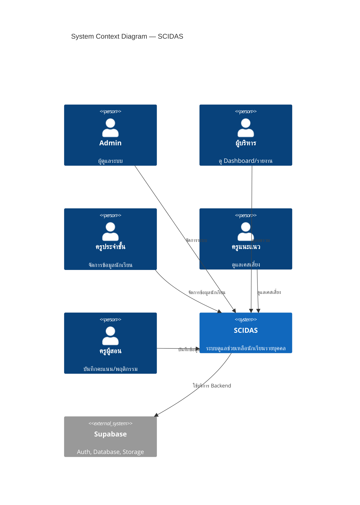
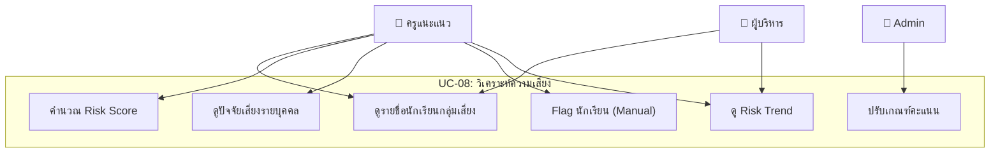

# 📋 ข้อกำหนดความต้องการของระบบ (Software Requirements Specification)

## ระบบสารสนเทศเพื่อวิเคราะห์และดูแลช่วยเหลือนักเรียนรายบุคคลสำหรับโรงเรียนขนาดเล็ก

**เวอร์ชัน:** 1.0  
**วันที่:** 9 มิถุนายน 2569  
**ชื่อภาษาอังกฤษ:** Student Care and Individual Development Analytics System for Small Schools (SCIDAS)

---

## สารบัญ

1. [บทนำ](#1-บทนำ)
2. [ขอบเขตของระบบ](#2-ขอบเขตของระบบ)
3. [ผู้มีส่วนได้ส่วนเสีย](#3-ผู้มีส่วนได้ส่วนเสีย)
4. [ข้อกำหนดเชิงฟังก์ชัน](#4-ข้อกำหนดเชิงฟังก์ชัน-functional-requirements)
5. [ข้อกำหนดที่ไม่ใช่เชิงฟังก์ชัน](#5-ข้อกำหนดที่ไม่ใช่เชิงฟังก์ชัน-non-functional-requirements)
6. [Use Case Diagrams](#6-use-case-diagrams)
7. [User Stories](#7-user-stories)
8. [ข้อจำกัดของระบบ](#8-ข้อจำกัดของระบบ)
9. [สมมติฐาน](#9-สมมติฐาน)
10. [แผนการพัฒนาในอนาคต](#10-แผนการพัฒนาในอนาคต)

---

## 1. บทนำ

### 1.1 วัตถุประสงค์ของเอกสาร

เอกสารฉบับนี้อธิบายข้อกำหนดความต้องการของระบบ SCIDAS อย่างละเอียด เพื่อใช้เป็นแนวทางในการพัฒนาระบบ ทดสอบ และส่งมอบ

### 1.2 วัตถุประสงค์ของระบบ

1. **พัฒนาระบบสารสนเทศ** สำหรับติดตามดูแลนักเรียนรายบุคคลในโรงเรียนขนาดเล็ก
2. **สร้างระบบ Early Warning** ที่สามารถตรวจจับนักเรียนกลุ่มเสี่ยงจากข้อมูลหลายมิติ
3. **เชื่อมโยงข้อมูล** การมาเรียน ผลการเรียน พฤติกรรม ครอบครัว เข้าด้วยกัน
4. **สนับสนุนการตัดสินใจ** ของครูและผู้บริหารด้วยข้อมูลเชิงวิเคราะห์
5. **จัดทำแผนพัฒนารายบุคคล** ที่ติดตามผลได้อย่างเป็นระบบ

### 1.3 กลุ่มเป้าหมาย

- โรงเรียนขนาดเล็ก (นักเรียน < 120 คน) ในสังกัด สพฐ.
- ครูและบุคลากรที่ทำหน้าที่ดูแลช่วยเหลือนักเรียน

### 1.4 คำนิยาม

| คำศัพท์ | คำอธิบาย |
|---------|---------|
| **SCIDAS** | Student Care and Individual Development Analytics System |
| **EWS** | Early Warning System — ระบบเตือนภัยล่วงหน้า |
| **IDP** | Individual Development Plan — แผนพัฒนารายบุคคล |
| **Risk Score** | คะแนนความเสี่ยงที่คำนวณจากปัจจัยหลายด้าน |
| **RLS** | Row Level Security — การรักษาความปลอดภัยระดับแถวข้อมูล |
| **RBAC** | Role-Based Access Control — การควบคุมการเข้าถึงตามบทบาท |
| **RSC** | React Server Components |
| **GPA** | Grade Point Average — เกรดเฉลี่ย |

---

## 2. ขอบเขตของระบบ

### 2.1 สิ่งที่ระบบทำ (In Scope)

| หมวด | รายละเอียด |
|------|-----------|
| **จัดการข้อมูลนักเรียน** | CRUD นักเรียน ผู้ปกครอง ข้อมูลครอบครัว นำเข้า/ส่งออก |
| **บันทึกการมาเรียน** | มาเรียน/ขาด/ลา/สาย สถิติรายวัน-เดือน-เทอม กราฟ |
| **จัดการผลการเรียน** | คะแนนรายวิชา เกรด ทักษะพื้นฐาน (อ่าน-เขียน-คิดเลข) |
| **บันทึกพฤติกรรม** | พฤติกรรมดี/ควรติดตาม การส่งงาน หมายเหตุครู |
| **เยี่ยมบ้าน** | บันทึกการเยี่ยม รูปภาพ ปัญหา ข้อเสนอแนะ |
| **การช่วยเหลือ** | ทุน อุปกรณ์ อาหาร คำปรึกษา ติดตามสถานะ |
| **วิเคราะห์ความเสี่ยง** | คำนวณ Risk Score จัดกลุ่ม แจ้งเตือน |
| **แผนพัฒนารายบุคคล** | สร้างแผน ตั้งเป้าหมาย กิจกรรม ประเมินผล |
| **Dashboard & Reports** | ภาพรวม กราฟ สถิติ รายงาน |
| **จัดการผู้ใช้** | RBAC, Authentication, Audit Log |

### 2.2 สิ่งที่ระบบไม่ทำ (Out of Scope)

| หมวด | รายละเอียด |
|------|-----------|
| **ระบบการเงิน** | ไม่จัดการการเงินโรงเรียน (นอกจากบันทึกว่าให้ทุนแล้ว) |
| **ระบบตารางสอน** | ไม่จัดตารางเรียนตารางสอน |
| **ระบบ LMS** | ไม่ใช่ระบบจัดการการเรียนรู้ |
| **ระบบ Chat** | ไม่มีระบบ Chat แบบ Real-time ระหว่างครู-ผู้ปกครอง |
| **AI/ML** | ไม่มี Machine Learning ในเวอร์ชันแรก (แต่ออกแบบให้ขยายได้) |
| **Mobile App** | เวอร์ชันแรกเป็น Web App (Responsive) ไม่มี Native App |

### 2.3 บริบทของระบบ (System Context)



---

## 3. ผู้มีส่วนได้ส่วนเสีย

### 3.1 ผู้ใช้งานหลัก

| ผู้มีส่วนได้ส่วนเสีย | ความต้องการหลัก |
|---------------------|----------------|
| **ครูประจำชั้น** | ดูแลนักเรียนในห้องแบบครบวงจร เห็นภาพรวมของเด็กแต่ละคน |
| **ครูผู้สอน** | บันทึกคะแนน พฤติกรรม การส่งงานได้ง่ายและรวดเร็ว |
| **ครูแนะแนว/ฝ่ายปกครอง** | มีข้อมูลประกอบการตัดสินใจช่วยเหลือเด็ก |
| **ผู้บริหาร** | เห็นภาพรวมทั้งโรงเรียน ตัดสินใจเชิงนโยบายได้ |
| **ผู้ดูแลระบบ** | จัดการผู้ใช้ ดูแลระบบให้ทำงานได้ต่อเนื่อง |

### 3.2 ผู้มีส่วนได้ส่วนเสียทางอ้อม

| ผู้มีส่วนได้ส่วนเสีย | ผลกระทบ |
|---------------------|---------|
| **นักเรียน** | ได้รับการดูแลอย่างทันท่วงทีและเหมาะสม |
| **ผู้ปกครอง** | ลูกได้รับการติดตามดูแลอย่างใกล้ชิด |
| **สพท. / สพฐ.** | มีข้อมูลเชิงวิเคราะห์ประกอบการรายงาน |

---

## 4. ข้อกำหนดเชิงฟังก์ชัน (Functional Requirements)

### FR-01: การยืนยันตัวตนและการจัดการสิทธิ์ (Authentication & Authorization)

| รหัส | ข้อกำหนด | ระดับ |
|------|---------|-------|
| FR-01-01 | ผู้ใช้ต้องสามารถเข้าสู่ระบบด้วย Email + Password | **Must** |
| FR-01-02 | ผู้ใช้ต้องสามารถรีเซ็ตรหัสผ่านผ่าน Email | **Must** |
| FR-01-03 | ระบบต้องรองรับ 5 บทบาท: admin, director, homeroom, counselor, teacher | **Must** |
| FR-01-04 | ระบบต้องจำกัดการเข้าถึงข้อมูลตามบทบาทผู้ใช้ (RBAC) | **Must** |
| FR-01-05 | ระบบต้องบันทึก Audit Log ทุกครั้งที่มีการแก้ไขข้อมูลสำคัญ | **Should** |
| FR-01-06 | Admin ต้องสามารถสร้าง แก้ไข ลบ ผู้ใช้งาน | **Must** |
| FR-01-07 | ระบบต้อง Redirect ผู้ใช้ที่ไม่ได้ login ไปหน้า login | **Must** |
| FR-01-08 | ระบบต้อง Auto-logout เมื่อ Session หมดอายุ | **Should** |

---

### FR-02: โมดูลข้อมูลนักเรียน (Student Profile)

| รหัส | ข้อกำหนด | ระดับ |
|------|---------|-------|
| FR-02-01 | ระบบต้องจัดเก็บข้อมูลพื้นฐานนักเรียน: ชื่อ-นามสกุล, เลขประจำตัว, ชั้น/ห้อง, วันเกิด, เพศ | **Must** |
| FR-02-02 | ระบบต้องจัดเก็บข้อมูลผู้ปกครอง: ชื่อ, ความสัมพันธ์, เบอร์โทร, อาชีพ | **Must** |
| FR-02-03 | ระบบต้องจัดเก็บที่อยู่นักเรียน: บ้านเลขที่, หมู่, ตำบล, อำเภอ, จังหวัด, รหัสไปรษณีย์ | **Must** |
| FR-02-04 | ระบบต้องบันทึกวิธีเดินทางมาโรงเรียน | **Must** |
| FR-02-05 | ระบบต้องบันทึกสถานะครอบครัว (อยู่พร้อมหน้า, บิดา/มารดาแยกกัน, กำพร้า, อื่นๆ) | **Must** |
| FR-02-06 | ระบบต้องบันทึกภาวะเศรษฐกิจครอบครัวเบื้องต้น | **Should** |
| FR-02-07 | ระบบต้องรองรับรูปภาพนักเรียน | **Should** |
| FR-02-08 | ระบบต้องรองรับการค้นหานักเรียนด้วยชื่อ, เลขประจำตัว, ชั้น/ห้อง | **Must** |
| FR-02-09 | ระบบต้องรองรับการนำเข้าข้อมูลนักเรียนจาก CSV/Excel | **Should** |
| FR-02-10 | ระบบต้องแสดงหน้า Profile นักเรียนที่รวมข้อมูลจากทุกโมดูล | **Must** |
| FR-02-11 | ระบบต้องรองรับนักเรียนที่มีผู้ปกครองหลายคน | **Must** |
| FR-02-12 | ระบบต้องบันทึกข้อมูลโรคประจำตัว/ภูมิแพ้ | **Should** |
| FR-02-13 | ระบบต้องบันทึกเลข 13 หลักบัตรประชาชน (เข้ารหัส) | **Could** |

---

### FR-03: โมดูลการมาเรียน (Attendance)

| รหัส | ข้อกำหนด | ระดับ |
|------|---------|-------|
| FR-03-01 | ครูต้องสามารถบันทึกการมาเรียนรายวันเป็นรายชั้น/ห้อง | **Must** |
| FR-03-02 | สถานะการมาเรียนต้องมี: มาเรียน, ขาดเรียน, ลาป่วย, ลากิจ, มาสาย | **Must** |
| FR-03-03 | ระบบต้องแสดงสถิติการมาเรียน: รายวัน, รายสัปดาห์, รายเดือน, รายเทอม | **Must** |
| FR-03-04 | ระบบต้องแจ้งเตือนเมื่อนักเรียนขาดเรียนติดต่อกัน ≥ 3 วัน | **Must** |
| FR-03-05 | ระบบต้องแสดงกราฟสถิติการมาเรียนเทียบรายเดือน | **Must** |
| FR-03-06 | ระบบต้องรองรับการบันทึกหมายเหตุประกอบ เช่น เหตุผลการขาดเรียน | **Should** |
| FR-03-07 | ระบบต้องคำนวณเปอร์เซ็นต์การมาเรียนอัตโนมัติ | **Must** |
| FR-03-08 | ระบบต้อง Highlight นักเรียนที่มาเรียนต่ำกว่า 80% | **Must** |
| FR-03-09 | ครูต้องสามารถแก้ไขข้อมูลการมาเรียนย้อนหลังได้ (มี Audit Trail) | **Should** |

---

### FR-04: โมดูลผลการเรียนและทักษะพื้นฐาน (Academic Performance & Basic Skills)

| รหัส | ข้อกำหนด | ระดับ |
|------|---------|-------|
| FR-04-01 | ระบบต้องรองรับการบันทึกคะแนนรายวิชา | **Must** |
| FR-04-02 | ระบบต้องรองรับการบันทึกเกรดเฉลี่ย (GPA) รายเทอม | **Must** |
| FR-04-03 | ระบบต้องรองรับการบันทึกทักษะพื้นฐาน: อ่านออก, เขียนได้, คิดเลขพื้นฐาน | **Must** |
| FR-04-04 | ทักษะพื้นฐานต้องมีระดับ: ดีมาก, ดี, พอใช้, ปรับปรุง, ไม่ผ่าน | **Must** |
| FR-04-05 | ระบบต้องวิเคราะห์รายวิชาที่เป็นจุดอ่อนของนักเรียน | **Must** |
| FR-04-06 | ระบบต้องแสดงแนวโน้ม (Trend) คะแนนของนักเรียนข้ามเทอม | **Must** |
| FR-04-07 | ระบบต้อง Highlight นักเรียนที่มีคะแนนต่ำกว่า 50% ในวิชาใดวิชาหนึ่ง | **Should** |
| FR-04-08 | ระบบต้องเปรียบเทียบคะแนนเฉลี่ยของนักเรียนกับค่าเฉลี่ยของชั้น | **Should** |
| FR-04-09 | ระบบต้องรองรับการประเมินทักษะพื้นฐานเป็นรายเทอม | **Must** |

---

### FR-05: โมดูลพฤติกรรมและการส่งงาน (Behavior & Assignment Tracking)

| รหัส | ข้อกำหนด | ระดับ |
|------|---------|-------|
| FR-05-01 | ครูต้องสามารถบันทึกพฤติกรรมดีของนักเรียน | **Must** |
| FR-05-02 | ครูต้องสามารถบันทึกพฤติกรรมที่ควรติดตาม | **Must** |
| FR-05-03 | ระบบต้องแบ่งประเภทพฤติกรรม: ด้านการเรียน, ด้านสังคม, ด้านอารมณ์, ด้านระเบียบวินัย | **Must** |
| FR-05-04 | ครูต้องสามารถบันทึกสถานะการส่งงาน: ส่งแล้ว, ไม่ส่ง, ส่งช้า | **Must** |
| FR-05-05 | ระบบต้องแสดงประวัติพฤติกรรมย้อนหลังเรียงตามวันที่ | **Must** |
| FR-05-06 | ระบบต้องแสดงสถิติเปอร์เซ็นต์การส่งงานของนักเรียน | **Must** |
| FR-05-07 | ครูต้องสามารถเพิ่มหมายเหตุ/บันทึกประกอบ | **Should** |
| FR-05-08 | ระบบต้องรองรับ severity levels: ปกติ, น่าเป็นห่วง, ร้ายแรง | **Should** |

---

### FR-06: โมดูลเยี่ยมบ้าน (Home Visit)

| รหัส | ข้อกำหนด | ระดับ |
|------|---------|-------|
| FR-06-01 | ครูต้องสามารถบันทึกวันที่และรายละเอียดการเยี่ยมบ้าน | **Must** |
| FR-06-02 | ระบบต้องบันทึกสภาพแวดล้อมของบ้าน | **Must** |
| FR-06-03 | ระบบต้องบันทึกปัญหาที่พบระหว่างเยี่ยมบ้าน | **Must** |
| FR-06-04 | ระบบต้องบันทึกความต้องการความช่วยเหลือ | **Must** |
| FR-06-05 | ระบบต้องรองรับการอัปโหลดรูปภาพ ≥ 5 รูป/ครั้ง | **Must** |
| FR-06-06 | ครูต้องสามารถเพิ่มข้อเสนอแนะ | **Should** |
| FR-06-07 | ระบบต้องแสดงประวัติเยี่ยมบ้านทั้งหมดของนักเรียนแต่ละคน | **Must** |
| FR-06-08 | ระบบต้องบันทึกผู้เข้าร่วมการเยี่ยมบ้าน | **Should** |
| FR-06-09 | ระบบต้องบันทึกผู้ที่พบระหว่างเยี่ยม (ผู้ปกครอง/ญาติ/เพื่อนบ้าน) | **Should** |

---

### FR-07: โมดูลการช่วยเหลือนักเรียน (Student Support)

| รหัส | ข้อกำหนด | ระดับ |
|------|---------|-------|
| FR-07-01 | ระบบต้องรองรับประเภทการช่วยเหลือ: ทุนการศึกษา, อุปกรณ์การเรียน, อาหารกลางวัน, เครื่องแต่งกาย, คำปรึกษา, ส่งต่อหน่วยงาน | **Must** |
| FR-07-02 | ระบบต้องบันทึกผู้รับผิดชอบการช่วยเหลือ | **Must** |
| FR-07-03 | ระบบต้องมีสถานะ: รอดำเนินการ, กำลังดำเนินการ, สำเร็จ, ยกเลิก | **Must** |
| FR-07-04 | ครูต้องสามารถบันทึกการติดตามผลหลังการช่วยเหลือ (Follow-up) | **Must** |
| FR-07-05 | ระบบต้องแสดงประวัติการช่วยเหลือทั้งหมดของนักเรียนแต่ละคน | **Must** |
| FR-07-06 | ระบบต้องแสดงจำนวนเคสที่ช่วยเหลือแล้ว/รอดำเนินการ | **Must** |
| FR-07-07 | ระบบต้องบันทึกงบประมาณ/มูลค่าการช่วยเหลือ | **Could** |
| FR-07-08 | ระบบต้องบันทึกแหล่งที่มาของทุน/การช่วยเหลือ | **Should** |

---

### FR-08: โมดูลวิเคราะห์ความเสี่ยง — Early Warning System (EWS)

| รหัส | ข้อกำหนด | ระดับ |
|------|---------|-------|
| FR-08-01 | ระบบต้องคำนวณ Risk Score จากปัจจัย 8 ด้าน | **Must** |
| FR-08-02 | ระบบต้องจัดระดับความเสี่ยง: ปกติ (0-30), เฝ้าระวัง (31-60), เสี่ยงสูง (61-100) | **Must** |
| FR-08-03 | ระบบต้องคำนวณ Risk Score ใหม่อัตโนมัติเมื่อข้อมูลเปลี่ยน | **Must** |
| FR-08-04 | ระบบต้องแจ้งเตือนครูประจำชั้นเมื่อนักเรียนเปลี่ยนระดับเป็น "เฝ้าระวัง" | **Must** |
| FR-08-05 | ระบบต้องแจ้งเตือนครูแนะแนว + ผู้บริหารเมื่อนักเรียนเปลี่ยนระดับเป็น "เสี่ยงสูง" | **Must** |
| FR-08-06 | ระบบต้องแสดงรายชื่อนักเรียนกลุ่มเสี่ยงพร้อมปัจจัยเสี่ยง | **Must** |
| FR-08-07 | ระบบต้องรองรับการปรับน้ำหนักคะแนนปัจจัยเสี่ยงโดย Admin | **Should** |
| FR-08-08 | ระบบต้องแสดง Risk Trend ย้อนหลัง | **Should** |
| FR-08-09 | ระบบต้องแนะนำให้สร้าง IDP อัตโนมัติเมื่อเข้าระดับเสี่ยง | **Should** |
| FR-08-10 | ระบบต้องรองรับการ Flag นักเรียนโดยครูแบบ Manual | **Must** |

#### ตารางน้ำหนักคะแนนปัจจัยเสี่ยง (Default)

| ปัจจัย | คะแนน | เงื่อนไขเริ่มต้น |
|--------|-------|-----------------|
| ขาดเรียนบ่อย (`frequent_absence`) | +20 | ขาดเรียน ≥ 3 วัน/เดือน หรือ ≥ 10% ของวันเรียนทั้งหมด |
| มาสายบ่อย (`frequent_late`) | +10 | มาสาย ≥ 5 วัน/เดือน |
| คะแนนต่ำ (`low_score`) | +20 | GPA < 1.5 หรือ คะแนนเฉลี่ย < 50% |
| อ่าน/เขียนต่ำกว่าเกณฑ์ (`low_basic_skills`) | +15 | ระดับ "ปรับปรุง" หรือ "ไม่ผ่าน" ในทักษะพื้นฐานใดๆ |
| ไม่ส่งงานบ่อย (`frequent_missing_work`) | +10 | ไม่ส่งงาน ≥ 30% ของงานทั้งหมด |
| มีปัญหาครอบครัว (`family_issues`) | +15 | จากข้อมูลเยี่ยมบ้านหรือแบบสอบถาม |
| เดินทางมาเรียนลำบาก (`difficult_commute`) | +10 | ระยะทาง > 10 กม. หรือไม่มีพาหนะส่วนตัว |
| ครูระบุว่าควรติดตาม (`teacher_flagged`) | +10 | ครูประจำชั้น/ครูผู้สอน Flag |

---

### FR-09: โมดูลแผนพัฒนารายบุคคล — Individual Development Plan (IDP)

| รหัส | ข้อกำหนด | ระดับ |
|------|---------|-------|
| FR-09-01 | ระบบต้องแสดงจุดที่ควรพัฒนาของนักเรียนอัตโนมัติ (จาก Risk Factors) | **Must** |
| FR-09-02 | ครูต้องสามารถสร้างแผนพัฒนารายบุคคลจากข้อมูลความเสี่ยง | **Must** |
| FR-09-03 | แผนต้องกำหนดเป้าหมายที่วัดผลได้ (SMART Goals) | **Must** |
| FR-09-04 | แผนต้องกำหนดกิจกรรมช่วยเหลือ | **Must** |
| FR-09-05 | ระบบต้องบันทึกผลการประเมินก่อน/หลังช่วยเหลือ | **Must** |
| FR-09-06 | แผนต้องมีสถานะ: ร่าง, ดำเนินการ, สำเร็จ, ยกเลิก | **Must** |
| FR-09-07 | ระบบต้องแสดงสรุปว่านักเรียนดีขึ้นหรือยัง (Trend Comparison) | **Must** |
| FR-09-08 | ระบบต้องรองรับกำหนดระยะเวลาของแผน (วันเริ่ม-วันสิ้นสุด) | **Must** |
| FR-09-09 | ระบบต้องแจ้งเตือนเมื่อแผนใกล้ครบกำหนด | **Should** |
| FR-09-10 | ระบบต้องแนบหลักฐาน/รูปภาพผลงานนักเรียนได้ | **Could** |

---

### FR-10: Dashboard สำหรับผู้บริหาร

| รหัส | ข้อกำหนด | ระดับ |
|------|---------|-------|
| FR-10-01 | แสดงจำนวนนักเรียนทั้งหมดในโรงเรียน | **Must** |
| FR-10-02 | แสดงจำนวนนักเรียนแบ่งตามระดับความเสี่ยง: ปกติ, เฝ้าระวัง, เสี่ยงสูง | **Must** |
| FR-10-03 | แสดงรายชื่อนักเรียนที่ขาดเรียนบ่อย (Top 10) | **Must** |
| FR-10-04 | แสดงรายชื่อนักเรียนผลการเรียนต่ำ (Top 10) | **Must** |
| FR-10-05 | แสดงสาเหตุความเสี่ยงที่พบบ่อยที่สุด (Bar Chart) | **Must** |
| FR-10-06 | แสดงจำนวนเคสที่ช่วยเหลือแล้ว vs รอดำเนินการ | **Must** |
| FR-10-07 | แสดงกราฟเปรียบเทียบรายชั้น/รายห้อง | **Must** |
| FR-10-08 | แสดงกราฟแนวโน้มการมาเรียนรายเดือน | **Should** |
| FR-10-09 | รองรับการกรองข้อมูลตามปีการศึกษา, เทอม, ชั้น | **Must** |
| FR-10-10 | รองรับการส่งออกรายงาน PDF | **Should** |
| FR-10-11 | รองรับการส่งออกข้อมูล Excel | **Should** |

---

### FR-11: ระบบแจ้งเตือน (Notifications)

| รหัส | ข้อกำหนด | ระดับ |
|------|---------|-------|
| FR-11-01 | ระบบต้องแจ้งเตือน In-App เมื่อมี Event สำคัญ | **Must** |
| FR-11-02 | ประเภทแจ้งเตือน: ความเสี่ยงเปลี่ยนระดับ, นักเรียนขาดเรียน, แผน IDP ใกล้ครบกำหนด, เคสรอดำเนินการ | **Must** |
| FR-11-03 | ผู้ใช้ต้องสามารถ Mark เป็น Read/Unread | **Must** |
| FR-11-04 | ระบบต้องแสดงจำนวน Notification ที่ยังไม่อ่าน (Badge) | **Must** |
| FR-11-05 | ระบบต้องเก็บประวัติแจ้งเตือน | **Should** |

---

## 5. ข้อกำหนดที่ไม่ใช่เชิงฟังก์ชัน (Non-Functional Requirements)

### NFR-01: ประสิทธิภาพ (Performance)

| รหัส | ข้อกำหนด |
|------|---------|
| NFR-01-01 | หน้าเว็บต้องโหลดภายใน 3 วินาที (First Contentful Paint) |
| NFR-01-02 | การค้นหานักเรียนต้องแสดงผลภายใน 1 วินาที |
| NFR-01-03 | Dashboard ต้องโหลดข้อมูลภายใน 2 วินาที |
| NFR-01-04 | ระบบต้องรองรับผู้ใช้พร้อมกัน ≥ 20 คน |

### NFR-02: ความปลอดภัย (Security)

| รหัส | ข้อกำหนด |
|------|---------|
| NFR-02-01 | ข้อมูลนักเรียนต้องเข้ารหัสระหว่างการสื่อสาร (HTTPS/TLS) |
| NFR-02-02 | ระบบต้องใช้ Row Level Security (RLS) ทุกตาราง |
| NFR-02-03 | รหัสผ่านต้องเข้ารหัสด้วย bcrypt/argon2 |
| NFR-02-04 | ระบบต้องป้องกัน SQL Injection, XSS, CSRF |
| NFR-02-05 | Service Role Key ต้องใช้เฉพาะฝั่ง Server เท่านั้น |
| NFR-02-06 | ข้อมูลสำคัญ (เลขบัตร ปชช.) ต้องเข้ารหัสก่อนจัดเก็บ |

### NFR-03: ความสามารถในการใช้งาน (Usability)

| รหัส | ข้อกำหนด |
|------|---------|
| NFR-03-01 | ระบบต้อง Responsive — ใช้งานได้บน Desktop, Tablet, Mobile |
| NFR-03-02 | ระบบต้องรองรับ Dark Mode / Light Mode |
| NFR-03-03 | ระบบต้องมี UI เป็นภาษาไทย |
| NFR-03-04 | ครูต้องสามารถเรียนรู้การใช้งานได้ภายใน 30 นาที |
| NFR-03-05 | ระบบต้องมี Loading state / Skeleton สำหรับทุกการโหลดข้อมูล |
| NFR-03-06 | ระบบต้องมี Error message ที่อ่านเข้าใจง่าย (ภาษาไทย) |

### NFR-04: ความน่าเชื่อถือ (Reliability)

| รหัส | ข้อกำหนด |
|------|---------|
| NFR-04-01 | ระบบต้องมี Uptime ≥ 99% |
| NFR-04-02 | ระบบต้อง Handle errors gracefully (ไม่ Crash) |
| NFR-04-03 | ข้อมูลต้อง Backup อัตโนมัติ (Supabase จัดการ) |

### NFR-05: ความสามารถในการบำรุงรักษา (Maintainability)

| รหัส | ข้อกำหนด |
|------|---------|
| NFR-05-01 | Code ต้องเขียนด้วย TypeScript อย่างเคร่งครัด |
| NFR-05-02 | ต้องมี Documentation สำหรับ API และ Component |
| NFR-05-03 | ต้องแยก Concern ชัดเจน (Presentation / Business Logic / Data) |
| NFR-05-04 | ต้องใช้ Environment Variables สำหรับ Configuration |

### NFR-06: ความสามารถในการขยาย (Scalability)

| รหัส | ข้อกำหนด |
|------|---------|
| NFR-06-01 | สถาปัตยกรรมต้องรองรับการเพิ่มโมดูลใหม่ในอนาคต |
| NFR-06-02 | Database Schema ต้องออกแบบให้รองรับหลายโรงเรียน (Multi-tenant ready) |
| NFR-06-03 | ระบบต้องรองรับการเพิ่มปัจจัยเสี่ยงใหม่โดยไม่ต้องแก้ Code |

---

## 6. Use Case Diagrams

### Use Case Overview

```mermaid
graph TB
    subgraph "ระบบ SCIDAS"
        UC1["UC-01: เข้าสู่ระบบ"]
        UC2["UC-02: จัดการนักเรียน"]
        UC3["UC-03: บันทึกการมาเรียน"]
        UC4["UC-04: บันทึกผลการเรียน"]
        UC5["UC-05: บันทึกพฤติกรรม"]
        UC6["UC-06: บันทึกเยี่ยมบ้าน"]
        UC7["UC-07: จัดการการช่วยเหลือ"]
        UC8["UC-08: วิเคราะห์ความเสี่ยง"]
        UC9["UC-09: จัดการแผนพัฒนา"]
        UC10["UC-10: ดู Dashboard"]
        UC11["UC-11: ส่งออกรายงาน"]
        UC12["UC-12: จัดการผู้ใช้"]
    end

    Admin["👤 Admin"] --> UC1 & UC2 & UC12
    Director["👤 ผู้บริหาร"] --> UC1 & UC10 & UC11
    Homeroom["👤 ครูประจำชั้น"] --> UC1 & UC2 & UC3 & UC4 & UC5 & UC6 & UC7 & UC9
    Counselor["👤 ครูแนะแนว"] --> UC1 & UC5 & UC6 & UC7 & UC8 & UC9
    Teacher["👤 ครูผู้สอน"] --> UC1 & UC4 & UC5
```



### UC-08: วิเคราะห์ความเสี่ยง (Detail)



---

## 7. User Stories

### Epic 1: การจัดการนักเรียน

> **US-01:** ในฐานะ **ครูประจำชั้น** ฉันต้องการ **เพิ่มข้อมูลนักเรียนใหม่** เพื่อที่จะ **เริ่มติดตามดูแลนักเรียนได้**  
> Acceptance Criteria:
> - สามารถกรอกข้อมูลพื้นฐาน ผู้ปกครอง ที่อยู่ ได้ครบ
> - มี Form Validation ทุก Field ที่จำเป็น
> - แสดง Success message หลังบันทึก
> - นักเรียนใหม่ปรากฏในรายชื่อห้องเรียน

> **US-02:** ในฐานะ **ครูประจำชั้น** ฉันต้องการ **นำเข้าข้อมูลนักเรียนจาก Excel** เพื่อที่จะ **ไม่ต้องกรอกทีละคน**  
> Acceptance Criteria:
> - มี Template Excel ให้ดาวน์โหลด
> - รองรับ .xlsx และ .csv
> - แสดง Preview ก่อน Import
> - แสดง Error สำหรับ Row ที่ข้อมูลไม่ครบ/ผิดรูปแบบ

> **US-03:** ในฐานะ **ครู** ฉันต้องการ **ดูหน้า Profile นักเรียนที่รวมข้อมูลทุกอย่าง** เพื่อที่จะ **เข้าใจสถานะของเด็กแบบองค์รวม**  
> Acceptance Criteria:
> - แสดงข้อมูลพื้นฐาน, สถิติมาเรียน, คะแนน, พฤติกรรม, เยี่ยมบ้าน, การช่วยเหลือ, ระดับเสี่ยง, แผน IDP
> - ใช้ Tab layout แบ่งหมวดหมู่
> - แสดง Risk Badge ที่มุมขวาบน

### Epic 2: Early Warning System

> **US-04:** ในฐานะ **ครูแนะแนว** ฉันต้องการ **เห็นรายชื่อนักเรียนที่มีความเสี่ยงสูง** เพื่อที่จะ **จัดลำดับความสำคัญในการช่วยเหลือ**  
> Acceptance Criteria:
> - แสดง List ของนักเรียนเสี่ยงสูง เรียงตาม Risk Score จากมากไปน้อย
> - แสดง Badge สีตามระดับความเสี่ยง (เขียว/เหลือง/แดง)
> - แสดงปัจจัยเสี่ยงของนักเรียนแต่ละคน
> - กดชื่อนักเรียนเพื่อดู Profile ได้

> **US-05:** ในฐานะ **ครูประจำชั้น** ฉันต้องการ **ได้รับแจ้งเตือนเมื่อนักเรียนในห้องเข้าระดับเสี่ยง** เพื่อที่จะ **ดำเนินการช่วยเหลือทันที**  
> Acceptance Criteria:
> - ได้รับ In-App Notification เมื่อ Risk Level เปลี่ยน
> - แสดง Badge จำนวนแจ้งเตือนที่ยังไม่อ่าน
> - คลิกแจ้งเตือนแล้วไปที่หน้า Profile นักเรียน

### Epic 3: แผนพัฒนารายบุคคล

> **US-06:** ในฐานะ **ครูประจำชั้น** ฉันต้องการ **สร้างแผนพัฒนารายบุคคลให้นักเรียน** เพื่อที่จะ **มีแนวทางช่วยเหลือที่ชัดเจน**  
> Acceptance Criteria:
> - ระบบแสดงจุดที่ควรพัฒนาอัตโนมัติ
> - สามารถตั้งเป้าหมาย + กิจกรรม + ระยะเวลา
> - บันทึกสถานะ: ร่าง / ดำเนินการ / สำเร็จ
> - เห็น Timeline ของแผน

> **US-07:** ในฐานะ **ครูประจำชั้น** ฉันต้องการ **บันทึกผลก่อน/หลังการช่วยเหลือ** เพื่อที่จะ **วัดผลว่านักเรียนดีขึ้นจริงหรือไม่**  
> Acceptance Criteria:
> - กรอกคะแนน/ระดับก่อนช่วยเหลือ (Pre)
> - กรอกคะแนน/ระดับหลังช่วยเหลือ (Post)
> - แสดง Comparison Chart ก่อน vs หลัง
> - แสดงสรุปว่า "ดีขึ้น" / "เท่าเดิม" / "แย่ลง"

### Epic 4: Dashboard

> **US-08:** ในฐานะ **ผู้บริหาร** ฉันต้องการ **เห็นภาพรวมนักเรียนทั้งโรงเรียนในหน้าเดียว** เพื่อที่จะ **ตัดสินใจเชิงนโยบาย**  
> Acceptance Criteria:
> - แสดง Stat Cards: จำนวนนักเรียน, กลุ่มปกติ/เฝ้าระวัง/เสี่ยงสูง
> - แสดง Pie Chart: สัดส่วนความเสี่ยง
> - แสดง Bar Chart: เปรียบเทียบรายชั้น
> - แสดงรายชื่อเคสที่ต้องติดตาม
> - กรองตามปีการศึกษา/เทอม/ชั้น

---

## 8. ข้อจำกัดของระบบ

| ข้อจำกัด | รายละเอียด |
|---------|-----------|
| **ภาษา** | UI เป็นภาษาไทยเท่านั้น (เวอร์ชันแรก) |
| **ขนาดโรงเรียน** | ออกแบบสำหรับโรงเรียนขนาดเล็ก (< 120 คน) แต่รองรับขยาย |
| **Internet** | ต้องมี Internet เพื่อเข้าใช้งาน (ไม่รองรับ Offline) |
| **Browser** | รองรับ Chrome, Firefox, Safari, Edge (เวอร์ชันล่าสุด) |
| **File Upload** | ขนาดไฟล์สูงสุด 5MB/รูป, 20MB/ครั้ง |
| **Concurrent Users** | รองรับ 20 คนพร้อมกัน (Free tier Supabase) |

---

## 9. สมมติฐาน

1. โรงเรียนมี Internet ที่เพียงพอสำหรับการใช้งาน Web Application
2. ครูมีอุปกรณ์ (คอมพิวเตอร์, แท็บเล็ต, หรือสมาร์ทโฟน) สำหรับเข้าใช้งาน
3. ครูมีทักษะพื้นฐานในการใช้งานคอมพิวเตอร์และ Web Browser
4. โรงเรียนมีข้อมูลนักเรียนพื้นฐานในรูปแบบ Excel/CSV
5. ระบบจะใช้ Supabase Free Tier ซึ่งเพียงพอสำหรับโรงเรียนขนาดเล็ก
6. ข้อมูลนักเรียนถือเป็นข้อมูลส่วนบุคคลที่ต้องได้รับการปกป้องตาม PDPA

---

## 10. แผนการพัฒนาในอนาคต (Future Enhancements)

### Phase 2 — ขยายขีดความสามารถ
| ฟีเจอร์ | คำอธิบาย |
|---------|---------|
| **LINE Notification** | แจ้งเตือนผ่าน LINE Official Account |
| **AI Risk Prediction** | ใช้ Machine Learning ทำนายความเสี่ยง |
| **Multi-School Support** | รองรับหลายโรงเรียนในระบบเดียว |
| **Parent Portal** | ผู้ปกครองสามารถดูข้อมูลลูกได้ |
| **Offline Mode** | รองรับการใช้งานแบบ Offline ด้วย PWA |

### Phase 3 — ระดับเขตพื้นที่
| ฟีเจอร์ | คำอธิบาย |
|---------|---------|
| **สพท. Dashboard** | Dashboard สำหรับเขตพื้นที่การศึกษา |
| **Data Analytics** | วิเคราะห์ข้อมูลข้ามโรงเรียน |
| **API Integration** | เชื่อมต่อกับระบบ สพฐ. |
| **Mobile App** | Native App สำหรับ iOS/Android |

---

## 📎 ภาคผนวก

### ก. MoSCoW Priority Legend

| ระดับ | ความหมาย |
|-------|---------|
| **Must** | จำเป็นต้องมี — ระบบทำงานไม่ได้หากไม่มี |
| **Should** | ควรจะมี — สำคัญแต่ไม่ใช่ข้อกำหนดบังคับ |
| **Could** | มีได้ก็ดี — เพิ่มคุณค่าแต่ไม่จำเป็น |
| **Won't** | ไม่ทำในรอบนี้ — อาจทำในอนาคต |

### ข. การสอดคล้องกับระบบดูแลช่วยเหลือนักเรียน กระทรวงศึกษาธิการ

ระบบ SCIDAS ออกแบบให้สอดคล้องกับ **ระบบดูแลช่วยเหลือนักเรียน** ของกระทรวงศึกษาธิการ ซึ่งมี 5 ขั้นตอน:

```
1. รู้จักนักเรียนเป็นรายบุคคล → โมดูล Student Profile + Home Visit
2. คัดกรองนักเรียน            → โมดูล Risk Analysis (EWS)
3. ส่งเสริมนักเรียน            → โมดูล IDP + Support
4. ป้องกันและแก้ไขปัญหา       → โมดูล Support + Behavior
5. ส่งต่อ                    → โมดูล Support (ส่งต่อหน่วยงาน)
```
